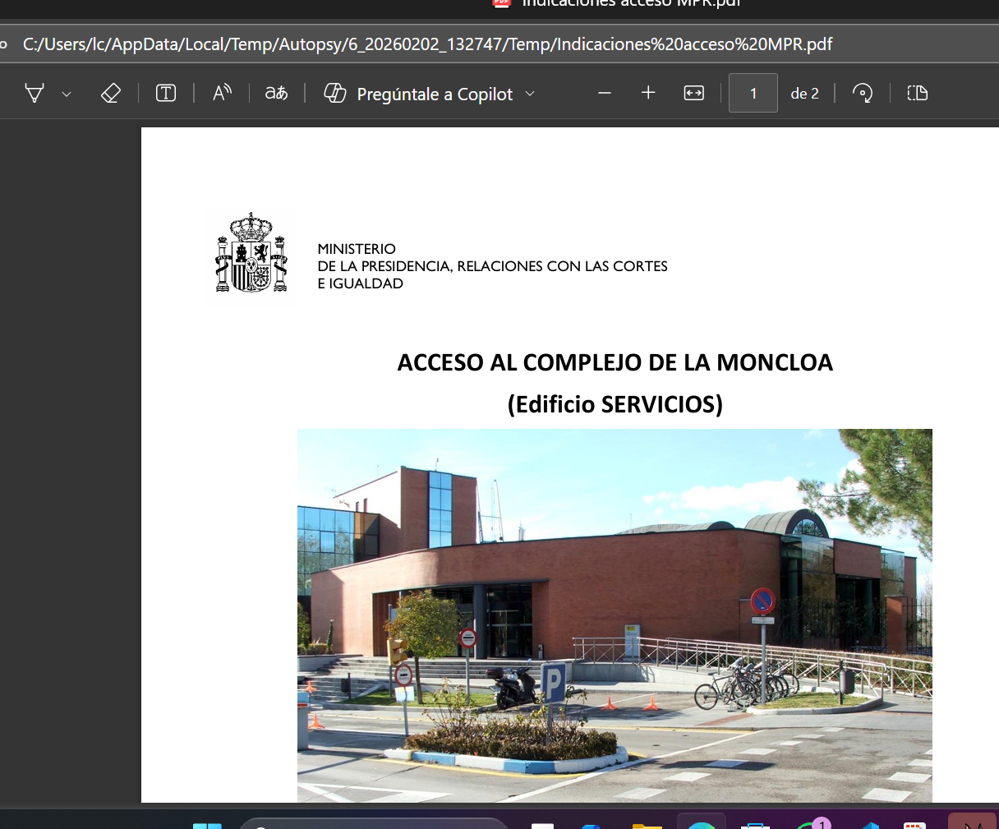
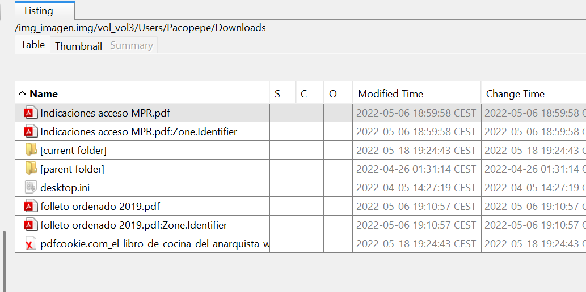
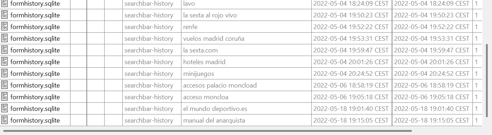
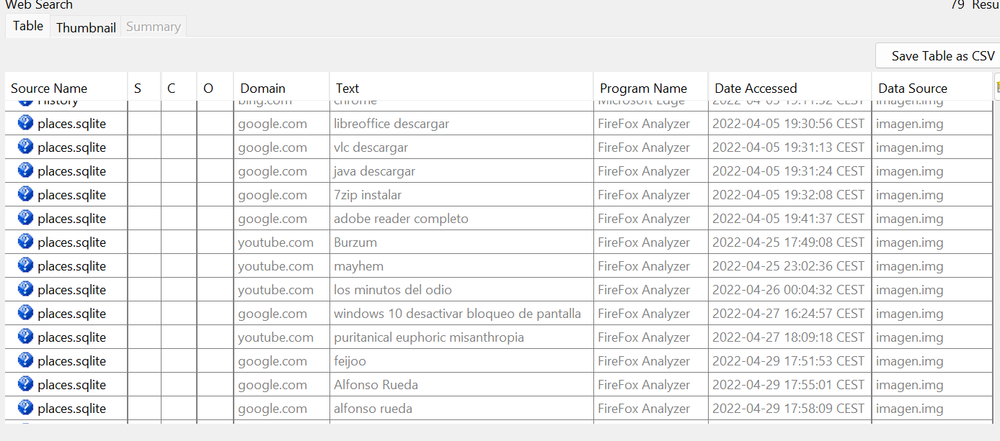
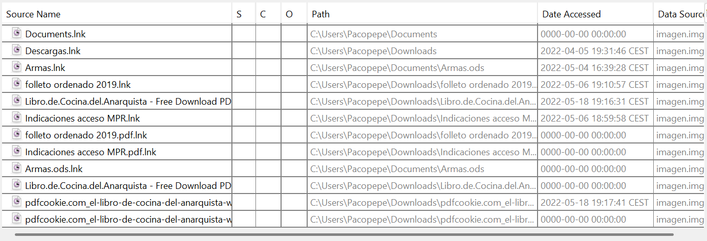
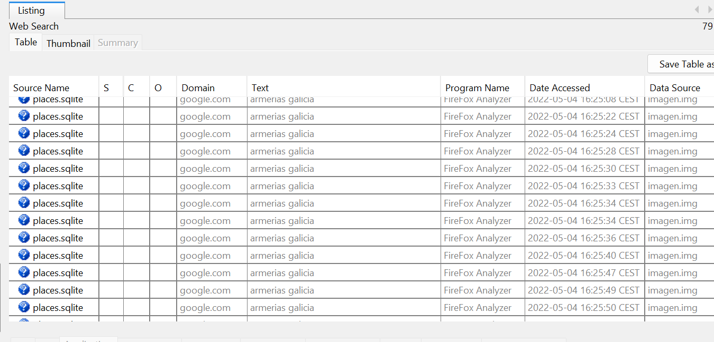
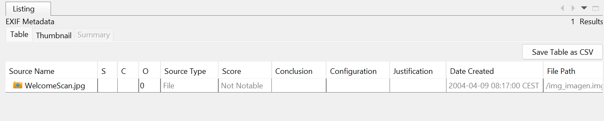

# Informe de Intento de asesinato

**Grupo:** 2

## Introducción

Este documento resume los hallazgos obtenidos tras el análisis forense de una imagen de disco. El objetivo ha sido reconstruir la actividad digital del sospechoso, identificar posibles víctimas y localizar indicios.

## Resumen ejecutivo

La investigación revela la existencia de un único usuario del equipo, búsquedas y accesos orientados hacia la planificación de un ataque contra un político, referencias a alojamientos en Madrid y consultas sobre armamento. Además, se encontraron fuentes de información (vídeos y documentos) que podrían haber influido en la conducta del sospechoso.

## Hallazgos principales

- **Usuario del equipo:** Pacopepe

- **Persona probablemente objetivo:** Iván Espinosa de los Monteros (principal). También aparecen búsquedas relacionadas con Alberto Núñez Feijóo.

- **Lugar considerado para el ataque:** La Moncloa, respaldado por búsquedas, pdf descargados y páginas consultadas sobre visitas y procedimientos de acceso.

- **Alojamientos consultados:** Entre los establecimientos identificados en el historial figuran Hotel Riu Plaza España, Hostal Mayerling, Hostal Condestable y Hostal Alaska.

- **Material audiovisual influyente:** Reproducciones reiteradas del programa de YouTube “Los minutos del odio”, incluyendo al menos un episodio concreto que se visualizó varias veces.

- **Documento consultado y descargado:** Varias versiones del texto "El libro de cocina del anarquista" (William Powell). Se detectó una copia en la carpeta de descargas del usuario.

- **Búsqueda de armamento:** Navegación por diversas armerías ubicadas en Galicia; las dos tiendas con navegación interna más significativa y probables anotaciones de precios son Armería Estradense y Armería Jardín.

- **Imágenes y EXIF:** Existen imágenes que podrían contener metadatos (fecha/hora y coordenadas) útiles para ubicar movimientos y verificar presencia en puntos de interés.

## Evidencias relevantes

- Historial de búsquedas y páginas visitadas relacionadas con el diputado objetivo.
- Páginas sobre solicitudes o procedimientos para visitar La Moncloa.
- Consultas y reservas/visualizaciones de alojamientos en Madrid.
- Reproducciones repetidas del vídeo “LOS MINUTOS DEL ODIO #33” y episodios relacionados.
- Descarga y apertura de PDF del "Libro de cocina del anarquista" (archivo localizado en la carpeta de descargas del usuario).
- Accesos directos y navegación dentro de sitios de armerías gallegas, con pasos en secciones de productos.

## Línea temporal de eventos

| Fase | Evento | Evidencia | Relevancia |
|------|--------|-----------|-----------|
| **Fase 1: Inspiración y radicalización** | Consumo repetido del programa "Los minutos del odio #33" | Historial de navegación, visualizaciones múltiples | Exposición a contenido incitador |
| **Fase 2: Investigación del objetivo** | Búsquedas sobre Iván Espinosa de los Monteros y Alberto Núñez Feijóo | Historial de búsquedas | Identificación y selección del objetivo político |
| **Fase 3: Planificación de acceso** | Consultas sobre procedimientos de acceso a La Moncloa, documentos PDF descargados | Historial de navegación, descargas | Evaluación de la accesibilidad del lugar |
| **Fase 4: Búsqueda de alojamiento** | Consultas de alojamientos en Madrid: Hotel Riu Plaza España, Hostal Mayerling, Hostal Condestable, Hostal Alaska | Historial de navegación, posibles reservas | Preparación logística para presencia en Madrid |
| **Fase 5: Obtención de material teórico** | Descargas de "El libro de cocina del anarquista" (múltiples versiones) | Archivo en carpeta de descargas, historial de descargas | Adquisición de conocimientos técnicos |
| **Fase 6: Búsqueda de armamento** | Navegación por armerías gallegas: Armería Estradense y Armería Jardín | Historial de navegación, navegación interna en secciones de productos, anotaciones de precios | Obtención de medios operacionales |

**Observaciones sobre la cronología:**
- La secuencia evidencia una progresión clara desde la radicalización ideológica hacia la planificación práctica del ataque.
- Las marcas temporales del historial de navegación y archivos de descarga permitirían establecer la duración de cada fase y detectar períodos de mayor o menor actividad delictiva.
- Los metadatos EXIF de imágenes recuperadas podrían revelar desplazamientos geográficos correlacionados con las búsquedas (ej: presencia en Madrid, Galicia, La Moncloa).

## Observaciones técnicas y recomendaciones

- Revisar las imágenes recuperadas para extraer EXIF completos (fecha, hora, coordenadas GPS). Esto puede aportar cronología y localización.
- Preservar la cadena de custodia y generar hashes de los archivos clave (PDFs, capturas, imágenes) antes de cualquier manipulación.
- Correlacionar marcas temporales del historial con registros de movimiento (si existen logs adicionales) para establecer cronología precisa.
- Analizar las páginas de armerías con herramientas de navegación forense para recuperar posibles formularios, precios o capturas que indiquen intención de compra.

## Conclusión

El análisis apunta a un único usuario que mostró interés documentado en un político concreto, exploró logística (alojamiento y acceso al lugar) y consultó fuentes que podrían facilitar la planificación de un ataque.

---
