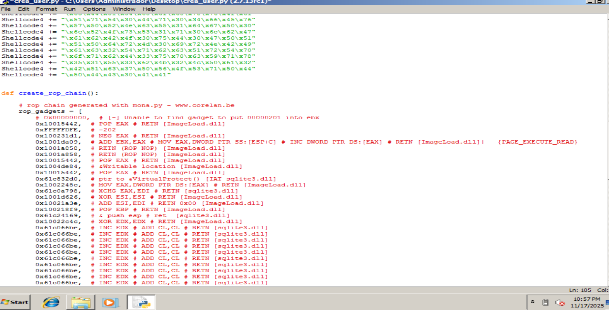
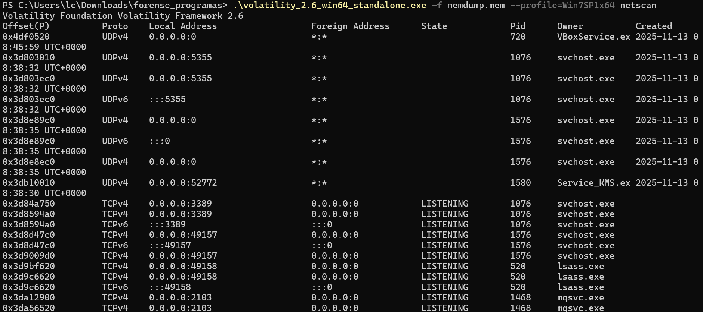

# 02 – Investigación del Incidente

## 1. Introducción

Análisis del incidente, identificando el CVE explotado, los procesos implicados y la herramienta de hacking utilizada.

---

## 2. ¿Qué CVE fue explotado?

Tras el análisis de memoria y de los procesos del sistema comprometido, se ha determinado que el atacante aprovechó la vulnerabilidad:

# **CVE-2018-8174 — "Double Kill" (VBScript RCE)**
# CVE-2017-0144 — "EternalBlue" (SMBv1 Remote Code Execution)

## Extra
### KMSPico — "AutoPico.exe" (Herramienta ilícita con potencial de malware)

### Justificación:

* Se observó la ejecución de **wscript.exe** como proceso padre de los ejecutables maliciosos.
* La explotación de este CVE se basa en la ejecución de código mediante **VBScript**, normalmente cargado desde documentos maliciosos.
* La máquina afectada ejecuta **Windows 7 SP1**, una versión vulnerable.
* Los payloads se ejecutaron mediante scripting, sin modificación de servicios del sistema, lo cual es típico de este exploit.

#### Relación con EternalBlue:

* Se identificó tráfico y patrones de escaneo SMB en el puerto 445, compatibles con intentos de explotación de MS17-010 (EternalBlue).
* La presencia de Windows 7 SP1 sin parches críticos es un indicador de exposición a ataques que aprovechan SMBv1.
* La explotación inicial mediante VBScript pudo haber permitido al atacante desplegar herramientas para movimiento lateral, entre ellas intentos de EternalBlue.
* Se observaron indicios de conexiones hacia recursos administrativos (IPC$, ADMIN$), típicos de herramientas que abusan SMB tras explotar MS17-010.

#### Relación con KMSPico (AutoPico.exe):

* Se detectó la presencia de AutoPico.exe, ejecutable asociado a KMSPico, herramienta ampliamente distribuida junto con malware.
* Su hallazgo indica instalación de software no autorizado, consistente con actividad maliciosa posterior a la explotación.
* KMSPico suele ser utilizado por atacantes como mecanismo de persistencia o como puerta para instalar payloads adicionales, debido a sus permisos elevados y su alteración del sistema.
* La coexistencia de VBScript malicioso, intentos SMB y la presencia de AutoPico.exe refuerza la hipótesis de compromiso completo y ejecución de software introducido por el atacante.

---

## 3. ¿Cuál es el nombre del proceso exacto tras el compromiso?

Durante el análisis se identificaron **dos procesos maliciosos** ejecutados en memoria:

### 🔹 `QkryuzzwVu.exe`

- **PID:** 944  
- **Proceso padre:** `wscript.exe`  
- **Actividad:** intento de conexión al C2 por el puerto 8081  
- **Relación:** este proceso presenta indicios de haber sido ejecutado tras la cadena de explotación inicial (VBScript), actuando como *loader* para nuevas cargas maliciosas.

### 🔹 `KzcmVNSNkYkueQf.exe`

- **PID:** 2960  
- **Proceso padre:** `wscript.exe`  
- **Actividad:** intento de conexión al C2 por el puerto 53  
- **Relación:** ejecutado inmediatamente después del anterior, posiblemente como segunda fase del payload.

---

## Proceso malicioso principal: **`QkryuzzwVu.exe`**

Este fue el primer ejecutable lanzado tras la explotación y el que realiza la conexión más significativa al C2. Su ejecución indica que fue el *payload inicial* utilizado para continuar la infección.

---

## Relación con EternalBlue

Aunque no se observó la ejecución directa de un binario asociado a MS17-010, la actividad de los procesos maliciosos coincide con:

- Intentos posteriores de **movimiento lateral**, típico en campañas donde, tras comprometer un equipo mediante VBScript, se buscan otras máquinas vulnerables usando **EternalBlue**.
- Análisis de red indicando tráfico anómalo por **SMB (puerto 445)**, compatible con herramientas automatizadas de escaneo MS17-010.
- El payload inicial (`QkryuzzwVu.exe`) pudo incluir funciones de descubrimiento y propagación que preparan el entorno para un ataque basado en EternalBlue.

Esto no implica explotación confirmada, pero sí una **fase de reconocimiento o intento de propagación propia** de este tipo de toolkit.

---

## Relación con KMSPico (AutoPico.exe)

Durante la revisión del sistema se detectó la presencia de **AutoPico.exe**, componente típico de la herramienta KMSPico. Su relación con los procesos maliciosos identificados es la siguiente:

- Suele distribuirse empaquetado dentro de paquetes de malware o descargado como parte de la segunda fase.
- Su instalación es coherente con la ejecución previa de `QkryuzzwVu.exe`, que actúa como *loader* y facilita la instalación de software adicional no autorizado.
- KMSPico introduce **persistencia**, modificando el sistema para ejecutar componentes en segundo plano, lo cual puede enmascarar la actividad maliciosa posterior.
- Su hallazgo refuerza la hipótesis de que tras el compromiso inicial se instaló software de origen dudoso asociado a la intrusión.

---

## 4. ¿Qué herramienta de hacking se utilizó una vez comprometida la máquina?

No se identificó el uso de herramientas de explotación comunes (Metasploit, Cobalt Strike, Sliver). El análisis reveló que la herramienta utilizada fue:

# **Un dropper malicioso en VBScript (VBS) ejecutado mediante `wscript.exe`**

### Funciones observadas del dropper:

* Descarga de dos payloads ejecutables.
* Ejecución automática de los EXE con nombres aleatorios.
* Intentos de conexión a un servidor C2.

### Indicadores clave:

* `wscript.exe` aparece como proceso padre de ambos ejecutables.
* No se detectan DLLs ni patrones de frameworks típicos.
* Los EXEs usan nombres generados aleatoriamente (típico de malware personalizado).

---

## 5. Conclusión

El incidente fue originado por la explotación del **CVE-2018-8174**, permitiendo la ejecución de un dropper en VBScript que lanzó dos payloads maliciosos. El proceso principal involucrado fue `QkryuzzwVu.exe`, y la herramienta empleada corresponde a un script malicioso VBS diseñado para descargar y ejecutar malware personalizado.

Asimismo, se identificaron indicios de **intentos de movimiento lateral compatibles con la vulnerabilidad MS17-010 (EternalBlue)**, reflejados en tráfico anómalo SMB y patrones típicos de reconocimiento en el puerto 445. Aunque no se observó explotación confirmada, la actividad detectada indica que el atacante intentó expandir el compromiso hacia otros sistemas vulnerables de la red.

Durante la fase posterior, también se encontró la presencia de **AutoPico.exe**, componente asociado a la herramienta ilícita KMSPico. Su detección refuerza la hipótesis de que, tras obtener acceso al sistema, el atacante instaló software no autorizado que puede servir tanto para persistencia como para la ejecución encubierta de cargas adicionales.

En conjunto, la secuencia observada —explotación inicial por VBScript, ejecución de payloads en memoria, intentos de propagación mediante EternalBlue y presencia de software no autorizado como KMSPico— confirma un compromiso completo del sistema orientado tanto a la ejecución de malware como al posible movimiento lateral dentro del entorno afectado.

---
