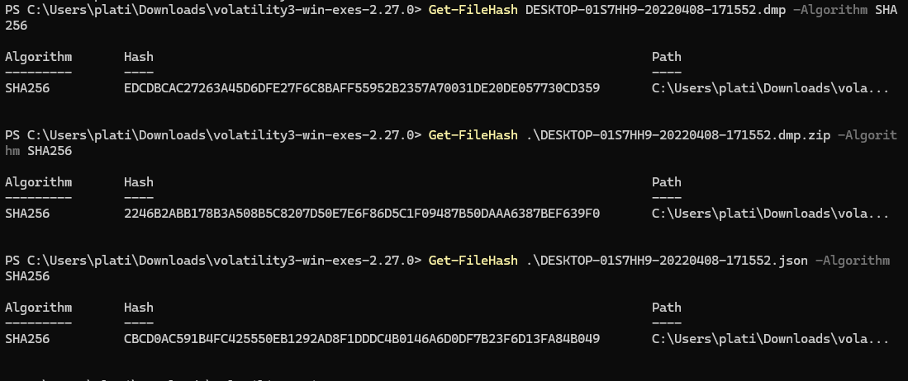
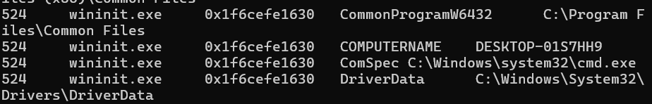
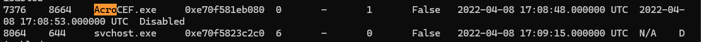
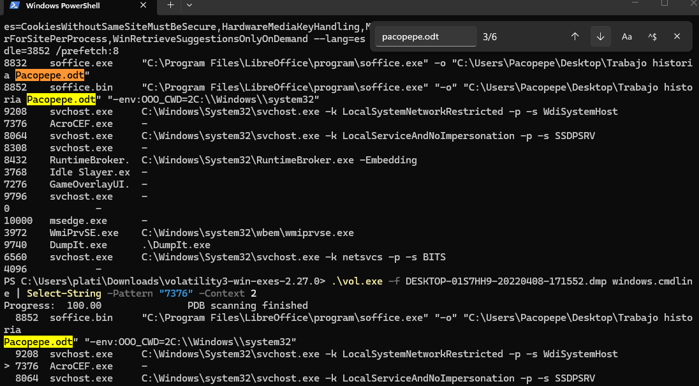
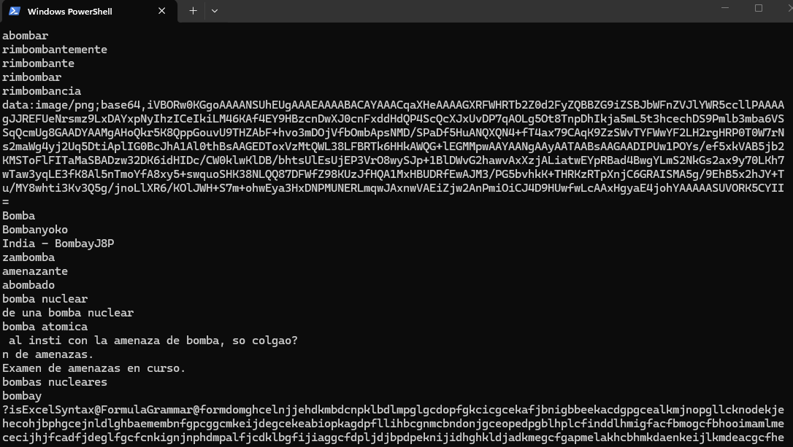

# Informe de análisis forense

Caso: Amenaza de bomba en centro educativo (Bachillerato)

Equipo analizado: DESKTOP-01S7HH9

Resumen ejecutivo

Se presenta el análisis forense de la imagen de memoria proporcionada, con el objetivo de verificar la vinculación de la evidencia con el equipo `DESKTOP-01S7HH9` y localizar indicios que relacionen al usuario con la amenaza. El informe resume metodología, hallazgos y recomendaciones, e incluye las capturas que documentan las pruebas encontradas en memoria.

Introducción

Este informe recoge el análisis forense realizado sobre un volcado de memoria RAM perteneciente al ordenador del alumno Francisco José Jiménez (alias “Pacopepe”), en el marco de la investigación por una falsa amenaza de bomba contra un centro educativo. El objetivo principal fue verificar la vinculación de la imagen con el equipo investigado y localizar evidencias en memoria que puedan relacionar al usuario con la amenaza.

Fundamentación teórica

El análisis de memoria permite recuperar artefactos que sólo residen en RAM: procesos activos, parámetros en memoria, manejadores abiertos, conexiones de red temporales y fragmentos de texto. Estos elementos son valiosos para reconstruir el estado del sistema en el momento de la adquisición y pueden aportar pruebas que no están presentes en el almacenamiento persistente.

Herramientas especializadas, combinadas con utilidades de extracción de texto, permiten localizar y documentar artefactos relevantes manteniendo la integridad de la evidencia mediante verificación de hashes.

Objetivos del análisis

- Verificar que la imagen de memoria corresponde al equipo identificado como `DESKTOP-01S7HH9`.
- Identificar el PID del proceso empleado para visualizar documentos PDF y su proceso padre.
- Determinar, mediante manejadores, qué documento estaba abierto o en edición durante la captura.
- Localizar en memoria evidencias directas o indirectas que vinculen al usuario con la amenaza.

Adquisición de la evidencia e integridad

Descripción de la evidencia

Se recibió la siguiente evidencia:

- `DESKTOP-01S7HH9-20220408-171552.dmp` (imagen de memoria)
- `DESKTOP-01S7HH9-20220408-171552.json` (log de DumpIt)
- `DESKTOP-01S7HH9-20220408-171552.dmp.zip`

Verificación de integridad (SHA-256)

Se calcularon y compararon los hashes SHA-256 suministrados con los valores calculados localmente; las tres sumas coinciden exactamente, lo que confirma la integridad de la evidencia y la conservación de la cadena de custodia.

Metodología de análisis

Herramientas empleadas

- Volatility 3 para carga y análisis de la imagen de memoria y extracción de artefactos.
- Utilidades del sistema (`strings`, `findstr`) para extraer y filtrar texto legible de regiones de memoria volcadas.

Procedimiento resumido

1. Verificación de hashes SHA-256 de los ficheros recibidos.
2. Carga de la imagen en Volatility 3; obtención de metadatos y variables de entorno para confirmar el nombre del equipo.
3. Listado del árbol de procesos y extracción de la información de PID/PPID para identificar procesos relacionados con visores de PDF.
4. Extracción de manejadores (`handles`) para localizar ficheros abiertos por procesos activos en el momento de la captura.
5. Volcado de regiones relevantes de memoria y extracción de cadenas legibles con `strings` para buscar términos relacionados con la amenaza.

Resultados del análisis

Confirmación del equipo

Mediante las variables de entorno recuperadas con Volatility 3 se verificó que el nombre del equipo en la imagen coincide con `DESKTOP-01S7HH9`, lo que establece la relación entre la evidencia y el equipo objeto de la investigación.

Identificación del visor de PDF

El árbol de procesos (`pstree`) obtenido con Volatility 3 muestra la presencia de `AcroCEF.exe`, componente de Adobe Acrobat/Reader. A partir de la salida se obtuvo el PID de `AcroCEF.exe` y su PPID, confirmando que una aplicación de lectura/gestión de PDFs estaba en ejecución al momento del volcado.

Documento abierto en el instante de la captura

El listado de manejadores asociado a los procesos activos reveló un handle hacia el archivo “Trabajo historia Pacopepe.odt”, lo que indica que el usuario tenía ese documento abierto o en edición durante la intervención.

Evidencia relativa a la amenaza

Se volcaron las regiones de memoria pertinentes y se extrajeron cadenas de texto legibles. En las cadenas filtradas por términos relacionados con la amenaza se localizó un fragmento de conversación en la plataforma Discord, atribuible al alias `pakopepe88`, en el que el autor reconoce haber sido quien realizó la llamada con la amenaza de bomba. Este fragmento constituye una confesión explícita recuperada en memoria y representa una prueba directa que vincula al usuario con el incidente.

Presentación de los hallazgos principales

- Nombre del equipo
  - Localización: variable de entorno del sistema extraída con Volatility 3.
  - Valor: `DESKTOP-01S7HH9`.

- Proceso: `AcroCEF.exe`
  - Localización: listado de procesos y árbol de procesos en Volatility 3.
  - Observación: proceso del ecosistema Adobe indicando actividad de lector/gestor de PDFs.

- Documento abierto: “Trabajo historia Pacopepe.odt”
  - Localización: manejadores de archivos extraídos con Volatility 3.
  - Observación: fichero de trabajo del alumno abierto en el momento de la captura.

Evidencia relativa a la amenaza
Se volcaron las regiones de memoria pertinentes y se extrajeron cadenas de texto legibles. En las cadenas filtradas por términos relacionados con la amenaza se localizó un fragmento de conversación en la plataforma Discord, atribuible al alias `pakopepe88`, en el que el autor reconoce haber sido quien realizó la llamada con la amenaza de bomba. Este fragmento constituye una confesión explícita recuperada en memoria y representa una prueba directa que vincula al usuario con el incidente.

Recomendaciones

- Preservar las copias forenses originales y los logs de verificación de hashes.
- Exportar y preservar el documento identificado y las porciones de memoria que contienen la conversación como evidencias separadas con sus correspondientes hashes y metadatos (MAC times, tamaños).
- Correlacionar la evidencia en memoria con otros registros externos (logs de red, registros de la plataforma Discord si son accesibles legalmente, registros telefónicos) para reforzar la cadena probatoria.

Anexos — índices y hashes

- DESKTOP-01S7HH9-20220408-171552.dmp — SHA-256: EDCDBCAC27263A45D6DFE27F6C8BAFF55952B2357A70031DE20DE057730CD359
- DESKTOP-01S7HH9-20220408-171552.json — SHA-256: CBCD0AC591B4FC425550EB1292AD8F1DDDC4B0146A6D0DF7B23F6D13FA84B049
- DESKTOP-01S7HH9-20220408-171552.dmp.zip — SHA-256: 2246B2ABB178B3A508B5C8207D50E7E6F86D5C1F09487B50DAAA6387BEF639F0
