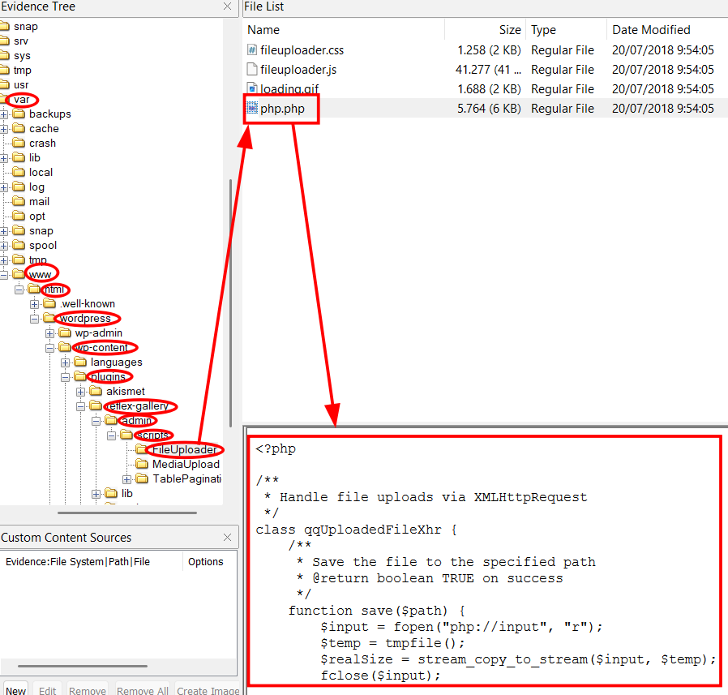
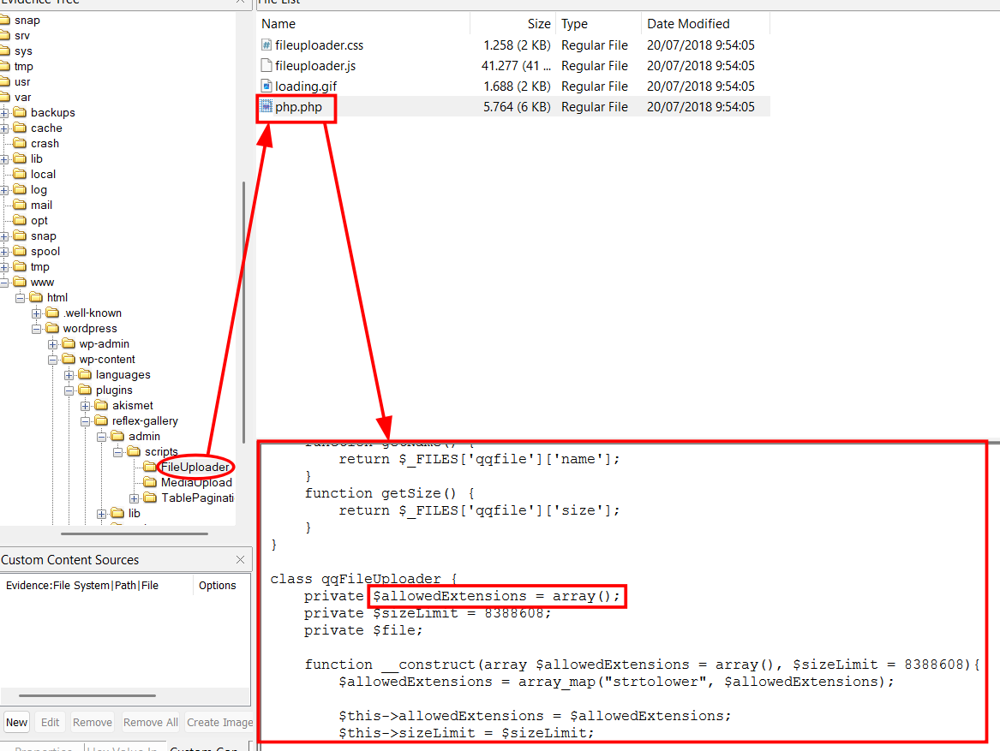
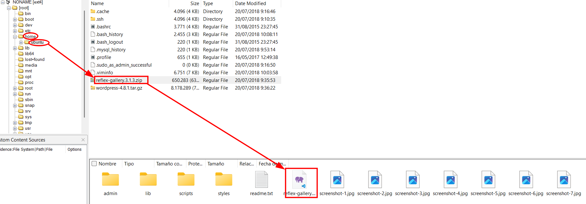
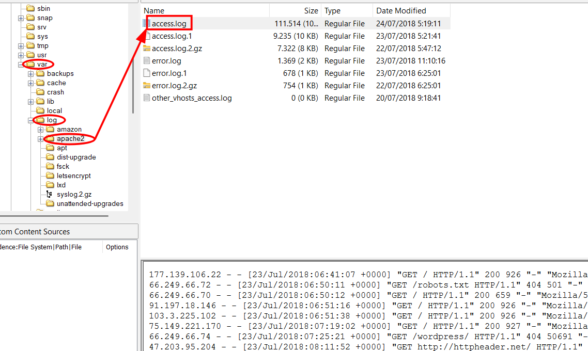

# Informe de Análisis Forense de Disco

## 1. Introducción
Este informe presenta los resultados del análisis forense realizado sobre el disco implicado en un incidente de seguridad. Se describen las evidencias encontradas, las vulnerabilidades detectadas y el posible impacto de las mismas.

---

## 2. Verificación de Integridad
Se realizó la verificación de hashes de los archivos relevantes para asegurar la integridad de las evidencias analizadas.

---

## 3. Hallazgos

### 3.1. Archivo del Plugin Vulnerable: Reflex Gallery
Se identificó un archivo comprimido correspondiente al plugin "Reflex Gallery". Este archivo contiene el código fuente que permitió el análisis de la vulnerabilidad explotada.

### 3.2. Código PHP Vulnerable
Se localizó el archivo PHP del plugin Reflex Gallery que permite la subida de archivos maliciosos, como una reverse shell, debido a la falta de controles adecuados.

#### Hallazgo: Falta de Sanitización
En el análisis del código se detectó la ausencia de sanitización en los datos recibidos, lo que facilita la explotación de la vulnerabilidad por parte de un atacante.

---

## 4. Registros de Eventos

### 4.1. Error Log
Se adjunta el registro de errores (errorlog), donde se evidencian intentos de explotación y posibles fallos del sistema relacionados con el plugin vulnerable.

### 4.2. Access Log
Se incluye el registro de accesos (accesslog), que muestra las conexiones realizadas al sistema y resulta útil para el análisis de la intrusión.

### 4.3. Archivos PHP subidos en uploads de WordPress

Durante el análisis de la carpeta `wp-content/uploads` se identificaron varios archivos PHP subidos de forma no autorizada. Al inspeccionar su contenido, se observó que no contienen código malicioso típico (como webshells o backdoors), sino un bloque de texto que corresponde a una cabecera PGP firmada con metadatos de repositorios de Ubuntu.

Este hallazgo es inusual, ya que los archivos PHP subidos no ejecutan código, sino que parecen haber sido utilizados como señuelo, relleno o para ocultar actividad. Es posible que el atacante intentara evadir mecanismos de detección o simplemente probar la capacidad de subida de archivos.

### 4.4. Modificación del archivo index.html

Durante el análisis se detectó que el archivo `index.html` de la aplicación web fue modificado. Este tipo de alteración es característico de ataques de defacement, donde el atacante sustituye o altera la página principal para mostrar mensajes, imágenes o simplemente para evidenciar el compromiso del sistema.

---
