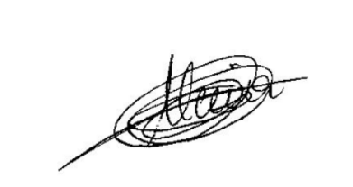
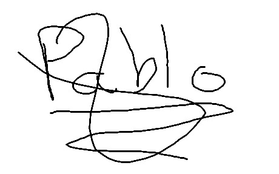

# Estructura del informe

Este documento define la **estructura** y el **orden** de los apartados del informe.

## Índice

1. [Juramento y declaración de abstención y tacha](#1-juramento-y-declaración-de-abstención-y-tacha)
2. [Palabras clave](#2-palabras-clave)
3. [Índice de figuras](#3-índice-de-figuras)
4. [Resumen ejecutivo](#4-resumen-ejecutivo)
5. [Introducción](#5-introducción)
	1. [Antecedentes](#51-antecedentes)
	2. [Objetivos](#52-objetivos)
6. [Fuentes de información](#6-fuentes-de-información)
	1. [Comprobación de hashes (SHA-256)](#61-comprobación-de-hashes-sha-256)
	2. [Adquisición de evidencias](#62-adquisición-de-evidencias)
7. [Análisis](#7-análisis)
	1. [Herramientas utilizadas](#71-herramientas-utilizadas)
	2. [Procesos](#72-procesos)
		1. [Análisis de XXX](#721-análisis-de-xxx)
		2. [Análisis de YYY](#722-análisis-de-yyy)
8. [Limitaciones](#8-limitaciones)
9. [Conclusiones](#9-conclusiones)
10. [Anexo 1. Sobre el perito](#10-anexo-1-sobre-el-perito)
11. [Anexo 2. Sumas de verificación](#11-anexo-2-sumas-de-verificación)
12. [Anexo 3. Otras necesidades](#12-anexo-3-otras-necesidades)

---

## 1. Juramento y declaración de abstención y tacha

Los peritos abajo firmantes manifiestan, bajo juramento o promesa de decir verdad, que han actuado y actuarán con la mayor objetividad posible, considerando tanto lo que pueda favorecer como lo que pueda perjudicar a cualquiera de las partes. Asimismo, declaran conocer las sanciones penales en las que podrían incurrir si incumplen su deber como peritos.

En cumplimiento de las mejores prácticas y estándares de la industria, los peritos declaran expresamente:

- Que no existe conflicto de interés alguno que pueda comprometer la objetividad del presente informe.
- Que no tienen parentesco, vínculo matrimonial o situación de hecho asimilable con ninguna de las partes, ni con sus abogados o procuradores.
- Que no tienen interés directo ni indirecto en el objeto del pleito ni en su resolución.
- Que no han prestado servicios profesionales anteriormente a ninguna de las partes en relación directa con este caso.

## 2. Palabras clave

## 3. Índice de figuras

## 4. Resumen ejecutivo

Este informe detalla la investigación de un incidente de seguridad en un servidor web **Apache**. Se identificó una vulnerabilidad de **inyección de comandos** en el archivo `ping.php`, explotada por un atacante desde la IP **192.168.1.6**. El acceso no autorizado permitió comprometer el servidor de la compañía (**192.168.1.28**).

El ataque resultó en la exfiltración del contenido del archivo `/etc/passwd`, almacenado en un nuevo archivo `passwd.txt`. La investigación documenta el método de ataque, los datos comprometidos y la evidencia de que el archivo original no fue modificado. Se concluye que el atacante logró acceso no autorizado al servidor, comprometiendo la seguridad de la información almacenada en él.

## 5. Introducción

### 5.1. Antecedentes

La organización detectó indicios de **actividad anómala y posible salida de información** desde un servidor Linux corporativo (**192.168.1.28**).

Para esclarecer los hechos, se ha llevado a cabo una investigación basada en las adquisiciones facilitadas (imagen de almacenamiento y volcado de memoria), complementada con el análisis de artefactos del sistema (registros de distintos servicios, procesos en ejecución y cadenas recuperadas en memoria).

### 5.2. Objetivos

Los objetivos de este informe forense son:

- Identificar la **vulnerabilidad** explotada en la aplicación web y explicar su mecanismo (inyección de comandos).
- Determinar la **IP de origen**, el **cliente (User-Agent)** y el **sistema operativo** empleado por el atacante a partir de evidencias de red y registros.
- Verificar qué **datos fueron exfiltrados** y por qué canal/servicio se produjo la salida.
- Explicar por qué el **archivo original** objeto del robo (p. ej., un fichero del sistema) puede no reflejar cambios en sus marcas de tiempo durante el incidente.
- Proponer **medidas de reparación y mitigación** para evitar recurrencias (validación/saneamiento de entradas, hardening y controles de registro/monitorización).

## 6. Fuentes de información

### 6.1. Comprobación de hashes (SHA-256)

| Archivo | Hash SHA-256 original | Hash SHA-256 verificado |
|---|---|---|
| perfil_memoria.zip | `18b30b973223b8ab233aa1581bccd35bef6c678b29e671b3fe3a7ee5ea24b076` | `18b30b973223b8ab233aa1581bccd35bef6c678b29e671b3fe3a7ee5ea24b076` |
| captura_ram.lime.zip | `632d3d95260753029d7c9ade15e0dcab69b8fe7eb08d7001d9f923b22ddf003f` | `632d3d95260753029d7c9ade15e0dcab69b8fe7eb08d7001d9f923b22ddf003f` |
| imagen_disco.dd.zip | `b0189203fa682fd086ed3c52a3723ac46ab896a2fb8e4daf49ed6228bc7d3b76` | `b0189203fa682fd086ed3c52a3723ac46ab896a2fb8e4daf49ed6228bc7d3b76` |
| captura_ram.live | `0f5d751208b08450e298b8d27f22451dd2ae158dfc1cb80b974f360e9a88ff05` | `0f5d751208b08450e298b8d27f22451dd2ae158dfc1cb80b974f360e9a88ff05` |
| image_disco.dd | `9f2b2dace6cfebec1b6f956fc231e199c00f39e05d50286b8f284043537d65d9` | `9f2b2dace6cfebec1b6f956fc231e199c00f39e05d50286b8f284043537d65d9` |

### 6.2. Adquisición de evidencias

## 7. Análisis

### 7.1. Herramientas utilizadas

### 7.2. Procesos

#### 7.2.1. Análisis de XXX

#### 7.2.2. Análisis de YYY

## 8. Limitaciones

## 9. Conclusiones

## 10. Anexo 1. Sobre el perito

Los peritos responsables de este informe son:

- Carlos Alcina  
	Titulación: Técnico Superior en Desarrollo de Aplicaciones Multiplataforma (DAM)  
	Correo: calcrom0607@g.educaand.es

- Pablo González  
	Titulación: Técnico Superior en Desarrollo de Aplicaciones Multiplataforma (DAM) y Técnico Superior en Desarrollo de Aplicaciones Web (DAW)  
	Correo: pablo.gonzalez@g.educaand.es

- Luis Carlos Romero  
	Titulación: Técnico Superior en Desarrollo de Aplicaciones Web (DAW)  
	Correo: luiscarlos.romero@g.educaand.es

## 11. Anexo 2. Sumas de verificación

## 12. Anexo 3. Otras necesidades

---

**Firmas:**

**Carlos Alcina**

**Pablo González**

**Luis Carlos Romero**

Fecha: 14/04/2026
