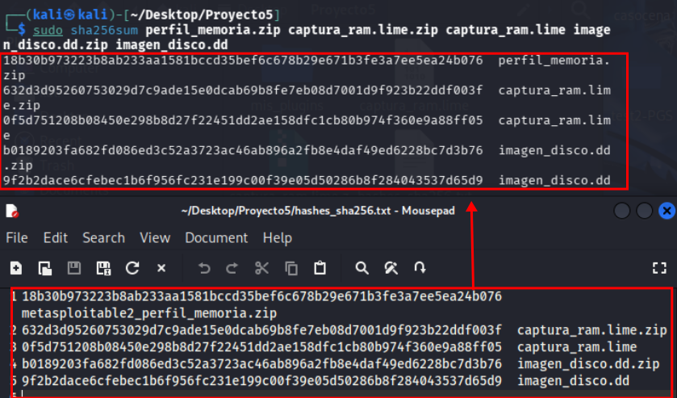

# Proyecto 5: Incident on Linux Server I

## Índice

1. [Juramento y declaración de abstención](#1-juramento-y-declaración-de-abstención)
2. [Palabras clave](#2-palabras-clave)
3. [Índice de figuras](#3-índice-de-figuras)
4. [Resumen ejecutivo](#4-resumen-ejecutivo)
5. [Introducción](#5-introducción)
   1. [Antecedentes](#51-antecedentes)
   2. [Objetivos](#52-objetivos)
6. [Fuentes de información](#6-fuentes-de-información)
   1. [Comprobación de hashes (SHA-256)](#61-comprobación-de-hashes-sha-256)
   2. [Adquisición de hallazgos](#62-adquisición-de-hallazgos)
7. [Análisis](#7-análisis)
   1. [Herramientas utilizadas](#71-herramientas-utilizadas)
   2. [Procesos](#72-procesos)
      1. [Análisis de memoria RAM](#721-análisis-de-memoria-ram)
      2. [Análisis de imagen de disco](#722-análisis-de-imagen-de-disco)
8. [Limitaciones](#8-limitaciones)
9. [Conclusiones](#9-conclusiones)
10. [Anexo 1. Sobre el perito](#10-anexo-1-sobre-el-perito)
11. [Anexo 2. Cadena de custodia](#11-anexo-2-cadena-de-custodia)
12. [Anexo 3. Sumas de verificación](#12-anexo-3-sumas-de-verificación)
13. [Anexo 4. Otras necesidades](#13-anexo-4-otras-necesidades)

---

## 1. Juramento y declaración de abstención

Los peritos abajo firmantes manifiestan, bajo juramento o promesa de decir verdad, que han actuado y actuarán con la mayor objetividad posible, considerando tanto lo que pueda favorecer como lo que pueda perjudicar a cualquiera de las partes. Asimismo, declaran conocer las sanciones penales en las que podrían incurrir si incumplen su deber como peritos.

En cumplimiento de las mejores prácticas y estándares de la industria, los peritos declaran expresamente:

- Que no existe conflicto de interés alguno que pueda comprometer la objetividad del presente informe.
- Que no tienen parentesco, vínculo matrimonial o situación de hecho asimilable con ninguna de las partes, ni con sus abogados o procuradores.
- Que no tienen interés directo ni indirecto en el objeto del pleito ni en su resolución.
- Que no han prestado servicios profesionales anteriormente a ninguna de las partes en relación directa con este caso.

## 2. Palabras clave

- **Hash (SHA-256):** huella criptográfica usada para comprobar integridad; si el hash cambia, el contenido ha cambiado.
- **Imagen de disco (`.dd`):** copia bit a bit de un soporte/partición; permite analizar el sistema de archivos sin modificar el original.
- **Volcado de memoria (RAM dump):** captura del contenido de la memoria en un instante; puede contener procesos, conexiones y comandos que no quedan persistidos en disco.
- **MAC time:** conjunto de marcas de tiempo de un fichero: **M**odified (modificación), **A**ccessed (acceso), **C**hanged (cambio de metadatos/permisos).
- **Timeline (línea de tiempo):** correlación temporal de eventos y artefactos (MAC time, logs, ejecución de procesos) para reconstruir la secuencia del incidente.
- **Log / registro:** fichero de eventos generado por un servicio (p. ej., Apache o Samba) que permite atribución técnica y reconstrucción de actividad.
- **Apache `access.log`:** registro de peticiones HTTP; incluye IP origen, recurso solicitado, código de respuesta y a menudo el **User-Agent**.
- **User-Agent:** cadena que identifica el cliente que realiza la petición web (navegador/versión y, en muchos casos, sistema operativo).
- **Inyección de comandos (Command Injection):** vulnerabilidad donde entrada del usuario se concatena a una orden del sistema sin validación/escape, permitiendo ejecutar comandos arbitrarios.
- **RCE (Remote Code Execution):** capacidad de ejecutar código/comandos en el servidor remotamente; en este caso se materializa a través de la inyección en `ping.php`.
- **Payload:** parte “activa” del ataque (cadena/comando) diseñada para conseguir un efecto concreto (lectura de ficheros, creación de artefactos, etc.).
- **Encadenamiento de comandos (`&&`, `;`, `|`):** operadores de shell que permiten ejecutar órdenes adicionales; son indicadores típicos en inyecciones.
- **Redirección de salida (`>`):** operador de shell que vuelca la salida de un comando a un fichero; puede usarse para crear archivos con datos exfiltrados.
- **Exfiltración:** salida no autorizada de información desde el sistema comprometido hacia un tercero.
- **SMB / Samba:** protocolo y servicio de compartición de ficheros en red; en Linux suele estar gestionado por el proceso `smbd`.
- **smbd:** daemon/proceso de Samba que gestiona conexiones SMB; una conexión establecida puede indicar transferencia de ficheros.
- **Antiforense (acción antiforense):** técnica para dificultar la investigación (p. ej., borrado/vaciado de logs o eliminación de rastros).

## 3. Índice de figuras

## 4. Resumen ejecutivo

Este informe detalla la investigación de un incidente de seguridad en un servidor web **Apache**. Se identificó una vulnerabilidad de **inyección de comandos** en el archivo `ping.php`, explotada por un atacante desde la IP **192.168.1.6**. El acceso no autorizado permitió comprometer el servidor de la compañía (**192.168.1.28**).

El ataque resultó en la exfiltración del contenido del archivo `/etc/passwd`, almacenado en un nuevo archivo `passwd.txt`. La investigación documenta el método de ataque, los datos comprometidos y la evidencia de que el archivo original no fue modificado. Se concluye que el atacante logró acceso no autorizado al servidor, comprometiendo la seguridad de la información almacenada en él.

## 5. Introducción

### 5.1. Antecedentes

La organización detectó indicios de **actividad anómala y posible salida de información** desde un servidor Linux corporativo (**192.168.1.28**).

Para esclarecer los hechos, se ha llevado a cabo una investigación basada en las adquisiciones facilitadas (imagen de almacenamiento y volcado de memoria), complementada con el análisis de artefactos del sistema (registros de distintos servicios, procesos en ejecución y cadenas recuperadas en memoria).

### 5.2. Objetivos

Los objetivos de este informe forense son:

- Identificar la **vulnerabilidad** explotada en la aplicación web y explicar su mecanismo (inyección de comandos).
- Determinar la **IP de origen**, el **cliente (User-Agent)** y el **sistema operativo** empleado por el atacante a partir de evidencias de red y registros.
- Verificar qué **datos fueron exfiltrados** y por qué canal/servicio se produjo la salida.
- Explicar por qué el **archivo original** objeto del robo (p. ej., un fichero del sistema) puede no reflejar cambios en sus marcas de tiempo durante el incidente.
- Proponer **medidas de reparación y mitigación** para evitar recurrencias (validación/saneamiento de entradas, hardening y controles de registro/monitorización).

## 6. Fuentes de información

### 6.1. Comprobación de hashes (SHA-256)

| Archivo              | Hash SHA-256 original                                              | Hash SHA-256 verificado                                            |
| -------------------- | ------------------------------------------------------------------ | ------------------------------------------------------------------ |
| perfil_memoria.zip   | `18b30b973223b8ab233aa1581bccd35bef6c678b29e671b3fe3a7ee5ea24b076` | `18b30b973223b8ab233aa1581bccd35bef6c678b29e671b3fe3a7ee5ea24b076` |
| captura_ram.lime.zip | `632d3d95260753029d7c9ade15e0dcab69b8fe7eb08d7001d9f923b22ddf003f` | `632d3d95260753029d7c9ade15e0dcab69b8fe7eb08d7001d9f923b22ddf003f` |
| imagen_disco.dd.zip  | `b0189203fa682fd086ed3c52a3723ac46ab896a2fb8e4daf49ed6228bc7d3b76` | `b0189203fa682fd086ed3c52a3723ac46ab896a2fb8e4daf49ed6228bc7d3b76` |
| captura_ram.lime     | `0f5d751208b08450e298b8d27f22451dd2ae158dfc1cb80b974f360e9a88ff05` | `0f5d751208b08450e298b8d27f22451dd2ae158dfc1cb80b974f360e9a88ff05` |
| image_disco.dd       | `9f2b2dace6cfebec1b6f956fc231e199c00f39e05d50286b8f284043537d65d9` | `9f2b2dace6cfebec1b6f956fc231e199c00f39e05d50286b8f284043537d65d9` |

## 7. Análisis

### 7.1. Herramientas utilizadas

| Herramienta                             | Uso en la investigación                                                                                                                                                                                                                          |
| --------------------------------------- | ------------------------------------------------------------------------------------------------------------------------------------------------------------------------------------------------------------------------------------------------ |
| Volatility (Framework v2.6)             | Análisis forense avanzado de memoria RAM. Utilizado para extraer el historial de comandos (`linux_bash`), conexiones de red activas (`linux_netstat`), procesos (`linux_pstree`) y archivos abiertos (`linux_lsof`) en el momento del incidente. |
| FTK Imager                              | Herramienta para el análisis forense de discos y volúmenes. Permite examinar y extraer artefactos, generar líneas de tiempo (MAC times) y visualizar evidencias sin alterarlas.                                                                  |
| Comandos de gestión de archivos (Linux) | Comandos como `unzip`, `mkdir` y `cp`, utilizados en Kali Linux para preparar el entorno forense (descompresión y carga manual de evidencias, por ejemplo perfiles `.zip` para Volatility).                                                      |
| Comandos de exploración nativos         | Comandos como `cat` y `ls -la`, usados para inspección directa de evidencias en disco (p. ej., comprobar el estado de `/var/log/samba/log.192.168.1.6` o revisar permisos de rutas web).                                                         |
| `grep`                                  | Filtrado de texto y búsqueda de indicadores/artefactos concretos en evidencias o salidas de herramientas.                                                                                                                                        |
| `strings`                               | Extracción de cadenas legibles desde volcados binarios (p. ej., memoria) para localizar indicadores.                                                                                                                                             |
| `sha256sum`                             | Cálculo y verificación de integridad mediante hashes SHA-256 de las evidencias adquiridas.                                                                                                                                                       |

### 7.2. Procesos

En este apartado se documenta la metodología seguida para el análisis de las dos fuentes principales de evidencia: **memoria RAM** (volcado `captura_ram.lime`) e **imagen de disco** (`image_disco.dd`).

Durante todo el proceso se ha trabajado **sobre copias** de las evidencias y se ha comprobado la **integridad** mediante SHA-256 (ver sección 6.1 y anexo de sumas). Las capturas de pantalla y extractos más relevantes se incluyen como anexos para respaldar los hallazgos.

Para la **presentación de hallazgos**, en cada vestigio se ha documentado: **ruta de localización**, **descripción del contenido**, **MAC time**, **tamaño lógico** y **valor hash** (cuando aplica), referenciando la evidencia visual correspondiente en anexos.

#### Línea de tiempo del incidente

La siguiente tabla resume la secuencia del incidente según las evidencias existentes (IP origen **192.168.1.6**). En aquellos hallazgos donde no existe marca temporal directa en dicha figura, se mantiene el valor **N/D**.

| Orden | Fecha/hora (según evidencia) | Evento / hallazgo                                                                                                                          |
| ----: | ---------------------------- | ------------------------------------------------------------------------------------------------------------------------------------------ |
|     1 | 11:04:48                     | Accesos no autorizados detectados en múltiples intentos de conexión SSH.                                                                   |
|     2 | 11:05:21                     | Conexión SSH establecida correctamente.                                                                                                    |
|     3 | 11:06:13                     | Copia del archivo `ping.php` al directorio `/var/www/`.                                                                                    |
|     4 | 11:07:12                     | Apertura/edición del archivo `ping.php` mediante el editor `nano`.                                                                         |
|     5 | 11:09:53                     | Recepción de múltiples solicitudes POST HTTP al recurso `/ping.php`.                                                                       |
|     6 | 11:09:53                     | Evidencia del payload con encadenamiento de comandos y redirección a `passwd.txt` (extracción de `/etc/passwd`).                           |
|     7 | 15:09:37                     | Última modificación del archivo `ping.php`.                                                                                                |
|     8 | 15:13:49                     | Última modificación del archivo `passwd.txt`.                                                                                              |
|     9 | N/D                          | Sesión **SMB** establecida asociada a `smbd` entre **192.168.1.28** y **192.168.1.6**, consistente con canal de transferencia de datos.    |
|    10 | N/D                          | El fichero `/var/log/samba/log.192.168.1.6` aparece con **0 bytes**, consistente con vaciado/limpieza de log |

#### 7.2.1. Análisis de memoria RAM

El análisis de memoria se orientó a identificar **actividad en ejecución**, **conexiones de red** y **rastros de comandos/payloads** que no necesariamente quedan reflejados en disco.

1. **Preparación y validación**
   - Se verificó el hash de `captura_ram.lime` y de sus contenedores comprimidos.
   - Se utilizó Volatility Framework (perfil Linux proporcionado para el caso) para poder ejecutar plugins Linux de forma consistente.
2. **Enumeración inicial del sistema en memoria**
   - Se revisaron procesos y servicios relevantes para el caso (Apache y Samba), así como puertos en escucha y conexiones activas.
3. **Identificación de conexiones de red relevantes (SMB)**
   - Se localizaron conexiones establecidas hacia el puerto SMB, asociadas al proceso `smbd`.
   - Evidencia: conexión TCP entre el servidor (**192.168.1.28**) y el atacante (**192.168.1.6**) (ver `img/Anexo_4.png` y `img/Anexo_6.png`).
4. **Recuperación de historial de comandos (traza de terminal)**
   - Se extrajo el historial de comandos en memoria para reconstruir acciones realizadas durante la ventana del incidente.
   - Evidencia: aparición del comando de edición del fichero web (`sudo nano /var/www/ping.php`) (ver `img/Anexo_7.png`).
5. **Búsqueda de indicadores y cadenas en memoria (payloads)**
   - Se realizaron búsquedas de texto/indicadores en memoria para localizar rastros de la inyección.
   - Evidencia: cadena compatible con el encadenamiento de comandos y redirección a `passwd.txt` (ver `img/Anexo_3.png`).
6. **Documentación y anexos**
   - Los resultados (salidas relevantes y capturas) se consolidaron como anexos para su trazabilidad en el informe.

#### 7.2.2. Análisis de imagen de disco

El análisis de disco se centró en localizar **artefactos persistentes**: código vulnerable, registros del sistema y evidencias de actividad del atacante.

1. **Apertura de la imagen y trabajo en modo solo lectura**
   - Se verificó el hash de `image_disco.dd` (sección 6.1) y se analizó la imagen en modo de solo lectura.
   - Se extrajeron metadatos de los ficheros de interés (MAC time, tamaño lógico) para su documentación posterior.
2. **Localización y revisión del recurso web vulnerable**
   - Se localizó el fichero `/var/www/ping.php` y se revisó su contenido para validar el origen de la vulnerabilidad.
   - Evidencia: uso de llamada al sistema con entrada controlada por el usuario sin validación estricta (ver `hallazgos/ping.png` y `img/Anexo_2.png`).
3. **Correlación con registros web (Apache)**
   - Se analizaron los logs de Apache (p. ej., `/var/log/apache2/access.log`) filtrando por el recurso `ping.php` y la IP **192.168.1.6**.
   - Evidencia: peticiones hacia `ping.php` desde la IP del atacante y User-Agent que identifica cliente y sistema operativo (ver `img/Anexo_1.png`).
4. **Revisión de rastros del servicio Samba (SMB)**
   - Se revisaron los logs del servicio Samba, especialmente el fichero de log por IP.
   - Evidencia: existencia de `/var/log/samba/log.192.168.1.6` con **tamaño 0 bytes**, compatible con un borrado/limpieza del registro (ver `img/Anexo_5.png`).
5. **Búsqueda de artefactos de exfiltración**
   - Se revisó el árbol de `/var/www/` y otros directorios relevantes en busca de ficheros generados durante el incidente (por ejemplo, volcados a texto accesibles por web), y se correlacionó con los indicadores obtenidos en RAM y con los accesos en los logs.
6. **Documentación y anexos**
   - Los extractos relevantes y capturas se referenciaron como anexos para justificar cada conclusión del análisis.

## 8. Limitaciones

### 8.1. Falta de registros detallados en Samba

La principal limitación de esta investigación es la ausencia de información en el archivo `/var/log/samba/log.192.168.1.6`, que tiene 0 bytes. La configuración por defecto de Samba solo se define la ruta y el tamaño máximo del log, pero no se especifica el nivel de registro (`log level`).

Por defecto, Samba utiliza `log level = 0`, lo que significa que no se almacena prácticamente ninguna información sobre las conexiones o actividades.

**Consecuencias de esta limitación:**

- No se puede determinar con exactitud qué otros archivos navegó o extrajo el atacante vía SMB.
- El alcance real de la exfiltración queda indeterminado — solo se confirma `/etc/passwd`, pero podrían existir otros archivos robados que no dejaron rastro.

### 8.2. Identificación limitada del atacante

La IP identificada como origen del ataque es 192.168.1.6, una dirección privada de red local (RFC 1918). Esto supone varias limitaciones:

- No es posible rastrear al atacante más allá del perímetro de la red interna.
- No se puede asegurar si 192.168.1.6 corresponde a la máquina real del atacante o a un equipo intermedio comprometido (pivote).
- La atribución definitiva del responsable requeriría el análisis forense del dispositivo físico con esa IP en el momento del incidente.

### 8.3. Alcance desconocido de la sesión SMB

Se confirma la existencia de una sesión SMB activa, pero debido a la falta de registros:

- No se puede reconstruir el árbol de directorios navegado ni el listado de archivos transferidos por el atacante.
- No se puede determinar si la sesión SMB fue utilizada también para subir herramientas adicionales al servidor (malware, scripts, etc.).

## 9. Conclusiones

## 10. Anexo 1. Sobre el perito

Los peritos responsables de este informe son:

- Carlos Alcina  
  Titulación: Técnico Superior en Desarrollo de Aplicaciones Multiplataforma (DAM)  
  Correo: calcrom0607@g.educaand.es

- Pablo González  
  Titulación: Técnico Superior en Desarrollo de Aplicaciones Multiplataforma (DAM) y Técnico Superior en Desarrollo de Aplicaciones Web (DAW)  
  Correo: pablo.gonzalez@g.educaand.es

- Luis Carlos Romero  
  Titulación: Técnico Superior en Desarrollo de Aplicaciones Web (DAW)  
  Correo: luiscarlos.romero@g.educaand.es

## 11. Anexo 2. Cadena de custodia

### 11.1. Información del caso

| Campo                 | Valor                                          |
| --------------------- | ---------------------------------------------- |
| Número de Caso        | 05                                             |
| Tipo de Investigación | Análisis forense de incidente de seguridad web |
| Fecha de Adquisición  | 13/04/2026                                     |
| Lugar de Adquisición  | C. Amiel, s/n, 11012 Barriada de la Paz, Cádiz |

### 11.2. Descripción del hallazgo en original

| Campo                                | Valor                                                              |
| ------------------------------------ | ------------------------------------------------------------------ |
| Tipo de Dispositivo                  | Imagen de disco (`image_disco.dd`)                                 |
| Hash del Hallazgo Original (SHA-256) | `9f2b2dace6cfebec1b6f956fc231e199c00f39e05d50286b8f284043537d65d9` |
| Tipo de Dispositivo                  | Volcado de memoria RAM (`captura_ram.lime`)                        |
| Hash del Hallazgo Original (SHA-256) | `0f5d751208b08450e298b8d27f22451dd2ae158dfc1cb80b974f360e9a88ff05` |
| Tipo de Dispositivo                  | Archivo `ping.php`                                                 |
| Hash del Hallazgo Original (SHA-1)   | `525132ce24328226594b0f97d0ef2d3f8b7a422e`                         |
| Tipo de Dispositivo                  | Archivo `passwd.txt`                                               |
| Hash del Hallazgo Original (SHA-1)   | `2d8c72a744c486342f5ec770ac27e8dd7b2f2ee0`                         |
| Tipo de Dispositivo                  | Archivo `access.log`                                               |
| Hash del Hallazgo Original (SHA-1)   | `640b5541fb9d263389b923ad786701ab149f84f9`                         |

### 11.3. Preservación del hallazgo original

| Campo                   | Valor                                          |
| ----------------------- | ---------------------------------------------- |
| Fecha de Entrega        | 13/04/2026                                     |
| Hora de Entrega         | 9:00                                           |
| Recibido por            | Manuel Jesús Rivas Sández                      |
| Ubicación en el Juzgado | C. Amiel, s/n, 11012 Barriada de la Paz, Cádiz |

### 11.4. Creación y verificación de copias

| Campo                      | Valor                                                              |
| -------------------------- | ------------------------------------------------------------------ |
| Fecha y Hora de Creación   | 14/04/2026 , 10:15                                                 |
| Técnico Responsable        | Carlos Alcina Romero                                               |
| Hash de la Copia (SHA-256) | `9f2b2dace6cfebec1b6f956fc231e199c00f39e05d50286b8f284043537d65d9` |
| Verificación de Integridad | Sí                                                                 |
| Entregado a                | Manuel Jesús Rivas Sánchez                                         |
| Fecha y Hora de Entrega    | 14/04/2026, 12:00                                                  |

### 11.5. Registro de accesos y verificaciones

| Campo                      | Valor                                                              |
| -------------------------- | ------------------------------------------------------------------ |
| Fecha y Hora               | 21/03/2025, 19:50                                                  |
| Propósito                  | Análisis de hallazgos                                              |
| Técnico                    | Luis Carlos Romero                                                 |
| Hash Verificado (SHA-256)  | `9f2b2dace6cfebec1b6f956fc231e199c00f39e05d50286b8f284043537d65d9` |
| Verificación de Integridad | Sí                                                                 |

## 12. Anexo 3. Sumas de verificación

## 13. Anexo 4. Otras necesidades

### 12.1. Índice de hallazgos

| Ruta | Contenido | MAC | Tamaño (bytes) | HASH MD5 | HASH SHA1 |
|------|-----------|--------------|---------------|----------|-----------|
| /root/var/www/ping.php | ping.php | 20/05/2022 15:09:37 | 542 | d3f424335dac2d8af26ad3f0a99a1a7d | 525132ce24328226594b0f97d0ef2d3f8b7a422e |
| /root/var/www/passwd.txt | passwd.txt | 20/05/2022 15:13:49 | 1626 | 7cd7b33f99cc526d01473b553e1042d5 | 2d8c72a744c486342f5ec770ac27e8dd7b2f2ee0 |
| /root/var/log/apache2/access.log | access.log | 20/05/2022 15:21:03 | 3494 | a71e80bd1ad541352d5907628f1bb3ce | 640b5541fb9d263389b923ad786701ab149f84f9 |
| /root/var/log/samba/log.192.168.1.6 | log.192.168.1.6 | 20/05/2022 15:03:03 | 0 | 620f0b67a91f7f74151bc5be745b7110 | 1ceaf73df40e531df3bfb26b4fb7cd95fb7bff1d |
| /root/var/log/samba/log.kali | log.kali | 15:03:03 | 0 | 620f0b67a91f7f74151bc5be745b7110 | 1ceaf73df40e531df3bfb26b4fb7cd95fb7bff1d |

<table>
	<thead>
		<tr>
			<th>Nombre y Apellidos</th>
			<th>Cargo / Titulación</th>
			<th>Firma</th>
			<th>Fecha</th>
		</tr>
	</thead>
	<tbody>
		<tr>
			<td>Carlos Alcina</td>
			<td>Técnico Superior en Desarrollo de Aplicaciones Multiplataforma (DAM)</td>
			<td></td>
			<td>14/04/2026</td>
		</tr>
		<tr>
			<td>Pablo González</td>
			<td>Técnico Superior en Desarrollo de Aplicaciones Multiplataforma (DAM) y Técnico Superior en Desarrollo de Aplicaciones Web (DAW)</td>
			<td></td>
			<td>14/04/2026</td>
		</tr>
		<tr>
			<td>Luis Carlos Romero</td>
			<td>Técnico Superior en Desarrollo de Aplicaciones Web (DAW)</td>
			<td></td>
			<td>14/04/2026</td>
		</tr>
	</tbody>
</table>
