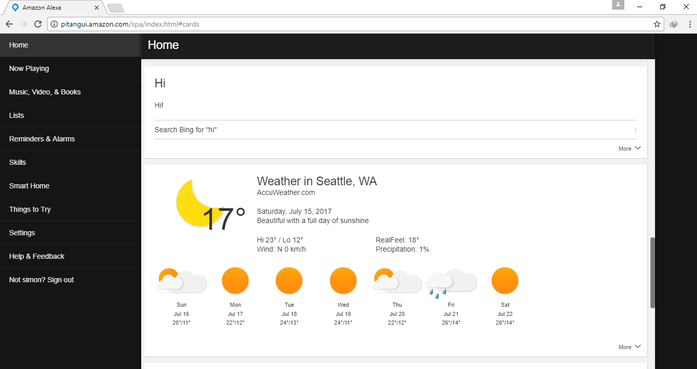
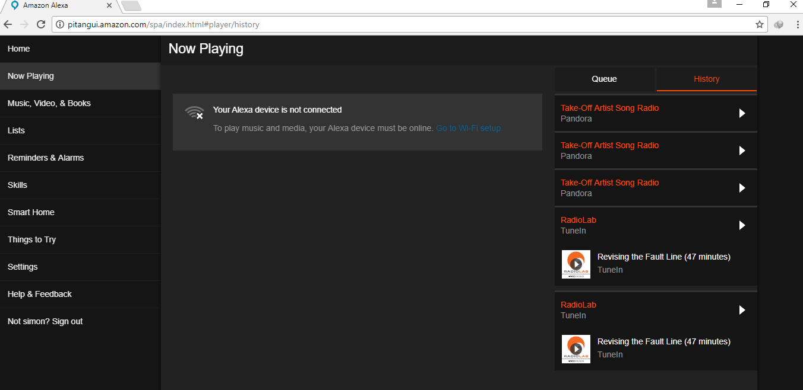

# Informe Forense — Amazon Echo (Alexa)
**Caso:** Proyecto 9 — Murder Investigation  
**Fecha del crimen:** 17 de julio de 2017  
**Analista:** Pablo González Silva  
**Fecha del análisis:** 11 de mayo de 2026

---

## 1. Cadena de custodia y verificación de integridad

| Campo | Valor |
|---|---|
| Archivo analizado | `Alexa.zip` |
| SHA-256 | `6c09813eea5475dc0011c547e7fb774cfbd7216cafdeeb9a8308306046c14edf` |
| MD5 | `93639c62f68c5155611bbd7e8eb3f477` |
| Contenido | 18 archivos WAV + 18 archivos JSON + carpeta `Alexa screenshot` + `json and audio api.txt` |

Los hashes se calcularon sobre el archivo comprimido original antes de su extracción, garantizando la integridad de la evidencia. Cualquier modificación posterior al archivo produciría valores distintos, invalidando la cadena de custodia.

---

## 2. Identificación del dispositivo

| Campo | Valor |
|---|---|
| Dispositivo | Amazon Echo (1.ª generación) |
| Device Type | `AB72C64C86AW2` |
| Número de serie | `B0F00715535302W5` |
| Customer ID | `A32TRBM6QOXJ5H` |
| Usuario registrado | **Not simon** (aviso de sesión en capturas: *"Not simon? Sign out"*) |
| Zona horaria configurada | Seattle, WA (UTC-7) → los eventos del caso ocurren en UTC+9 (Corea del Sur) |

> **Nota sobre zonas horarias:** Los timestamps de los JSON están en Unix epoch (milisegundos). Al convertirlos a UTC+9 corresponden al 17 de julio de 2017 entre las 11:57 y las 15:20. La interfaz web de Amazon Alexa mostraba hora de Seattle (UTC-7), lo que puede inducir a confusión al leer las capturas de pantalla directamente.

---

## 3. Dispositivos SmartHome vinculados a Alexa

Obtenidos de la captura de pantalla de `Smart Home → Devices`:

| Dispositivo | Tipo | Ubicación |
|---|---|---|
| **TV** | SmartThings Outlet | — |
| **Living Room** | Nest Thermostat | Living Room in **hallymhome** |

El nombre del hogar SmartThings es `hallymhome`, consistente con el apellido de la víctima (Hallym Betty). Esto confirma que la cuenta de Alexa está vinculada al hogar de la víctima y al ecosistema SmartThings controlado desde el móvil del marido.

### Escenas SmartThings disponibles

Obtenidas de la captura `Smart Home → Scenes`:

| Escena | Tipo |
|---|---|
| IAmBack | SmartThings Routine |
| Goodbye! | SmartThings Routine |
| Good Night! | SmartThings Routine |
| Good Morning! | SmartThings Routine |
| Good Morning! (Offline) | SmartThings Routine |
| Good Night! (Offline) | SmartThings Routine |
| Goodbye! (Offline) | SmartThings Routine |
| IAmBack (Offline) | SmartThings Routine |

La existencia de rutinas `IAmBack` y `Goodbye!` indica que el sistema estaba programado para registrar entradas y salidas del hogar. Estas rutinas son forenses­mente relevantes: si se activaron el 17 de julio, los registros del hub SmartThings mostrarían quién entró o salió y a qué hora.

---

## 4. Historial de reproducción (Now Playing → History)

Obtenido de la captura de `pitangui.amazon.com/spa/index.html#player/history`:

| Orden | Contenido | Servicio |
|---|---|---|
| 1 | Take-Off Artist Song Radio | Pandora |
| 2 | Take-Off Artist Song Radio | Pandora |
| 3 | Take-Off Artist Song Radio | Pandora |
| 4 | RadioLab | TuneIn |
| 5 | RadioLab — *Revising the Fault Line* (47 min) | TuneIn |
| 6 | RadioLab — *Revising the Fault Line* (47 min) | TuneIn |

**Nota:** Al momento de capturar la pantalla, el dispositivo aparecía como **"not connected"** (*"Your Alexa device is not connected"*). Esto es consistente con que el Echo fue desconectado de la red tras el crimen o durante el aseguramiento de la escena.

La estación `Take-Off Artist Song Radio` de Pandora corresponde a la activación registrada en el JSON 9 a las **15:06:06 UTC+9** del día del crimen.

---

## 5. Historial de tarjetas (Home → Cards)

Las capturas de la sección Home muestran el historial de interacciones en orden cronológico inverso:

| Consulta registrada | Respuesta de Alexa | Observaciones |
|---|---|---|
| *"who yes"* | Información sobre la banda de rock **Yes** | Última interacción registrada — 15:20:34 UTC+9 |
| *"Turn on take of farted song video"* | No encontrado | Transcripción errónea de "Turn on Take-Off Artist Song Radio" |
| Pandora Station | Browse Pandora | Activación de música — 15:06:06 UTC+9 |
| Alarm — **Jul 13, 2017, 8:00 AM** | — | Alarma configurada 4 días antes del crimen |
| *"How old are you?"* | Respuesta humorística de Alexa | Interacción previa al crimen |
| Coca-Cola (Wikipedia) | Información sobre Coca-Cola | Interacción previa |
| *"When is when is the coca cola from?"* | No encontrado | Transcripción errónea por ruido de fondo |
| RadioLab (TuneIn) | Estación en directo | Interacción previa al crimen |
| *"Hi"* | *"Hi!"* | Interacción previa |
| Weather in **Seattle, WA** — Sat Jul 15 | 17°C, soleado | Consulta 2 días antes del crimen |
| Weather in **Seattle, WA** — Wed Jul 12 | 64°F / 23°C | Consulta 5 días antes del crimen |
| *"Turn on"* | *"Sorry, I'm not sure what you meant"* | Comando incompleto |

> **Hallazgo:** La ubicación configurada en Alexa es **Seattle, WA**, no Corea del Sur donde ocurrió el crimen. Esto sugiere que la cuenta de Amazon fue creada o configurada en EE.UU., o que la dirección de la cuenta no fue actualizada tras la mudanza a Corea.

---

## 6. Análisis de los archivos JSON — Línea temporal completa

Cada interacción con Alexa genera dos registros JSON: uno con solo el wake word ("alexa") y otro con el comando completo. Los pares están numerados de mayor a menor timestamp (el JSON 1 es el más reciente).

| Hora (UTC+9) | JSON | Estado | Comando / Evento |
|---|---|---|---|
| 11:57:35 | 14 | INVALID | *"alexa kinda patton a.m. next monday"* — no reconocido |
| 12:07:00 | 15 | DISCARDED¹ | Sonido ambiente captado — no dirigido al dispositivo |
| 14:31:04 | 16 | DISCARDED¹ | Sonido ambiente captado — no dirigido al dispositivo |
| 14:45:29 | 17 | SUCCESS | Wake word "Alexa" |
| **14:45:31** | **13** | **SUCCESS** | **"Wake up" → "Good Morning! Today is National Ice Cream Day"** |
| 14:45:43 | 18 | SUCCESS | "Alexa stop" |
| 15:01:54 | 12 | SUCCESS | Wake word "Alexa" |
| **15:01:55** | **11** | **SUCCESS** | **"Turn on TV" → TV encendida** |
| 15:06:03 | 10 | SUCCESS | Wake word "Alexa" |
| **15:06:06** | **9** | **SUCCESS** | **"Turn on Pandora" → Pandora Station activada** |
| **15:12:39** | **8** | **SUCCESS** | **"Alexa how could you do this what are the flooding"** ⚠️ |
| 15:12:58 | 6 | SUCCESS | Wake word "Alexa" |
| **15:13:02** | **5** | **SUCCESS** | **"Stop"** |
| 15:20:05 | 4 | SUCCESS | Wake word "Alexa" |
| **15:20:07** | **3** | **SUCCESS** | **"Turn off TV" → TV apagada** |
| 15:20:32 | 2 | SUCCESS | Wake word "Alexa" |
| **15:20:34** | **1** | **SUCCESS** | **"Who is Yes?" → información sobre la banda Yes** |

¹ `DISCARDED_NON_DEVICE_DIRECTED_INTENT`: el micrófono captó audio ambiente que no fue interpretado como comando. Estos eventos prueban que había actividad sonora en el hogar en esos momentos.

---

## 7. Análisis de las transcripciones de audio (WAV)

Los archivos WAV son las grabaciones de voz que activaron el micrófono de Alexa. Cada par WAV corresponde a una interacción: el primero captura el wake word y el segundo el comando.

| WAV | Transcripción | Correlación JSON |
|---|---|---|
| WAV 13 / WAV 14 | *"I say Alexa, Luna. That's right. Wait. Stop"* / *"Alexa kind of has an AI…"* | JSON 13 (14:45:31) — wake up |
| WAV 11 / WAV 12 | *"Alexa, turn on TV"* | JSON 11 (15:01:55) |
| WAV 9 / WAV 10 | *"Alexa, turn on Pandora"* | JSON 9 (15:06:06) |
| **WAV 7 / WAV 8** | **"Leave? Alexa. I can't believe you would do this to me. Stop. We said we would. What are you thinking?" / "Alexa. How could you do this? What are you thinking? Stop"** | **JSON 8 (15:12:39) ⚠️** |
| WAV 5 / WAV 6 | *"Alexa? Stop"* | JSON 5-6 (15:13:02) |
| WAV 3 / WAV 4 | *"Alexa, turn off TV"* | JSON 3 (15:20:07) |
| WAV 1 / WAV 2 | *"Alexa, call the ambulance"* | **Sin JSON asociado** ⚠️ |

---

## 8. Hallazgos críticos

### 8.1 Confrontación grabada por Alexa (15:12–15:13)

El evento más relevante de toda la evidencia digital es la coincidencia entre los WAV 7 y 8 y el JSON 8. A las **15:12:39 UTC+9**, el micrófono de Alexa captó una conversación de alta carga emocional. El sistema de reconocimiento de voz de Amazon transcribió el audio como:

> *"alexa how could you do this what are the flooding"*

Las transcripciones manuales de los WAV revelan el contenido real de esa conversación:

> *"I can't believe you would do this to me. Stop. We said we would. What are you thinking?"*  
> *"How could you do this? What are you thinking? Stop."*

Estas frases indican un enfrentamiento activo entre dos personas en el salón donde estaba el Echo. El sistema lo registró porque Alexa detectó su wake word en medio del altercado. Alexa no comprendió el comando resultante ("what are the flooding") pero sí envió el audio a los servidores de Amazon y lo registró como evento `SUCCESS`.

### 8.2 "Call the ambulance" sin registro JSON

Los WAV 1 y 2 contienen la frase *"Alexa, call the ambulance"*, pero **no existe ningún JSON que corresponda a esta interacción**. Esto puede deberse a:

- El dispositivo ya no estaba conectado a internet en ese momento.
- El entorno acústico era tan caótico que Alexa no procesó el comando correctamente.
- El comando se emitió fuera del alcance del micrófono o con interferencias.

Este vacío es en sí mismo un dato forense: marca el momento aproximado en que la situación se convirtió en emergencia y el sistema dejó de registrar.

### 8.3 TV encendida y apagada mediante Alexa — inconsistencia con el testimonio

El marido declaró estar en el dormitorio viendo una película con auriculares. Sin embargo:

- A las **15:01:55** alguien dijo *"Alexa, turn on TV"* → la TV del salón se encendió.
- A las **15:20:07** alguien dijo *"Alexa, turn off TV"* → la TV del salón se apagó.

Ambos comandos se emitieron desde el salón, donde estaba el Echo y donde se encontró el cuerpo de la víctima. Si el marido estaba en el dormitorio con auriculares, no podría haber dado estas órdenes a Alexa desde allí.

### 8.4 Actividad previa a la hora de llegada declarada

El marido declaró que llegaron a casa alrededor de las **15:00 UTC+9**. Sin embargo, hay registros de actividad desde las **14:45:31** (*"wake up"*) y un sonido ambiente captado a las **14:31:04**. Esto sugiere que había presencia en el hogar antes de la hora de llegada declarada.

### 8.5 Alarma configurada el 13 de julio

La captura de Home muestra una alarma configurada para el **13 de julio de 2017 a las 8:00 AM**, cuatro días antes del crimen. Esto indica uso regular del dispositivo y descarta que fuera un dispositivo sin configurar o desconocido para los residentes.

### 8.6 Usuario registrado (simonhallym@gmail.com)

La interfaz web de Amazon muestra el aviso *"Not simon? Sign out"*, indicando que la sesión activa al momento de la captura forense era la del usuario **simon**. Esto debe cruzarse con la identidad del marido para determinar si la cuenta de Alexa estaba registrada a su nombre o al de la víctima.

---

## 9. Correlación con otras fuentes de evidencia

| Evidencia de Alexa | Correlación con otras fuentes |
|---|---|
| TV encendida a las 15:01 | Cruzar con logs del hub SmartThings (SmartThings Outlet → TV) |
| Pandora activa desde las 15:06 | Consistente con el testimonio del marido sobre "música puesta" |
| Confrontación a las 15:12 | Cruzar con sensores de movimiento del salón y sensor de la puerta del dormitorio |
| TV apagada a las 15:20 | Cruzar con logs de SmartThings |
| "Call ambulance" sin JSON | Cruzar con la llamada al 112 a las 15:31 (el conserje llamó, no el marido) |
| Sincronización de Google a las 15:05 | Teléfono de la víctima activo durante el período crítico |
| Nombre del hogar "hallymhome" | Confirma que el ecosistema SmartThings era del hogar de la víctima |

---

## 10. Conclusiones

Los registros de Amazon Echo constituyen evidencia digital de alta fiabilidad por tres razones: son generados automáticamente por el sistema sin intervención del usuario, se almacenan en los servidores de Amazon (fuera del alcance físico del sospechoso), y contienen timestamps precisos en Unix epoch que no pueden ser manipulados localmente.

La secuencia de eventos registrada por Alexa entre las 14:45 y las 15:20 del 17 de julio de 2017 contradice en varios puntos el testimonio del marido:

1. Hay actividad en el hogar **antes** de la hora de llegada declarada.
2. La TV del **salón** fue encendida y apagada mediante Alexa, lo que requiere presencia física en esa habitación.
3. El micrófono de Alexa captó y transcribió una **confrontación verbal** a las 15:12, con frases como *"I can't believe you would do this to me"* y *"How could you do this?"*.
4. El comando *"call the ambulance"* no tiene registro JSON, lo que indica que el dispositivo perdió conectividad o no procesó el audio en el momento de la emergencia.

Estos hallazgos, combinados con los datos del teléfono de la víctima (sincronización de Google a las 15:05, app de Nest instalada) y los datos del hub SmartThings controlado por el marido, apuntan a que el altercado ocurrió en el salón entre las 15:12 y las 15:20, con la música de Pandora activa como fondo.

---

## Anexo — Herramientas y metodología

| Fase | Herramienta | Uso |
|---|---|---|
| Verificación de integridad | `sha256sum`, `md5sum` | Comprobación de hashes del archivo Alexa.zip |
| Análisis de JSON | Lectura manual + Python (conversión de timestamps) | Extracción de eventos y correlación temporal |
| Transcripción de audio | Escucha manual de archivos WAV | Obtención del contenido de voz captado |
| Análisis del móvil | Autopsy 4.22.1 + DB Browser for SQLite | Volcado físico SHV-E250L USERDATA |
| Capturas de Alexa web | Análisis visual de screenshots forenses | Historial de reproducción, dispositivos, escenas |
