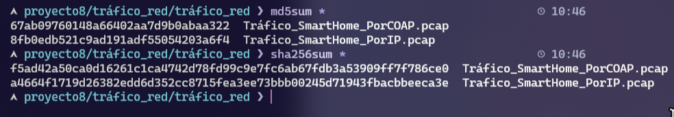
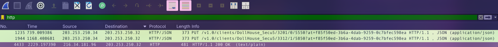
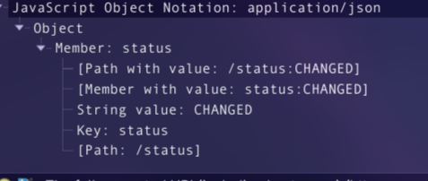

Este informe resume la evidencia disponible (capturas de verificación de hashes y capturas de tráfico) para el análisis de tráfico asociado a un entorno SmartHome.

## 1) Hashes

| Archivo | MD5 | SHA-256 |
|---|---|---|
| `Tráfico_SmartHome_PorCOAP.pcap` | `67ab09760148a66402aa7d9b0abaa322` | `f5ad42a50ca0d16261c1ca4742d78fd99c9e7fc6ab67fdb3a53909ff7f786ce0` |
| `Trafico_SmartHome_PorIP.pcap` | `8fb0edb521c9ad191adf5505420a36f4` | `a46644f1719d26382edd6d352cc8715fea32e73bbb00245d71943fbacbbeeca3e` |

Ambos hashes son idénticos a los proporcionados así que procedemos a la investigación
## 2) Hallazgos sospechosos

### 2.1 Descargas HTTP relacionadas con Rootkit Hunter (rkhunter)

Se observa tráfico HTTP desde `203.253.250.32` hacia `216.34.181.96` con peticiones a rutas asociadas a **rkhunter** (por ejemplo, `mirrors.dat`, `programs-bad.dat`, `backdoorports.dat`, `suspscan.dat`, `i18n.ver`). Esto es compatible con una **actualización/descarga de listas** de una herramienta de detección de rootkits.

Aunque no implica por sí mismo una intrusión, en un contexto “SmartHome” resulta llamativo ver actualizaciones de una herramienta de seguridad a través de HTTP en claro.

**Evidencia:**

### 2.2 Tráfico HTTP/JSON con token en la URL (SmartHome API)

Se aprecia tráfico **HTTP/JSON** con operaciones **PUT** a una API estilo `/v1.0/clients/...` (cliente `DollHouse_Secu5`) incluyendo un parámetro de query `at=...` (token) en la URL.

Esto es **sospechoso desde el punto de vista de seguridad** porque:

- El token queda expuesto en registros, historial y trazas de red (y potencialmente en proxies).
- Si el transporte no está cifrado, el token podría capturarse por un tercero en la red.

El cuerpo JSON observado refleja cambios de estado (`status: CHANGED`).

**Evidencia:**

## 3) Conclusiones

- Con la evidencia disponible, el tráfico observado parece centrarse en **actualizaciones/listas** (rkhunter) y en **telemetría/actualización de estado** de un cliente SmartHome (JSON con `status: CHANGED`).
- No se aprecian en las capturas **datos personales**, **credenciales en claro**, ni transferencia de documentos o contenido que pueda considerarse “información valiosa” en sí misma.
