# Proyecto 9
1. [Juramento y declaración de abstención](#1-juramento-y-declaración-de-abstención)
2. [Palabras clave](#2-palabras-clave)
3. [Índice de figuras](#3-índice-de-figuras)
4. [Resumen Ejecutivo](#4-resumen-ejecutivo)
5. [Introducción](#5-introducción)
   1. [Antecedentes](#51-antecedentes)
   2. [Objetivos](#52-objetivos)
6. [Fuentes de información](#6-fuentes-de-información)
    1. [Comprobación de hashes (MD5 y SHA-256)](#61-comprobación-de-hashes-md5-y-sha-256)
   2. [Adquisición de hallazgos](#62-adquisición-de-hallazgos)
7. [Análisis](#7-análisis)
   1. [Herramientas utilizadas](#71-herramientas-utilizadas)
    2. [Google OnHub](#72-google-onhub)
    3. [TV Intelligence](#73-tv-intelligence)
    4. [Amazon Echo (Alexa)](#74-amazon-echo-alexa)
    5. [Smartphone de la víctima](#75-smartphone-de-la-víctima)
    6. [Smartphone del marido](#76-smartphone-del-marido)
    7. [Análisis de red (tráfico SmartHome)](#77-análisis-de-red-tráfico-smarthome)
    8. [Correlación de evidencias](#78-correlación-de-evidencias)
    9. [Cronología del ataque](#79-cronología-del-ataque)
8. [Limitaciones](#8-limitaciones)
9. [Conclusiones](#9-conclusiones)
11. [Anexo 2. Cadena de custodia](#11-anexo-2-cadena-de-custodia)
12. [Anexo 3. Otras necesidades](#12-anexo-3-otras-necesidades)
    1. [Índice de hallazgos](#121-índice-de-hallazgos)

## 1. Juramento y declaración de abstención

Los peritos abajo firmantes manifiestan, bajo juramento o promesa de decir verdad, que han actuado y actuarán con la mayor objetividad posible, considerando tanto lo que pueda favorecer como lo que pueda perjudicar a cualquiera de las partes. Asimismo, declaran conocer las sanciones penales en las que podrían incurrir si incumplen su deber como peritos.

En cumplimiento de las mejores prácticas y estándares de la industria, los peritos declaran expresamente:

- Que no existe conflicto de interés alguno que pueda comprometer la objetividad del presente informe.
- Que no tienen parentesco, vínculo matrimonial o situación de hecho asimilable con ninguna de las partes, ni con sus abogados o procuradores.
- Que no tienen interés directo ni indirecto en el objeto del pleito ni en su resolución.
- Que no han prestado servicios profesionales anteriormente a ninguna de las partes en relación directa con este caso.

## 2. Palabras clave

En este apartado se incluyen términos técnicos utilizados en el informe que pueden dificultar la lectura. Se ofrece una definición breve para contextualizar su significado.

| Término | Definición breve |
| --- | --- |
| **Hash (MD5 / SHA-256)** | Huella digital calculada sobre un archivo para verificar su integridad (si cambia el archivo, cambia el hash). |
| **Cadena de custodia** | Registro de la trazabilidad de la evidencia (quién la maneja, cuándo y cómo) para preservar su validez. |
| **DNS (Domain Name System)** | Servicio que traduce nombres de dominio a direcciones IP; en el router se listan los servidores “resolutores” usados. |
| **Resolutor DNS** | Servidor DNS configurado para resolver consultas; un resolutor “no estándar” puede ser un dato anómalo a investigar. |
| **SSID** | Nombre público de una red Wi‑Fi (p. ej., la red principal y la red de invitados). |
| **WAN / IP WAN** | Interfaz “hacia Internet” del router; la IP WAN es la dirección asignada por el proveedor/red exterior. |
| **Gateway (puerta de enlace)** | Equipo destino por el que se enruta el tráfico hacia redes externas (normalmente el salto siguiente hacia Internet). |
| **Tabla ARP** | Lista que relaciona direcciones IP con direcciones MAC en una red local, útil para inventariar dispositivos conectados. |
| **ARP (Address Resolution Protocol)** | Protocolo que permite obtener la dirección MAC asociada a una IP dentro de la red local. |
| **MAC (dirección MAC)** | Identificador físico de una interfaz de red (Wi‑Fi/Ethernet/Bluetooth), usado para reconocer dispositivos. |
| **Red de invitados** | Wi‑Fi separada de la red principal, pensada para visitantes; aumenta superficie de exposición si está habilitada. |
| **Kodi** | Centro multimedia (software) usado para reproducción/gestión de contenido en TV/dispositivos dedicados. |
| **OSMC** | Distribución/sistema basado en Linux orientado a ejecutar Kodi (Open Source Media Center). |
| **Amazon Echo (Alexa)** | Dispositivo de asistente de voz que registra interacciones y puede controlar dispositivos del hogar. |
| **Wake word** | Palabra de activación (p. ej., “Alexa”) que inicia la captura de audio para interpretar un comando. |
| **JSON** | Formato de datos estructurado; en Alexa se usa para registrar metadatos/resultado de una interacción. |
| **WAV** | Formato de audio sin compresión; en este caso, grabaciones de voz asociadas a interacciones con Alexa. |
| **Unix epoch (ms)** | Timestamp numérico (milisegundos desde 01/01/1970) utilizado para fechar eventos en registros JSON. |
| **UTC / UTC+9 (KST)** | Referencias de zona horaria: UTC es tiempo universal; UTC+9 corresponde a Corea (KST) para la cronología del caso. |
| **SQLite** | Base de datos ligera embebida en apps; se usa en Android para almacenar historiales, configuraciones, etc. |
| **Autopsy** | Herramienta forense para analizar imágenes de disco/particiones y extraer artefactos relevantes. |
| **Token de acceso** | Credencial temporal usada por una app para acceder a un servicio (si expira, puede impedir recuperar datos). |

## 3. Índice de figuras

| Nº   | Figura                                                          | Descripción                                              |
| ---- | --------------------------------------------------------------- | -------------------------------------------------------- |
| 3.1  | 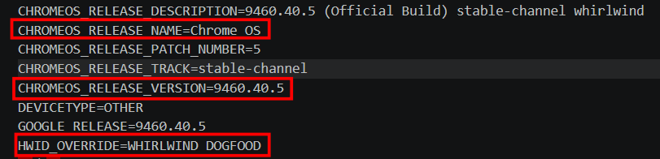                 | Información principal del router Google OnHub           |
| 3.2  | 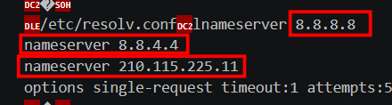               | Información adicional del router                         |
| 3.3  | 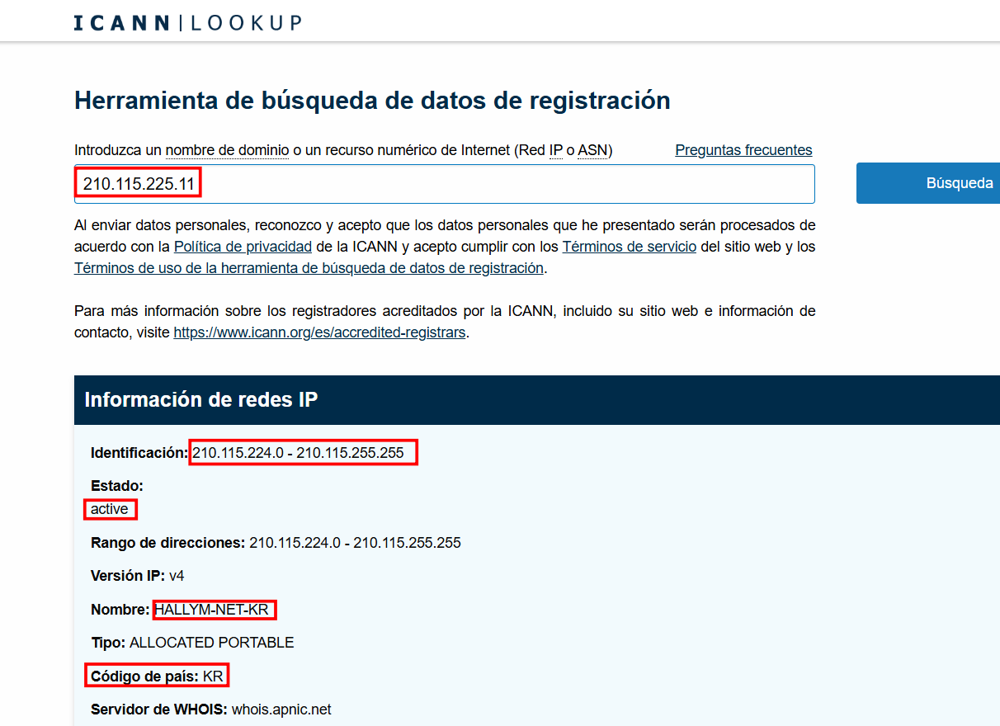               | Consulta geográfica del DNS no estándar                  |
| 3.4  | 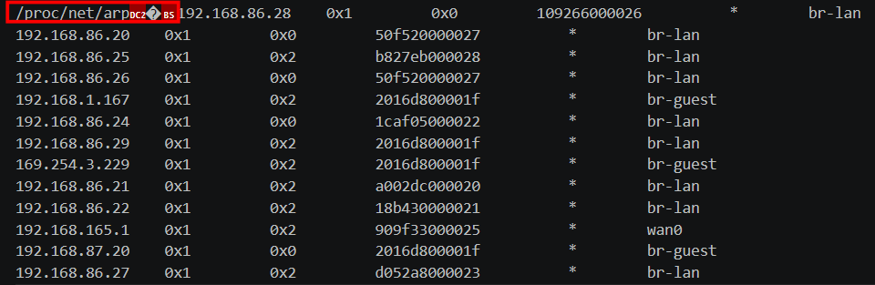               | Tabla ARP del router                                     |
| 3.5  | 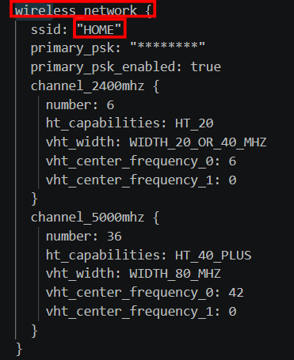               | Red inalámbrica principal                                |
| 3.6  | 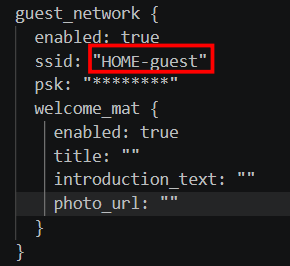               | Red de invitados                                         |
| 3.7  | 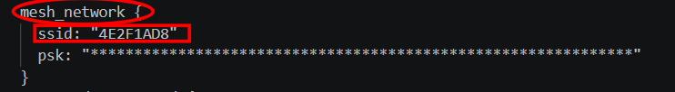               | Red mesh del entorno                                     |
| 3.8  | 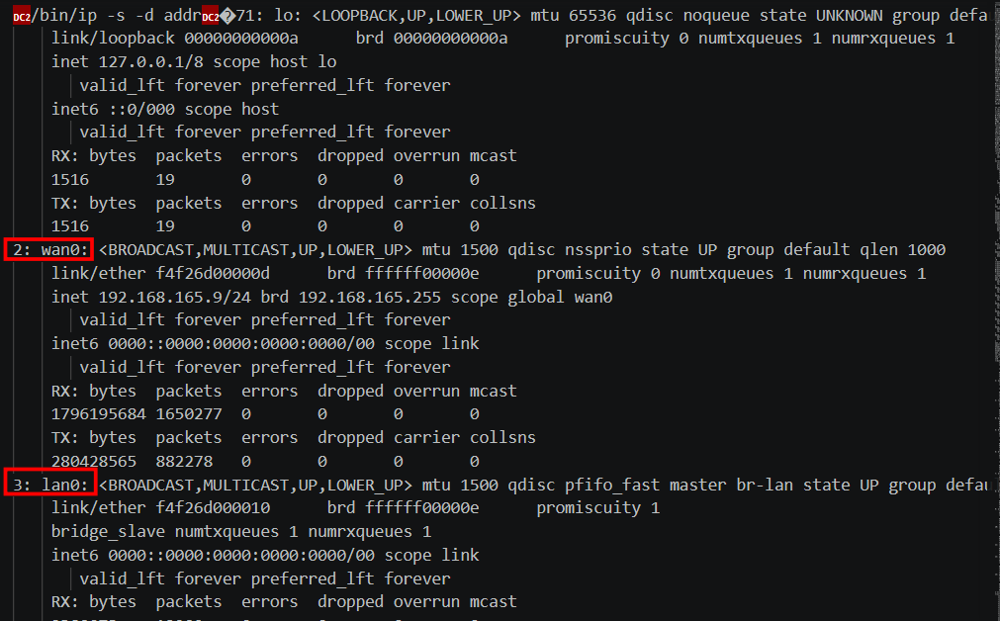               | Interfaces de red del dispositivo                        |
| 3.9  | 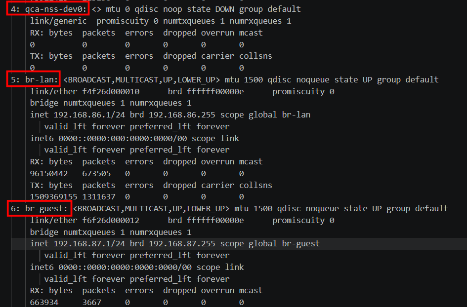               | Interfaces de red adicionales                            |
| 3.10 | 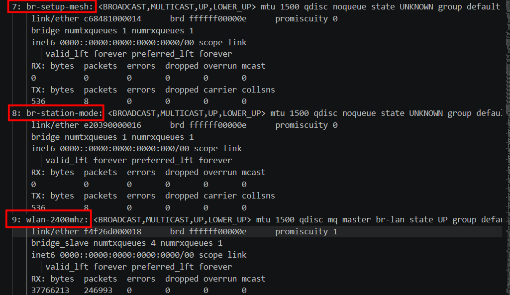              | Detalle adicional de interfaces                          |
| 3.11 | 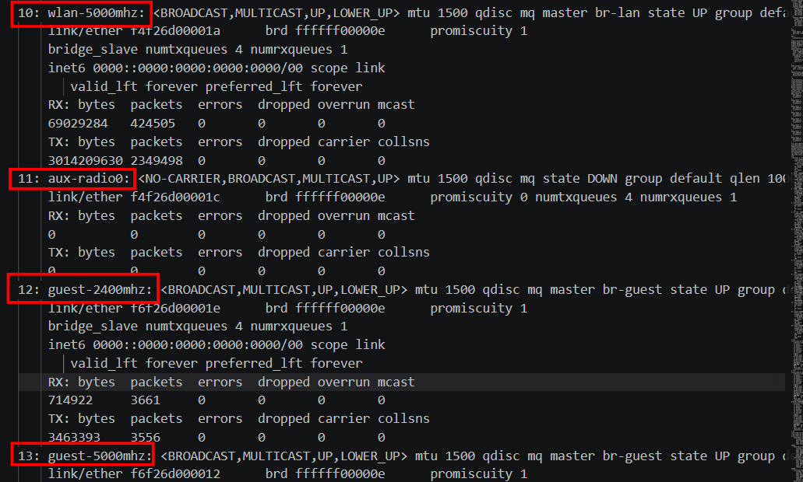             | Última captura de interfaces del OnHub                   |
| 3.12 |               | `kodi.log` del dispositivo multimedia                    |
| 3.13 |             | Zona horaria configurada en la TV                        |
| 3.14 | 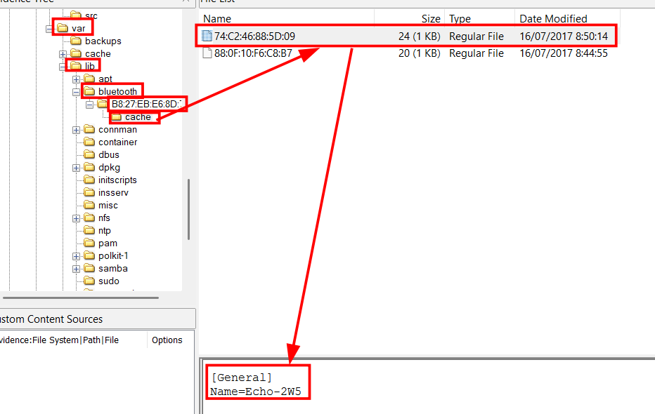            | Primer dispositivo Bluetooth detectado                   |
| 3.15 | 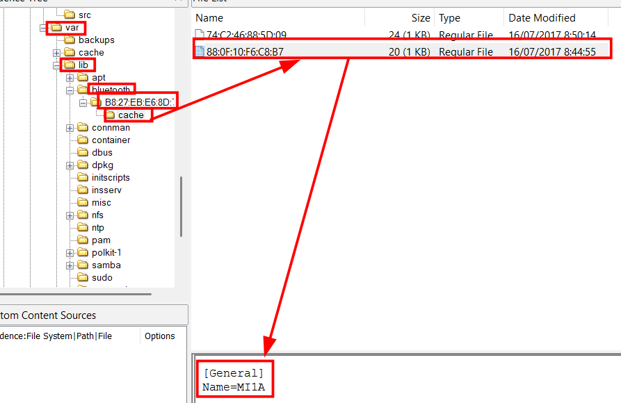            | Segundo dispositivo Bluetooth detectado                  |
| 3.16 |             | Verificación de hashes del paquete analizado             |
| 3.17 | 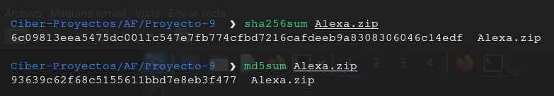                 | Verificación de hashes de Alexa.zip                      |
| 3.18 | 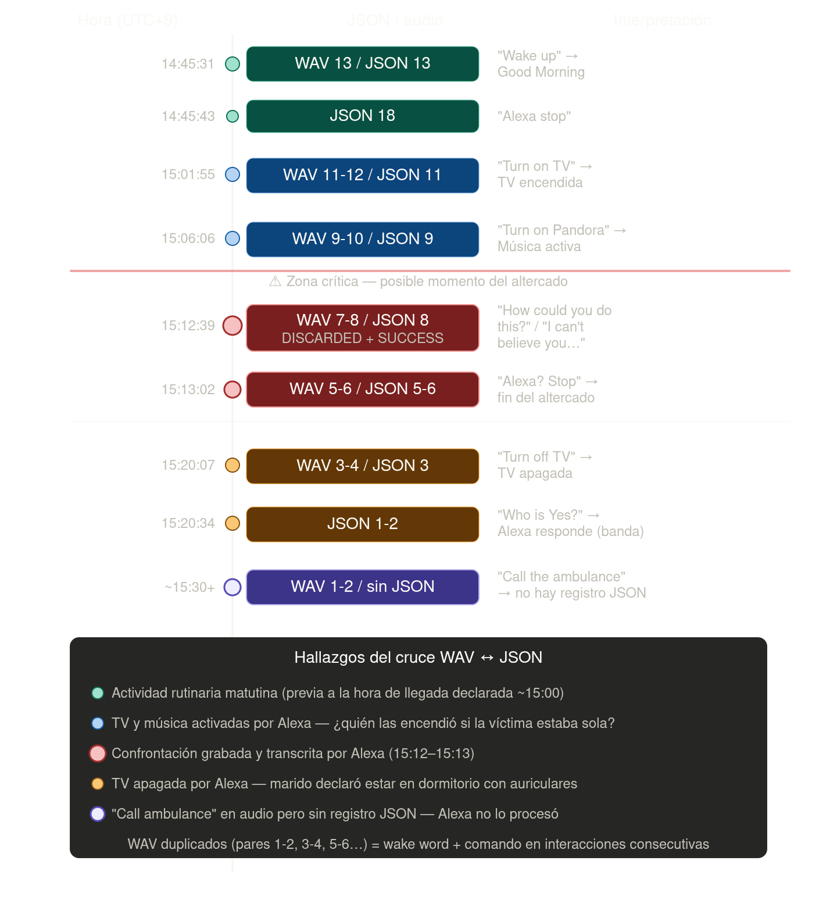                        | Línea temporal Alexa (cruce WAV ↔ JSON)                  |
| 3.19 | 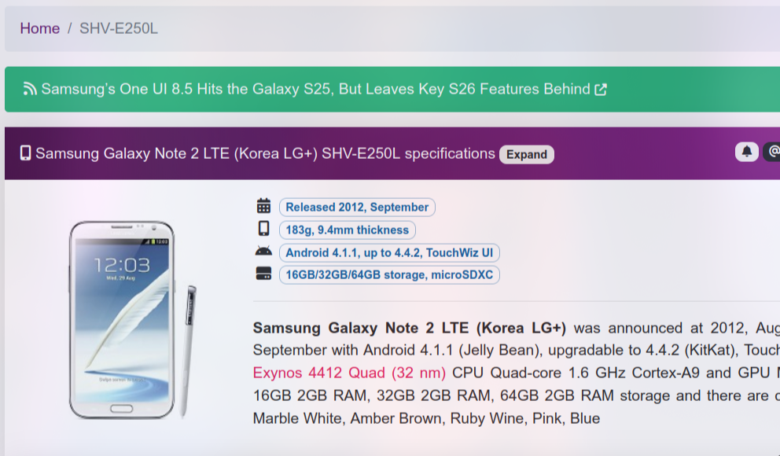     | Modelo/versión Android del smartphone del marido         |
| 3.20 | 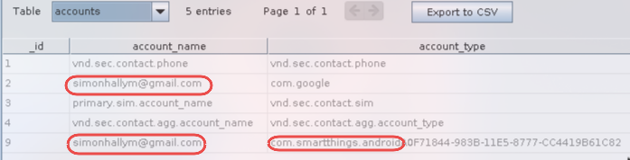  | Cuentas configuradas (Google/SmartThings)                |
| 3.21 | 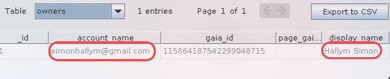       | Propietario (owners): cuenta, `gaia_id` y nombre mostrado |
| 3.22 | 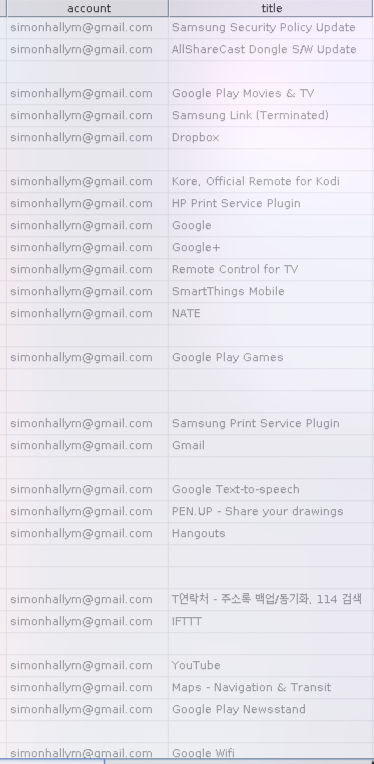     | Apps/servicios asociados a la cuenta (listado 1)         |
| 3.23 | 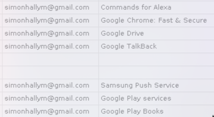   | Apps/servicios asociados a la cuenta (listado 2)         |
| 3.24 | 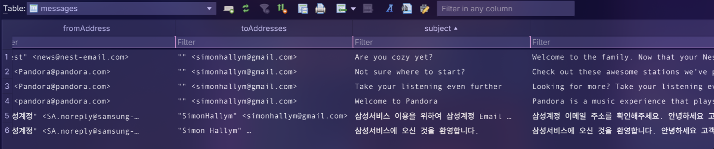            | Mensajes/correos asociados a la cuenta                   |
| 3.25 |        | Comprobación de hashes (PCAP SmartHome)                  |
| 3.26 | 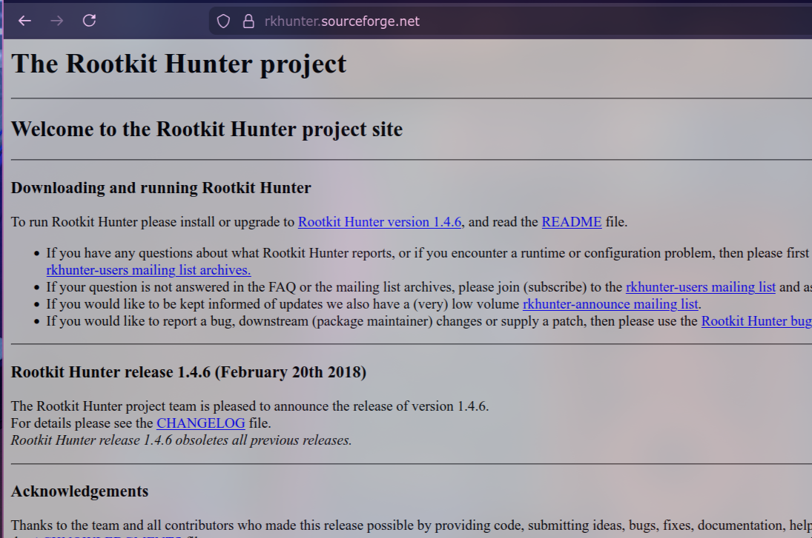                  | Sitio referenciado: Rootkit Hunter (rkhunter)            |
| 3.27 | 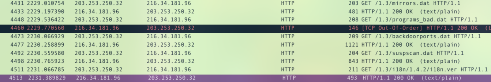                  | Peticiones HTTP a ficheros .dat de rkhunter              |
| 3.28 |                       | Tráfico HTTP/JSON PUT hacia API SmartHome                |
| 3.29 |                    | Detalle del JSON: `status = CHANGED`                     |

## 4. Resumen ejecutivo

Este informe consolida el análisis forense de evidencias digitales relacionadas con un homicidio (17/07/2017) en un entorno doméstico con dispositivos inteligentes. Se han revisado seis fuentes principales: (1) un router **Google OnHub** (estado de red, DNS y dispositivos), (2) un sistema multimedia/TV con **Kodi/OSMC** (logs, zona horaria y cachés Bluetooth), (3) un **Amazon Echo (Alexa)** (interacciones JSON y transcripciones de audio WAV), (4) el **smartphone de la víctima** (actividad de cuenta Google, apps instaladas, Bluetooth y bases de datos), (5) el **smartphone del marido** (cuenta/propietario, apps y configuración Bluetooth Bluedroid) y (6) el **tráfico de red** del entorno SmartHome (capturas de verificación de hashes y capturas de tráfico).

Los hallazgos más relevantes son:

- **Alexa registra un episodio crítico** entre **15:12 y 15:13 (UTC+9)** con contenido de confrontación en audio (WAV 7–8) y registro JSON asociado (JSON 8). Adicionalmente existe un comando **"call the ambulance"** en audio (WAV 1–2) sin registro JSON asociado, indicando una **interacción no procesada o no registrada** por el servicio.
- En el mismo día, Alexa registra **encendido y apagado de la TV** (15:01 y 15:20), útil para contrastar declaraciones de presencia/ubicación.
- El **móvil de la víctima** realiza una sincronización con Google a las **15:05:50 (UTC+9)**, evidenciando que el terminal estaba activo y con conectividad en ese momento.
- En el móvil de la víctima **no se observa SmartThings instalado**, lo que sugiere que el control del ecosistema domótico (TV/rutinas) recaía en otro terminal.
- El **móvil del marido** muestra vinculación a cuenta Google **`simonhallym@gmail.com`** y presencia de **SmartThings** y **Commands for Alexa**; además conserva artefactos Bluetooth (Bluedroid) con emparejamientos a **Echo-2W5** y **LG HBS900**.
- En el **tráfico de red SmartHome** se observan (a) descargas HTTP asociadas a **Rootkit Hunter (rkhunter)** y (b) peticiones **HTTP/JSON** tipo API con un **token en la URL**, lo que es relevante por exposición de credenciales en trazas/logs si el transporte no estuviera cifrado.
- El OnHub y el sistema Kodi/OSMC presentan coherencia entre sí (host/entorno `osmc`), y el OnHub muestra un **resolver DNS adicional** no estándar que requiere validación contextual.

## 5. Introducción

### 5.1. Antecedentes

El caso requiere el análisis de un entorno de hogar inteligente en el que confluyen: un router (Google OnHub), un sistema multimedia/TV (Kodi/OSMC), un asistente de voz (Amazon Echo/Alexa) y al menos dos smartphones (víctima y marido). En este tipo de escenarios, los artefactos de red, los registros de asistentes de voz y los datos de terminales móviles pueden aportar marcas temporales y trazas de actividad útiles para reconstruir hechos.

### 5.2. Objetivos

Los objetivos del presente informe son:

- Identificar y caracterizar los dispositivos y fuentes de evidencia aportadas.
- Verificar, cuando sea posible, la integridad de los ficheros (hashes) y documentar su trazabilidad.
- Extraer hallazgos técnicos relevantes (red, logs, interacciones, sincronizaciones).
- Correlacionar líneas temporales entre fuentes (Alexa ↔ móvil ↔ red/TV).
- Presentar conclusiones y limitaciones sin asumir hechos no soportados por las evidencias disponibles.

## 6. Fuentes de información

### 6.1. Comprobación de hashes (MD5 y SHA-256)

Para asegurar que los ficheros no han sido modificados desde su adquisición, se verificó la integridad mediante funciones hash, principalmente **MD5** y **SHA-256** cuando la fuente lo aportaba. La verificación se realiza antes y después de cualquier transferencia o uso en herramientas forenses.

**Evidencia con verificación explícita:**

| Evidencia | Hash MD5 | Hash SHA-256 |
| --- | --- | --- |
| `Alexa.zip` | `93639c62f68c5155611bbd7e8eb3f477` | `6c09813eea5475dc0011c547e7fb774cfbd7216cafdeeb9a8308306046c14edf` |
| `TV_Inteligente.zip` | `D9D2B3B3048A836289CEC02C6353B6E9` | `5423EA3F60D4AD0874346D3BA31C8783E5F2CE4B15B261BA0085E07F11E650E6` |
| `Tráfico_SmartHome_PorCOAP.pcap` | `67ab09760148a66402aa7d9b0abaa322` | `f5ad42a50ca0d16261c1ca4742d78fd99c9e7fc6ab67fdb3a53909ff7f786ce0` |
| `Trafico_SmartHome_PorIP.pcap` | `8fb0edb521c9ad191adf5505420a36f4` | `a46644f1719d26382edd6d352cc8715fea32e73bbb00245d71943fbacbbeeca3e` |

### 6.2. Adquisición de hallazgos

Se trabajó sobre capturas y documentos de análisis ya extraídos, organizados en seis bloques principales:

- Evidencias del **Google OnHub**: capturas del panel de estado, red Wi-Fi, DNS, tabla ARP e interfaces.
- Evidencias de **TV Intelligence**: captura del `kodi.log`, zona horaria, dispositivos Bluetooth y comprobación de hashes.
- Evidencias de **Amazon Echo (Alexa)**: capturas, transcripción y análisis de interacciones JSON y audios WAV (mediante imágenes/transcripciones).
- Evidencias del **smartphone de la víctima**: informe del análisis del volcado físico (particiones `.mdf`) y hallazgos de actividad de cuenta, apps y Bluetooth.
- Evidencias del **smartphone del marido**: configuración Bluetooth (`bt_config.xml`) y capturas de cuenta/propietario, apps y mensajes.
- Evidencias de **tráfico de red (SmartHome)**: capturas de verificación de hashes y capturas de tráfico (HTTP/JSON y descargas HTTP).

La adquisición se apoyó en trabajo sobre copias y en la preservación de los ficheros originales dentro del repositorio.

## 7. Análisis

### 7.1. Herramientas utilizadas

| Herramienta | Uso en el análisis |
| --- | --- |
| Visor de imágenes / capturas | Revisión de paneles, logs y pantallas de estado. |
| Herramientas de hash | Verificación de integridad de archivos aportados. |
| Interpretación manual de logs | Extracción de contexto técnico desde `kodi.log` y paneles del router. |
| Autopsy 4.22.1 | Análisis forense de particiones del volcado físico del smartphone (según informe individual). |
| DB Browser for SQLite | Revisión de bases de datos SQLite extraídas del smartphone (según informe individual). |
| Conversión de timestamps (epoch) | Alineación temporal de eventos Alexa a UTC+9 para correlación. |
| Wireshark | Inspección y filtrado de tráfico PCAP (según capturas aportadas). |

### 7.2. Google OnHub

El router analizado corresponde a un **Google OnHub** que ejecuta **Chrome OS 9460.40.5** en canal estable, sobre hardware **Qualcomm 8064**, identificado internamente como `whirlwind`.

Los datos más relevantes del dispositivo son los siguientes:

- IP del router: `192.168.86.1`
- IP WAN: `192.168.165.9`
- Gateway WAN: `192.168.165.1`
- Velocidad de enlace WAN: 100 Mbps
- SSID principal: `HOME`
- SSID de invitados: `HOME-guest`
- Banda de 2,4 GHz: canal 6, ancho HT20
- Banda de 5 GHz: canal 36, ancho de 80 MHz
- Estado de la red de invitados: activa

La red de invitados estaba habilitada en el momento del diagnóstico, lo que amplía la superficie de exposición del entorno doméstico y permite acceso a Internet sin necesidad de usar la red principal.

En la configuración DNS aparecen `8.8.8.8` y `8.8.4.4` como resolutores de Google, junto con `210.115.225.11`, que no encaja con un DNS público habitual. La comprobación geográfica de esta IP la sitúa en **Corea del Sur**, por lo que conviene tratarla como un dato anómalo hasta verificar su origen.

La tabla ARP y el inventario de interfaces muestran actividad en `br-lan`, `br-guest`, `wan0`, `wlan-2400mhz`, `wlan-5000mhz`, `lan0` y otras interfaces internas. Entre los registros relevantes destaca el host `osmc`, que aparece desconectado pero con actividad histórica, junto con otros dispositivos Android y varios equipos conectados por Wi-Fi o Ethernet.

Hallazgos técnicos principales:

- La red de invitados estaba habilitada, lo que amplía la superficie de exposición de la red doméstica.
- El host `osmc` figura en el historial del router y encaja con un dispositivo multimedia basado en Kodi.
- El hostname `ademanafe` resulta anómalo y merece verificación adicional por no seguir una nomenclatura estándar.
- La coexistencia de varios dispositivos Android en un intervalo temporal cercano sugiere una red doméstica con actividad diversa en el mismo periodo.

### 7.3. TV Intelligence

El segundo conjunto de evidencias corresponde a un dispositivo multimedia con **Kodi 17.3** ejecutándose sobre **Linux ARM (Thumb) 32-bit**. El propio registro indica que se trata de una instalación asociada a **Open Source Media Center 2017.06-1-kodi**, con mapeos internos típicos de un entorno OSMC:

- `special://masterprofile/` -> `/home/osmc/.kodi/userdata`
- `special://home/` -> `/home/osmc/.kodi`
- `special://temp/` -> `/home/osmc/.kodi/temp`

Este detalle es relevante porque enlaza directamente con el host `osmc` detectado en el OnHub.

La captura de la zona horaria muestra `America/New_York`, lo que aporta contexto sobre la configuración regional del sistema. No implica por sí solo una incidencia, pero sí permite alinear la cronología de eventos si se cruzan otros registros.

La evidencia Bluetooth contiene dos identificadores llamativos en la caché del sistema:

- `Echo-2W5`
- `M11A`

Estos nombres sugieren periféricos o dispositivos próximos detectados por el sistema multimedia, útiles para ampliar el inventario de activos asociados al entorno.

En conjunto, la evidencia no apunta a una intrusión por sí misma, sino a la identificación y caracterización de un sistema multimedia con sus artefactos de configuración, ubicación horaria y dispositivos Bluetooth asociados.

### 7.4. Amazon Echo (Alexa)

El conjunto de evidencias de Alexa documenta interacciones registradas el **17/07/2017** mediante (a) metadatos/JSON de interacción y (b) audios WAV (aquí aportados como capturas/transcripciones). La zona horaria del caso se considera **UTC+9 (Corea del Sur)**, aplicando conversión desde Unix epoch (ms) en los JSON.

Identificación y contexto (según informe individual):

- Dispositivo: **Amazon Echo (1.ª generación)**
- Device Type: `AB72C64C86AW2`
- Número de serie: `B0F00715535302W5`
- Usuario mostrado en la interfaz: *"Not simon"*

Línea temporal resumida (UTC+9):

| Hora | Evento | Fuente |
| --- | --- | --- |
| 14:45:31 | "Wake up" (respuesta de Alexa) | JSON 13 / WAV 13–14 |
| 15:01:55 | "Turn on TV" (TV encendida) | JSON 11 / WAV 11–12 |
| 15:06:06 | "Turn on Pandora" (música activada) | JSON 9 / WAV 9–10 |
| 15:12:39 | Conversación/altercado captado (wake word en medio del diálogo) | JSON 8 / WAV 7–8 |
| 15:13:02 | "Stop" | JSON 5–6 / WAV 5–6 |
| 15:20:07 | "Turn off TV" (TV apagada) | JSON 3 / WAV 3–4 |
| 15:20:34 | "Who is Yes?" | JSON 1 |
| (sin hora JSON) | "Call the ambulance" en audio, sin registro JSON asociado | WAV 1–2 |

Hallazgos forenses principales:

- **Confrontación grabada** (15:12–15:13): el contenido transcrito de WAV 7–8 incluye frases como *"I can't believe you would do this to me"* y *"How could you do this? What are you thinking?"*, consistentes con una discusión intensa.
- **"Call the ambulance" sin JSON**: la ausencia del registro JSON asociado a WAV 1–2 es relevante porque sugiere una ventana en la que Alexa **no procesó/no registró** la interacción (posible desconexión o fallo de reconocimiento).
- **Control de TV por voz**: los comandos de encendido/apagado de la TV aportan marcas temporales útiles para contrastar presencia en el salón.

Para el detalle completo (incluyendo custodia, dispositivos SmartHome vinculados y explicación de zona horaria), ver los documentos individuales en `hallazgos/alexa/`.

### 7.5. Smartphone de la víctima

El análisis del smartphone de la víctima (Samsung **SHV-E250L**, Android 4.4.2) aporta evidencia de actividad de cuenta, conectividad y emparejamientos Bluetooth relevantes para el caso.

Hallazgos clave (según informe individual):

- Identidad y pertenencia: nombre del dispositivo **"Betty"**, cuenta Google `bettyhallym@gmail.com`, zona horaria **Asia/Seúl (UTC+9)**.
- **Actividad el día del crimen**: sincronización de Google a las **15:05:50–15:05:52 (UTC+9)**, evidenciando terminal activo y con conectividad.
- Ecosistema domótico: se observa instalada la app **Amazon Alexa** (`com.amazon.dee.app`), pero **no** se encontró **SmartThings**, sugiriendo que el control SmartThings recaía en el terminal del marido.
- Bluetooth: aparecen dispositivos conocidos con nombres y MAC relevantes, incluyendo **Echo-2W5** (`74:c2:46:88:5d:09`), el móvil del marido **"Simon"** y una pulsera **MI1A** (`88:0f:10:f6:c8:b7`).
- Nest: token expirado el 13/07/2017 (posible explicación de ausencia de grabaciones del día del crimen).
- Bases de datos de SMS/llamadas sin contenido: `mmssms.db` sin registros (anómalo en un terminal en uso, compatible con borrado o ausencia de uso de SMS).

El detalle metodológico (particiones `.mdf`, Autopsy y DB Browser) consta en el informe individual en `hallazgos/movil-victima/README.md`.

### 7.6. Smartphone del marido

El análisis del smartphone del marido (Samsung **SHV-E250L**, Android 4.4.2) aporta evidencia complementaria sobre identidad de cuenta, ecosistema domótico y emparejamientos Bluetooth del entorno.

Evidencias usadas:

- `hallazgos/movil-marido/archivos/bt_config.xml` (Bluedroid)
- Capturas en `hallazgos/movil-marido/img/`

Hallazgos clave:

- **Identidad/cuenta**: aparece la cuenta Google **`simonhallym@gmail.com`** y el nombre mostrado **"Hallym Simon"** (con `gaia_id`).
- **Domótica/IoT**: hay indicios de uso/vinculación con **SmartThings** y presencia de **Commands for Alexa**.
- **Bluetooth (Bluedroid)**: el fichero `bt_config.xml` conserva artefactos de configuración y registro de dispositivos remotos (incluyendo emparejamientos con LinkKey y servicios detectados). Se detallan a continuación.

#### Bluetooth (Bluedroid) — detalle de conexiones y emparejamientos

Evidencia: `hallazgos/movil-marido/archivos/bt_config.xml`

**Adaptador local**

| Campo               | Valor                            | Interpretación forense                                  |
| ------------------- | -------------------------------- | ------------------------------------------------------- |
| Nombre dispositivo  | Simon (SHV-E250S)                | Samsung Galaxy Note II variante coreana SHV-E250S       |
| Dirección Bluetooth | 50:F5:20:A5:7D:CC                | MAC Bluetooth única del dispositivo analizado           |
| BluezMigrationDone  | 1                                | El sistema migró desde stack BlueZ a Bluedroid          |
| ScanMode            | 0                                | Bluetooth posiblemente no visible/discoverable          |
| DiscoveryTimeout    | 120                              | Tiempo de descubrimiento Bluetooth configurado en 120 s |

**Dispositivos remotos detectados/emparejados**

| MAC               | Nombre            | Tipo probable                         | DevType | Clase Bluetooth (decimal) | Timestamp Unix | Fecha aprox. UTC        | Emparejado  | Link Key | Fabricante | Servicios detectados                                     | Observaciones forenses                                                           |
| ----------------- | ----------------- | ------------------------------------- | ------- | ------------------------- | -------------- | ----------------------- | ----------- | -------- | ---------- | -------------------------------------------------------- | -------------------------------------------------------------------------------- |
| 1C:AF:05:9E:19:74 | Betty (SHV-E250L) | Samsung Galaxy Note II                | 1       | 5898764                   | 1499931533     | 2017-07-13 04:58:53 UTC | No evidente | No       | N/D        | N/D                                                      | Posible segundo terminal Samsung asociado al usuario. Variante coreana SHV-E250L |
| 74:C2:46:88:5D:09 | Echo-2W5          | Amazon Echo                           | 1       | 787476                    | 1500194150     | 2017-07-16 05:55:50 UTC | Sí          | Sí       | 69         | A2DP, AVRCP, Handsfree/Audio sink y servicio propietario | Dispositivo claramente emparejado. Conserva LinkKey válida                       |
| 4A:C3:55:48:C7:77 | Desconocido       | BLE aleatorio                         | 1       | N/D                       | N/D            | N/D                     | No evidente | No       | N/D        | N/D                                                      | Dirección aleatoria BLE (AddrType=1). Posible beacon o dispositivo temporal      |
| 88:0F:10:F6:C8:B7 | MI1A              | Xiaomi Mi Band/Mi device              | 2       | 7936                      | 1500194153     | 2017-07-16 05:55:53 UTC | No claro    | No       | N/D        | N/D                                                      | Dispositivo BLE. Posible wearable Xiaomi                                         |
| B8:AD:3E:01:5B:6A | LG HBS900         | Auriculares Bluetooth LG Tone Infinim | 1       | 2360324                   | 1500193456     | 2017-07-16 05:44:16 UTC | Sí          | Sí       | 10         | Serial Port, Headset, Handsfree, A2DP, AVRCP             | Headset estéreo claramente emparejado y usado                                    |

Interpretación forense (a partir de bt_config.xml):
- La presencia de `LinkKey` para **Echo-2W5** y **LG HBS900** indica **emparejamiento** (no solo detección puntual). La lista de UUIDs/servicios sugiere **perfiles usados** (audio/handsfree, etc.).
- Los `Timestamp` (epoch) aportan una referencia de **última actividad/registro** con cada dispositivo remoto; son útiles para aproximar ventanas temporales (no sustituyen logs de eventos completos).
- La entrada **Betty (SHV-E250L)** sugiere proximidad o relación con un segundo terminal Samsung, útil para correlación con el móvil de la víctima.
- La entrada de tipo **BLE aleatorio** (AddrType=1) es compatible con un dispositivo/beacon temporal; su valor probatorio suele ser menor sin más contexto.

**Fig. 3.19 — Modelo/versión Android (marido)**

- Confirma el contexto técnico del terminal (SHV‑E250L / Android 4.x), útil para interpretar rutas/artefactos del sistema y compatibilidad de apps.

**Fig. 3.20 — Cuentas configuradas (accounts)**

- La cuenta **`simonhallym@gmail.com`** figura como `com.google` (cuenta Google del dispositivo).
- La misma cuenta aparece asociada a **SmartThings** (`com.smartthings.android`), indicio de vinculación IoT desde este terminal.

**Fig. 3.21 — Propietario (owners)**

- Relaciona `account_name` (**`simonhallym@gmail.com`**) con `display_name` (**"Hallym Simon"**).
- El `gaia_id` permite correlación con artefactos donde el correo no aparezca explícitamente.

**Fig. 3.22 — Apps/servicios asociados (listado 1)**

- Se observa un ecosistema de apps Google/Samsung y presencia de **SmartThings**.
- La presencia de **IFTTT** sugiere automatizaciones potencialmente relacionadas con acciones domóticas.

**Fig. 3.23 — Apps/servicios asociados (listado 2)**

- Se observa **Commands for Alexa** y componentes Google (Chrome/Drive/Play services).
- Drive incrementa la probabilidad de sincronización cloud (cachés/metadatos locales si existieran en extracción completa).

**Fig. 3.24 — Mensajes/correos (messages)**

- Mensajes dirigidos a **`<simonhallym@gmail.com>`**, incluyendo comunicaciones de **Nest** y **Pandora**.
- Refuerza el contexto de uso de servicios (IoT/entretenimiento) asociado a la misma cuenta observada en Fig. 3.20–3.21.

### 7.7. Análisis de red (tráfico SmartHome)

Este apartado integra el análisis de tráfico asociado al entorno SmartHome a partir de las evidencias disponibles en `hallazgos/red/`.

Evidencias usadas:

- `hallazgos/red/README.md`
- Capturas en `hallazgos/red/img/`

#### 7.7.1. Hashes aportados

**Fig. 3.25 — Comprobación de hashes (PCAP SmartHome)**

Según la evidencia aportada, los ficheros PCAP analizados y sus hashes son:

| Archivo | MD5 | SHA-256 |
|---|---|---|
| `Tráfico_SmartHome_PorCOAP.pcap` | `67ab09760148a66402aa7d9b0abaa322` | `f5ad42a50ca0d16261c1ca4742d78fd99c9e7fc6ab67fdb3a53909ff7f786ce0` |
| `Trafico_SmartHome_PorIP.pcap` | `8fb0edb521c9ad191adf5505420a36f4` | `a46644f1719d26382edd6d352cc8715fea32e73bbb00245d71943fbacbbeeca3e` |

#### 7.7.2. Hallazgos relevantes

**Descargas HTTP relacionadas con Rootkit Hunter (rkhunter)**

Se observa tráfico HTTP desde `203.253.250.32` hacia `216.34.181.96` con peticiones a rutas asociadas a rkhunter (p. ej., `mirrors.dat`, `programs-bad.dat`, `backdoorports.dat`, `suspscan.dat`, `i18n.ver`). Esto es compatible con una descarga/actualización de listas de una herramienta de detección de rootkits.

**Fig. 3.26 — Sitio referenciado: Rootkit Hunter (rkhunter)**

**Fig. 3.27 — Peticiones HTTP a ficheros .dat de rkhunter**

Interpretación forense:
- No es prueba de intrusión por sí sola; es un indicador de **actividad de herramientas de seguridad/diagnóstico**.
- El uso de **HTTP en claro** puede ser relevante si se pretende atribuir integridad/origen del contenido descargado.

**Tráfico HTTP/JSON con token en la URL (SmartHome API)**

Se aprecia tráfico HTTP/JSON con operaciones PUT a una API estilo `/v1.0/clients/...` (cliente `DollHouse_Secu5`) incluyendo un parámetro `at=...` (token) en la URL.

**Fig. 3.28 — Tráfico HTTP/JSON PUT hacia API SmartHome**

**Fig. 3.29 — Detalle del JSON: `status = CHANGED`**

Interpretación forense:
- Un **token en la URL** puede filtrarse por logs, historial y proxies; si además el transporte no está cifrado, aumenta el riesgo de exposición.
- El JSON observado refleja cambios de estado (`status: CHANGED`), compatibles con telemetría/actualización de un cliente SmartHome.

#### 7.7.3. Conclusiones del tráfico

- Con la evidencia disponible, el tráfico observado se centra en descargas de listas/actualizaciones (rkhunter) y en telemetría/actualización de estado de un cliente SmartHome (`status: CHANGED`).
- No se aprecian en las capturas datos personales, credenciales en claro ni transferencia de documentos.

### 7.8. Correlación de evidencias

La correlación entre las fuentes analizadas refuerza la interpretación temporal y de pertenencia de dispositivos.

1) **OnHub ↔ TV (Kodi/OSMC):** el router OnHub registra el host `osmc` dentro del entorno de red; la evidencia del sistema multimedia muestra un entorno **Kodi/OSMC** coherente. Esto vincula ambos artefactos al mismo ecosistema doméstico.

2) **Alexa ↔ Móvil de la víctima (Bluetooth):** el smartphone registra el dispositivo **Echo-2W5** con MAC `74:c2:46:88:5d:09`, consistente con los identificadores observados en las evidencias del entorno (p. ej., `Echo-2W5`).

3) **Alexa ↔ Móvil (tiempo):** la sincronización del móvil a **15:05:50** ocurre **antes** del episodio de confrontación captado por Alexa a **15:12:39**, enmarcando una ventana temporal previa a la zona crítica.

4) **Entorno de red:** la red de invitados activa en el router y la presencia de varios equipos conectados o registrados en su historial indican un entorno con actividad suficiente como para requerir interpretación contextual de cada artefacto, evitando atribuciones erróneas.

5) **Red (tráfico SmartHome) ↔ Ecosistema IoT:** el tráfico HTTP/JSON hacia una ruta tipo `/v1.0/clients/DollHouse_Secu5` con cambios `status: CHANGED` es coherente con telemetría/actualización de estado en plataformas SmartHome. Dado que en el móvil del marido se observan apps de control/gestión IoT (SmartThings y Commands for Alexa), esto refuerza la hipótesis de que parte del control del entorno domótico recaía en ese terminal. La presencia de un token en la URL (parámetro `at=...`) es relevante por exposición de credenciales en trazas/logs si el transporte no estuviera cifrado.

### 7.9. Cronología del ataque

Cronología consolidada (horas en **UTC+9**, Corea del Sur) basada en el cruce de fuentes:

| Hora | Hecho observado | Fuente |
| --- | --- | --- |
| 14:31:04 | Audio ambiental detectado (evento no dirigido al dispositivo) | Alexa (JSON 16, DISCARDED) |
| 14:45:31 | Interacción "Wake up" | Alexa (JSON 13) |
| 15:01:55 | TV encendida por comando de voz | Alexa (JSON 11) |
| 15:05:50–15:05:52 | Sincronización del móvil con Google | Móvil víctima |
| 15:06:06 | Pandora activado por Alexa | Alexa (JSON 9) |
| 15:12:39–15:13:02 | Episodio de discusión/altercado y comandos "Stop" | Alexa (JSON 8 y JSON 5) |
| 15:20:07 | TV apagada por comando de voz | Alexa (JSON 3) |
| 15:20:34 | Consulta "Who is Yes?" | Alexa (JSON 1) |
| (sin registro JSON) | Audio "Call the ambulance" (no procesado/no registrado) | Alexa (WAV 1–2) |

Nota: la evidencia aportada de Alexa indica que la interfaz web mostraba hora de Seattle (UTC-7), por lo que la cronología se expresa en UTC+9 a partir de timestamps epoch de los JSON (según documentación individual).

## 8. Limitaciones

Las limitaciones principales del análisis son:

- La evidencia de Alexa se aporta como documentación, capturas y transcripciones; no se dispone en el repositorio del paquete original completo (p. ej., `Alexa.zip`) para revalidación independiente de su contenido.
- No se aportan registros nativos de SmartThings/Nest ni accesos a las cuentas cloud correspondientes; por tanto, no se puede confirmar la activación de rutinas o la existencia de grabaciones más allá de lo descrito.
- En el análisis del móvil, la ausencia de SMS/llamadas puede deberse a borrado, a uso de otros canales, o a limitaciones del volcado/parseo; no se puede atribuir causa única sin más artefactos.
- El análisis del OnHub y de la TV se basa principalmente en capturas y algunos ficheros; no se cuenta con un volcado completo de logs del router ni imagen completa del sistema multimedia.
- El análisis de red SmartHome se integra principalmente a partir de capturas y documentación; no constan en el repositorio los PCAP originales para revalidación independiente.

## 9. Conclusiones

Con base en la documentación y evidencias aportadas, se concluye:

- La evidencia de **Alexa** proporciona una línea temporal con alto valor probatorio en la ventana **15:01–15:20 (UTC+9)**, destacando un episodio de confrontación **15:12–15:13** registrado en audio y metadatos.
- El **móvil de la víctima** aporta un punto temporal objetivo (sync Google a **15:05:50**) coherente con actividad del terminal poco antes del episodio crítico registrado por Alexa.
- El **móvil del marido** aporta indicios de **gestión domótica** (SmartThings/Alexa) y de **proximidad/emparejamiento** con dispositivos del hogar (Echo-2W5, LG HBS900), reforzando la interpretación del ecosistema doméstico.
- El análisis de **tráfico de red SmartHome** aporta indicios de actualizaciones/descargas (rkhunter) y de uso de una API de cliente (`DollHouse_Secu5`) con token en la URL, relevante por consideraciones de seguridad y trazabilidad.
- Los comandos de **encendido/apagado de TV** mediante Alexa aportan marcas temporales y contexto para contrastar declaraciones de ubicación.
- La correlación **OnHub ↔ Kodi/OSMC** vincula el dispositivo multimedia con el entorno de red doméstico.

Necesidades para reforzar el caso (si se dispone de acceso legal/técnico):

- Solicitar/exportar logs cloud completos de **Alexa** (interacciones, audio y estado de conectividad) para validar el hueco de "call the ambulance".
- Obtener registros de **SmartThings** (rutinas `IAmBack`/`Goodbye!`) y de **Nest** (si existieran) para corroborar presencia/entradas/salidas.
- Analizar la pulsera **MI1A** (si se conserva) para extraer datos biométricos y aproximar la hora del fallecimiento.
- Obtener volcado/logs más completos del OnHub y del sistema Kodi/OSMC para mejorar atribución y contexto.

## 11. Anexo 2. Cadena de custodia

La siguiente tabla documenta la cadena de custodia de los archivos y evidencias digitales tratados en el presente informe, asegurando la trazabilidad, integridad y control de acceso en cada etapa del proceso forense.

| Nº | Ruta / Archivo | Descripción / Contenido | Responsable | Fecha/Hora adquisición | Método de adquisición | Observaciones |
| --- | --- | --- | --- | --- | --- | --- |
| 1 | hallazgos/google-on-hub/image.png | Información principal del router | Luis Carlos Romero | 2026-05-14 | Captura de pantalla | Original digital |
| 2 | hallazgos/google-on-hub/image-1.png | Información adicional del router | Luis Carlos Romero | 2026-05-14 | Captura de pantalla | Original digital |
| 3 | hallazgos/google-on-hub/image-2.png | Consulta geográfica del DNS | Luis Carlos Romero | 2026-05-14 | Captura de pantalla | Original digital |
| 4 | hallazgos/google-on-hub/image-3.png | Tabla ARP | Luis Carlos Romero | 2026-05-14 | Captura de pantalla | Original digital |
| 5 | hallazgos/google-on-hub/image-4.png | Red inalámbrica principal | Luis Carlos Romero | 2026-05-14 | Captura de pantalla | Original digital |
| 6 | hallazgos/google-on-hub/image-5.png | Red de invitados | Luis Carlos Romero | 2026-05-14 | Captura de pantalla | Original digital |
| 7 | hallazgos/google-on-hub/image-6.png | Red mesh | Luis Carlos Romero | 2026-05-14 | Captura de pantalla | Original digital |
| 8 | hallazgos/google-on-hub/image-7.png | Interfaces de red 1 | Luis Carlos Romero | 2026-05-14 | Captura de pantalla | Original digital |
| 9 | hallazgos/google-on-hub/image-8.png | Interfaces de red 2 | Luis Carlos Romero | 2026-05-14 | Captura de pantalla | Original digital |
| 10 | hallazgos/google-on-hub/image-9.png | Interfaces de red 3 | Luis Carlos Romero | 2026-05-14 | Captura de pantalla | Original digital |
| 11 | hallazgos/google-on-hub/image-10.png | Interfaces de red 4 | Luis Carlos Romero | 2026-05-14 | Captura de pantalla | Original digital |
| 12 | hallazgos/tv-intelligence/image.png | `kodi.log` del dispositivo | Luis Carlos Romero | 2026-05-14 | Captura de pantalla | Original digital |
| 13 | hallazgos/tv-intelligence/image-1.png | Zona horaria configurada | Luis Carlos Romero | 2026-05-14 | Captura de pantalla | Original digital |
| 14 | hallazgos/tv-intelligence/image-2.png | Dispositivo Bluetooth Echo-2W5 | Luis Carlos Romero | 2026-05-14 | Captura de pantalla | Original digital |
| 15 | hallazgos/tv-intelligence/image-3.png | Dispositivo Bluetooth M11A | Luis Carlos Romero | 2026-05-14 | Captura de pantalla | Original digital |
| 16 | hallazgos/tv-intelligence/image-4.png | Comprobación de hashes | Luis Carlos Romero | 2026-05-14 | Captura de pantalla | Original digital |
| 17 | hallazgos/tv-intelligence/kodi.log | Archivo de log del sistema Kodi | Luis Carlos Romero | 2026-05-14 | Extracción directa | Archivo de 22.477 bytes |
| 18 | hallazgos/tv-intelligence/74_C2_46_88_5D_09 | Archivo de dispositivo Bluetooth Echo-2W5 | Luis Carlos Romero | 2026-05-14 | Extracción directa | Identificador MAC |
| 19 | hallazgos/tv-intelligence/88_0F_10_F6_C8_B7 | Archivo de dispositivo Bluetooth M11A | Luis Carlos Romero | 2026-05-14 | Extracción directa | Identificador MAC |
| 20 | hallazgos/tv-intelligence/hash_74-C2-46-88-5D-09.csv | Hash de integridad Echo-2W5 | Luis Carlos Romero | 2026-05-14 | Extracción directa | Verificación SHA |
| 21 | hallazgos/tv-intelligence/has_bluethoot_88-0F-10-F6-C8-B7.csv | Hash de integridad M11A | Luis Carlos Romero | 2026-05-14 | Extracción directa | Verificación SHA |
| 22 | hallazgos/tv-intelligence/hash_timezone.csv | Hash de integridad zona horaria | Luis Carlos Romero | 2026-05-14 | Extracción directa | Verificación SHA |
| 23 | hallazgos/tv-intelligence/kodlog_hash.csv | Hash de integridad kodi.log | Luis Carlos Romero | 2026-05-14 | Extracción directa | Verificación SHA |
| 24 | hallazgos/tv-intelligence/timezone | Archivo de configuración horaria | Luis Carlos Romero | 2026-05-14 | Extracción directa | `America/New_York` |
| 25 | hallazgos/alexa/README.md | Informe individual Alexa | Pablo González Silva | 2026-05-11 | Documentación del análisis | Incluye custodia, identificación y hallazgos |
| 26 | hallazgos/alexa/analisis_alexa_json.md | Análisis individual de JSON Alexa | Pablo González Silva | 2026-05-11 | Documentación del análisis | Línea temporal JSON en UTC+9 |
| 27 | hallazgos/alexa/transcrito.md | Transcripción manual de WAV Alexa | Pablo González Silva | 2026-05-11 | Documentación del análisis | Traducción ES/EN |
| 28 | hallazgos/alexa/hashes-alexa.png | Captura de verificación de hashes | Pablo González Silva | 2026-05-11 | Captura de pantalla | Hashes de `Alexa.zip` |
| 29 | hallazgos/alexa/image.png | Línea temporal Alexa | Pablo González Silva | 2026-05-11 | Captura de pantalla | Cruce WAV ↔ JSON |
| 30 | hallazgos/alexa/1.wav.png | Transcripción WAV 1 | Pablo González Silva | 2026-05-11 | Captura de pantalla | "call the ambulance" |
| 31 | hallazgos/alexa/2.wav.png | Transcripción WAV 2 | Pablo González Silva | 2026-05-11 | Captura de pantalla | "call the ambulance" |
| 32 | hallazgos/alexa/3.wav.png | Transcripción WAV 3 | Pablo González Silva | 2026-05-11 | Captura de pantalla | "turn off TV" |
| 33 | hallazgos/alexa/4.wav.png | Transcripción WAV 4 | Pablo González Silva | 2026-05-11 | Captura de pantalla | "turn off TV" |
| 34 | hallazgos/alexa/5.wav.png | Transcripción WAV 5 | Pablo González Silva | 2026-05-11 | Captura de pantalla | "Stop" |
| 35 | hallazgos/alexa/6.wav.png | Transcripción WAV 6 | Pablo González Silva | 2026-05-11 | Captura de pantalla | "Stop" |
| 36 | hallazgos/alexa/7.wav.png | Transcripción WAV 7 | Pablo González Silva | 2026-05-11 | Captura de pantalla | Conversación |
| 37 | hallazgos/alexa/8.wav.png | Transcripción WAV 8 | Pablo González Silva | 2026-05-11 | Captura de pantalla | Conversación |
| 38 | hallazgos/alexa/9.wav.png | Transcripción WAV 9 | Pablo González Silva | 2026-05-11 | Captura de pantalla | "turn on Pandora" |
| 39 | hallazgos/alexa/10.wav.png | Transcripción WAV 10 | Pablo González Silva | 2026-05-11 | Captura de pantalla | "turn on Pandora" |
| 40 | hallazgos/alexa/11.wav.png | Transcripción WAV 11 | Pablo González Silva | 2026-05-11 | Captura de pantalla | "turn on TV" |
| 41 | hallazgos/alexa/12.wav.png | Transcripción WAV 12 | Pablo González Silva | 2026-05-11 | Captura de pantalla | "turn on TV" |
| 42 | hallazgos/alexa/13.wav.png | Transcripción WAV 13 | Pablo González Silva | 2026-05-11 | Captura de pantalla | Wake word / diálogo |
| 43 | hallazgos/alexa/14.wav.png | Transcripción WAV 14 | Pablo González Silva | 2026-05-11 | Captura de pantalla | Comentario sobre IA |
| 44 | hallazgos/movil-victima/README.md | Informe individual smartphone víctima | Pablo González Silva | No consta | Documentación del análisis | Autopsy/SQLite, hallazgos de actividad |
| 45 | hallazgos/movil-marido/README.md | Informe individual smartphone marido | No consta | No consta | Documentación del análisis | Hallazgos de cuenta/apps y Bluetooth |
| 46 | hallazgos/movil-marido/archivos/bt_config.xml | Configuración Bluetooth (Bluedroid) | No consta | No consta | Extracción directa | Artefactos de emparejamiento/blacklists |
| 47 | hallazgos/movil-marido/img/0-modelo-movil.png | Modelo/versión Android (marido) | No consta | No consta | Captura de pantalla | Contexto técnico del terminal |
| 48 | hallazgos/movil-marido/img/contactos-cuentas.png | Cuentas (accounts) (marido) | No consta | No consta | Captura de pantalla | Google/SmartThings |
| 49 | hallazgos/movil-marido/img/nombre-simon.png | Propietario (owners) (marido) | No consta | No consta | Captura de pantalla | `gaia_id` y display name |
| 50 | hallazgos/movil-marido/img/apps-instalads.png | Apps/servicios (listado 1) (marido) | No consta | No consta | Captura de pantalla | SmartThings/IFTTT, etc. |
| 51 | hallazgos/movil-marido/img/apps-instaladas2.png | Apps/servicios (listado 2) (marido) | No consta | No consta | Captura de pantalla | Commands for Alexa/Drive |
| 52 | hallazgos/movil-marido/img/correos.png | Mensajes/correos (marido) | No consta | No consta | Captura de pantalla | Nest/Pandora/Samsung |
| 53 | hallazgos/red/README.md | Informe individual análisis de red | No consta | No consta | Documentación del análisis | Hashes y capturas de tráfico SmartHome |
| 54 | hallazgos/red/img/0-comprobacion-hashes.png | Comprobación de hashes (PCAP SmartHome) | No consta | No consta | Captura de pantalla | Evidencia de MD5/SHA-256 aportados |
| 55 | hallazgos/red/img/1-rkhunter.png | Sitio referenciado: rkhunter | No consta | No consta | Captura de pantalla | Contexto del artefacto descargado |
| 56 | hallazgos/red/img/2-rkhunter.png | Peticiones HTTP a ficheros .dat (rkhunter) | No consta | No consta | Captura de pantalla | Descargas HTTP observadas |
| 57 | hallazgos/red/img/3-http.png | Tráfico HTTP/JSON PUT (SmartHome API) | No consta | No consta | Captura de pantalla | Token en URL y rutas /v1.0/clients/... |
| 58 | hallazgos/red/img/4-changed.png | Detalle JSON: status=CHANGED | No consta | No consta | Captura de pantalla | Cambio de estado del cliente |

## 12. Anexo 3. Otras necesidades

### 12.1. Índice de hallazgos

| **Ruta** | **Contenido** | **Sección** | **Observación** |
| --- | --- | --- | --- |
| hallazgos/google-on-hub/image.png | Información principal | hallazgos/google-on-hub/ | Router Google OnHub |
| hallazgos/google-on-hub/image-1.png | Información adicional | hallazgos/google-on-hub/ | Datos de estado del dispositivo |
| hallazgos/google-on-hub/image-2.png | DNS no estándar | hallazgos/google-on-hub/ | Geolocalización del resolver |
| hallazgos/google-on-hub/image-3.png | Tabla ARP | hallazgos/google-on-hub/ | Inventario de red |
| hallazgos/google-on-hub/image-4.png | Red principal | hallazgos/google-on-hub/ | SSID `HOME` |
| hallazgos/google-on-hub/image-5.png | Red de invitados | hallazgos/google-on-hub/ | SSID `HOME-guest` |
| hallazgos/google-on-hub/image-6.png | Red mesh | hallazgos/google-on-hub/ | Topología de red |
| hallazgos/google-on-hub/image-7.png | Interfaces 1 | hallazgos/google-on-hub/ | Interfaces de red |
| hallazgos/google-on-hub/image-8.png | Interfaces 2 | hallazgos/google-on-hub/ | Interfaces de red |
| hallazgos/google-on-hub/image-9.png | Interfaces 3 | hallazgos/google-on-hub/ | Interfaces de red |
| hallazgos/google-on-hub/image-10.png | Interfaces 4 | hallazgos/google-on-hub/ | Interfaces de red |
| hallazgos/tv-intelligence/image.png | `kodi.log` | hallazgos/tv-intelligence/ | Kodi / OSMC |
| hallazgos/tv-intelligence/image-1.png | Zona horaria | hallazgos/tv-intelligence/ | `America/New_York` |
| hallazgos/tv-intelligence/image-2.png | Bluetooth 1 | hallazgos/tv-intelligence/ | Dispositivo Echo-2W5 |
| hallazgos/tv-intelligence/image-3.png | Bluetooth 2 | hallazgos/tv-intelligence/ | Dispositivo M11A |
| hallazgos/tv-intelligence/image-4.png | Hashes | hallazgos/tv-intelligence/ | Verificación de integridad |
| hallazgos/tv-intelligence/kodi.log | Archivo de log | hallazgos/tv-intelligence/ | 22.477 bytes, 17/07/2017 |
| hallazgos/tv-intelligence/74_C2_46_88_5D_09 | MAC Echo-2W5 | hallazgos/tv-intelligence/ | 24 (1 KB), 16/07/2017 |
| hallazgos/tv-intelligence/88_0F_10_F6_C8_B7 | MAC M11A | hallazgos/tv-intelligence/ | 20 (1 KB), 16/07/2017 |
| hallazgos/tv-intelligence/hash_74-C2-46-88-5D-09.csv | Hash Echo-2W5 | hallazgos/tv-intelligence/ | CSV |
| hallazgos/tv-intelligence/has_bluethoot_88-0F-10-F6-C8-B7.csv | Hash M11A | hallazgos/tv-intelligence/ | CSV |
| hallazgos/tv-intelligence/hash_timezone.csv | Hash timezone | hallazgos/tv-intelligence/ | CSV |
| hallazgos/tv-intelligence/kodlog_hash.csv | Hash kodi.log | hallazgos/tv-intelligence/ | CSV |
| hallazgos/tv-intelligence/timezone | Zona horaria | hallazgos/tv-intelligence/ | `America/New_York` |
| hallazgos/alexa/README.md | Informe individual Alexa | hallazgos/alexa/ | Custodia, identificación y hallazgos |
| hallazgos/alexa/analisis_alexa_json.md | Línea temporal JSON | hallazgos/alexa/ | Timestamps a UTC+9 |
| hallazgos/alexa/transcrito.md | Transcripciones WAV | hallazgos/alexa/ | ES/EN |
| hallazgos/alexa/hashes-alexa.png | Hashes Alexa.zip | hallazgos/alexa/ | Verificación de integridad |
| hallazgos/alexa/image.png | Cruce WAV ↔ JSON | hallazgos/alexa/ | Línea temporal |
| hallazgos/alexa/1.wav.png | WAV 1 | hallazgos/alexa/ | "call the ambulance" |
| hallazgos/alexa/2.wav.png | WAV 2 | hallazgos/alexa/ | "call the ambulance" |
| hallazgos/alexa/3.wav.png | WAV 3 | hallazgos/alexa/ | "turn off TV" |
| hallazgos/alexa/4.wav.png | WAV 4 | hallazgos/alexa/ | "turn off TV" |
| hallazgos/alexa/5.wav.png | WAV 5 | hallazgos/alexa/ | "Stop" |
| hallazgos/alexa/6.wav.png | WAV 6 | hallazgos/alexa/ | "Stop" |
| hallazgos/alexa/7.wav.png | WAV 7 | hallazgos/alexa/ | Conversación |
| hallazgos/alexa/8.wav.png | WAV 8 | hallazgos/alexa/ | Conversación |
| hallazgos/alexa/9.wav.png | WAV 9 | hallazgos/alexa/ | "turn on Pandora" |
| hallazgos/alexa/10.wav.png | WAV 10 | hallazgos/alexa/ | "turn on Pandora" |
| hallazgos/alexa/11.wav.png | WAV 11 | hallazgos/alexa/ | "turn on TV" |
| hallazgos/alexa/12.wav.png | WAV 12 | hallazgos/alexa/ | "turn on TV" |
| hallazgos/alexa/13.wav.png | WAV 13 | hallazgos/alexa/ | Wake word / diálogo |
| hallazgos/alexa/14.wav.png | WAV 14 | hallazgos/alexa/ | Comentario sobre IA |
| hallazgos/movil-victima/README.md | Informe individual móvil víctima | hallazgos/movil-victima/ | Volcado `.mdf` y hallazgos |
| hallazgos/movil-marido/README.md | Informe individual móvil marido | hallazgos/movil-marido/ | Cuenta/apps y Bluetooth (Bluedroid) |
| hallazgos/movil-marido/archivos/bt_config.xml | Configuración Bluedroid | hallazgos/movil-marido/archivos/ | Emparejamientos, LinkKeys y blacklists |
| hallazgos/movil-marido/img/0-modelo-movil.png | Modelo/versión Android | hallazgos/movil-marido/img/ | Contexto técnico del terminal |
| hallazgos/movil-marido/img/contactos-cuentas.png | Cuentas (accounts) | hallazgos/movil-marido/img/ | Google/SmartThings |
| hallazgos/movil-marido/img/nombre-simon.png | Propietario (owners) | hallazgos/movil-marido/img/ | `gaia_id` y nombre mostrado |
| hallazgos/movil-marido/img/apps-instalads.png | Apps/servicios (1) | hallazgos/movil-marido/img/ | SmartThings/IFTTT y servicios |
| hallazgos/movil-marido/img/apps-instaladas2.png | Apps/servicios (2) | hallazgos/movil-marido/img/ | Commands for Alexa/Drive |
| hallazgos/movil-marido/img/correos.png | Mensajes/correos | hallazgos/movil-marido/img/ | Nest/Pandora/Samsung |
| hallazgos/red/README.md | Informe individual red | hallazgos/red/ | Hashes y hallazgos de tráfico SmartHome |
| hallazgos/red/img/0-comprobacion-hashes.png | Hashes PCAP | hallazgos/red/img/ | MD5/SHA-256 aportados |
| hallazgos/red/img/1-rkhunter.png | rkhunter (sitio) | hallazgos/red/img/ | Contexto de descargas |
| hallazgos/red/img/2-rkhunter.png | HTTP rkhunter | hallazgos/red/img/ | Peticiones a ficheros .dat |
| hallazgos/red/img/3-http.png | HTTP/JSON SmartHome | hallazgos/red/img/ | PUT /v1.0/clients/... con token |
| hallazgos/red/img/4-changed.png | JSON status changed | hallazgos/red/img/ | `status: CHANGED` |

<table>
    <thead>
        <tr>
            <th>Nombre y Apellidos</th>
            <th>Cargo / Titulación</th>
            <th>Firma</th>
            <th>Fecha</th>
        </tr>
    </thead>
    <tbody>
        <tr>
            <td>Carlos Alcina</td>
            <td>Técnico Superior en Desarrollo de Aplicaciones Multiplataforma (DAM)</td>
            <td>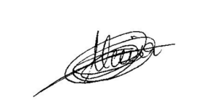</td>
            <td>27/04/2026</td>
        </tr>
        <tr>
            <td>Pablo González</td>
            <td>Técnico Superior en Desarrollo de Aplicaciones Multiplataforma (DAM) y Técnico Superior en Desarrollo de Aplicaciones Web (DAW)</td>
            <td>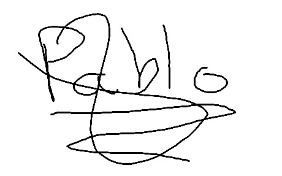</td>
            <td>27/04/2026</td>
        </tr>
        <tr>
            <td>Luis Carlos Romero</td>
            <td>Técnico Superior en Desarrollo de Aplicaciones Web (DAW)</td>
            <td></td>
            <td>27/04/2026</td>
        </tr>
    </tbody>
</table>