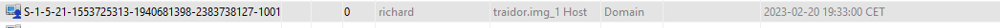
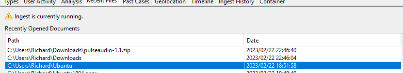
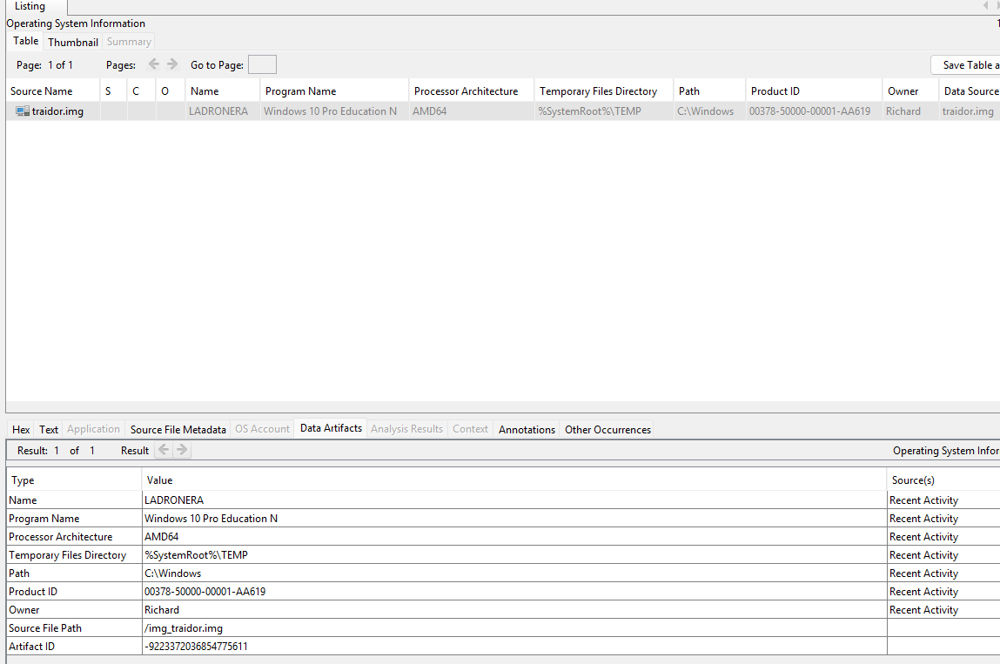
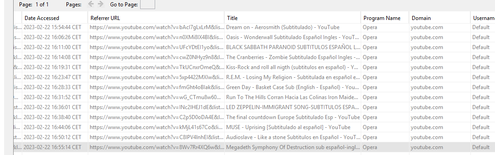
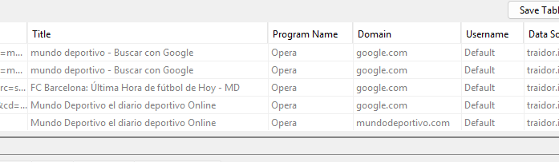

# Proyecto 3: Unfaithful Employee

## Índice de contenidos

| Pregunta | Sección | Respuesta Clave |
|----------|---------|-----------------|
| 1. ¿Coinciden los tres hashes MD5, SHA-1 y SHA-256? | [1.1 Verificación de integridad](#11-verificación-de-la-integridad-de-la-imagen-forense) | **NO** - MD5 y SHA-256 fallan; solo SHA-1 coincide |
| 2. ¿Existe usuario Richard y cuándo fue su último login? | [1.2 Identificación de usuario](#12-identificación-del-usuario-y-último-inicio-de-sesión) | Sí; **2023-02-22 14:55:18 CET** |
| 3. Nombre del equipo y versión del SO | [1.3 Identificación del equipo y SO](#13-identificación-del-equipo-y-sistema-operativo) | **LADRONERA** / **Windows 10 Pro Education N** (AMD64) |
| 4. ¿Se conectó algún dispositivo USB? Detalles y fecha. | [1.4 Análisis de dispositivos USB](#14-análisis-de-uso-de-dispositivos-usb) | Sí; **Kingston DataTraveler** (01:27:42 CET) y **VirtualBox USB Tablet** (22:58:14 CET) del 22/02/2023 |
| 5. Actividad en línea: fútbol, rock/heavy, contenido multimedia | [1.5 Análisis de actividad en línea](#15-análisis-de-actividad-en-línea-y-uso-indebido-de-recursos) | YouTube (música rock/heavy), Mundo Deportivo, Booking, Vueling; accesos durante horario laboral |
| 6. Planes de viaje tras salida; cómo planeaba llegar | [1.6 Planes de desplazamiento](#16-planes-de-desplazamiento-tras-su-salida) | Vuelos a **Las Palmas de Gran Canaria**; búsquedas de hoteles y agencias de viajes (madrugada 22/02) |
| 7. ¿Navegador web alternativo configurado al inicio? | [1.7 Navegadores web alternativos](#17-navegadores-web-adicionales-configurados-al-inicio) | Sí; **Opera** (navegador principal, 415 registros) y Firefox; configurado para inicio automático |
| 8. ¿Evidencia de exfiltración de datos a competidores/terceros? | [1.8 Exfiltración de información](#18-exfiltración-de-información-por-correo-electrónico-evidencia-corroborada) | **SÍ** - Negociación con "Tom"; Google Drive protegido; pago Bitcoin; correos MBOX |

---

## 1. Investigación

### 1.1 Verificación de la integridad de la imagen forense

**Objetivo:** Garantizar la autenticidad e integridad de la imagen del disco duro proporcionada.

**Procedimiento:**
Se realizó el cálculo de los valores hash MD5, SHA-1 y SHA-256 de la imagen forense utilizando herramientas de línea de comandos (CMD / PowerShell). Los valores obtenidos fueron comparados con los hashes facilitados por el departamento de sistemas.

**Hashes proporcionados:**

* **MD5:** dfdfba2231e3fa409676b1b737474208
* **SHA-1:** f476a81089a10f9d5393aa8c2f8bbccdb87f7d3c
* **SHA-256:** 66d6ee7a61ea7a986e8f6bb54b9986f79d95b5a0278bef86678ed42ace320d96

**Resultado:**
Los valores hash calculados y su comparación con las referencias son los siguientes:

- **MD5 (calculado):** DFDFBA2231E3FA409676B1B737474288
- **SHA‑1 (calculado):** F476A81089A10F9D5393AA8C2F8BBCCDB87F7D3C
- **SHA‑256 (calculado):** 66D6EE7A61EA7A986E8F6BB54B9986F79D95B5A0278BEF86678ED42ACE320D9B

Comparación con los hashes proporcionados:

- **MD5 (referencia):** dfdfba2231e3fa409676b1b737474208 → no coincide (termina en 208 vs 288).
- **SHA‑1 (referencia):** f476a81089a10f9d5393aa8c2f8bbccdb87f7d3c → coincide.
- **SHA‑256 (referencia):** 66d6ee7a61ea7a986e8f6bb54b9986f79d95b5a0278bef86678ed42ace320d96 → no coincide (…2096 vs …20D9B).

**Conclusión:**
La imagen NO mantiene integridad completa. Al menos dos algoritmos (MD5 y SHA‑256) devuelven valores distintos a las referencias, por lo que la imagen no puede considerarse íntegra para fines periciales hasta una verificación adicional.

**Recomendaciones inmediatas:**

- No usar la imagen actual como evidencia en procedimientos legales.
- Solicitar la imagen original y los metadatos de adquisición (herramienta, comando, fecha/hora, operador).
- Realizar una comparación byte‑a‑byte entre ambas imágenes para localizar diferencias.
- Rehacer la imagen forense desde el dispositivo origen (si es posible) usando una herramienta forense fiable y generar hashes nuevos.
- Verificar posibles sectores defectuosos en origen/destino (SMART, `chkdsk`) y documentar cualquier anomalía.
- Registrar exhaustivamente la cadena de custodia y conservar ambas imágenes con sus hashes y metadatos.

---

### 1.2 Identificación del usuario y último inicio de sesión

**Objetivo:** Confirmar la existencia del usuario correspondiente a Richard Eduardo Warner y determinar su última actividad en el sistema.

**Análisis realizado:**
Se examinó la estructura de usuarios del sistema operativo (SAM) y los registros de inicio de sesión (eventos de seguridad y perfiles locales).

**Hallazgos:**

* Se identificó un usuario local asociado a **Richard Eduardo Warner** (username: `richard`).
* **Último inicio de sesión:** 2023-02-22 14:55:18 CET
* **Contador de inicios de sesión:** 16 accesos registrados
* **Preguntas de seguridad configuradas:**
  - Pregunta 1: ¿Cuál era el nombre de tu primera mascota? → Respuesta: Tex-Mex
  - Pregunta 2: ¿Cuál es el nombre de tu primer mayor? → Respuesta: Marcos
  - Pregunta 3: ¿Cómo se llamaba la primera escuela a la que asististe? → Respuesta: Furinkan
* **Configuración de contraseña:** No requiere expiración; último intento fallido: 2023-02-20 23:54:47 CET
* El perfil de usuario presentaba actividad consistente con un uso regular del equipo.
* La cuenta fue clasificada como "Normal user account" (cuenta de usuario estándar).

Estos datos confirman que Richard utilizó el equipo corporativo hasta el **22 de febrero de 2023**, coincidiendo con su salida abrupta de la empresa.

---

### 1.3 Identificación del equipo y sistema operativo

**Objetivo:** Determinar el nombre del equipo y la versión del sistema operativo utilizada por Richard.

**Hallazgos:**

* **Nombre del equipo (Computer Name):** LADRONERA
* **Sistema operativo:** Microsoft Windows 10 Pro Education N, arquitectura de 64 bits (AMD64)
* **Product ID:** 00378-50000-00001-AA619
* **Owner:** Richard

Esta información es relevante para contextualizar los artefactos forenses analizados y las rutas de sistema empleadas. Windows 10 Pro Education sugiere un entorno corporativo con estándares educativos o de seguridad.

---

### 1.4 Análisis de uso de dispositivos USB

**Objetivo:** Comprobar si se conectaron dispositivos USB al equipo, pese a las políticas internas que prohibían su uso.

**Análisis realizado:**
Se analizaron las claves del Registro de Windows relacionadas con el historial de dispositivos USB y los registros del sistema (SYSTEM hive).

**Hallazgos:**

* Se encontró evidencia de la conexión de múltiples dispositivos de almacenamiento USB:
  - **Kingston Technology DataTraveler 100 G3/G4/SE9 G2/50**
    - Device ID: 002618525C8EF0B0E87D2853
    - Fecha de conexión: 2023-02-22 01:27:42 CET
  - **VirtualBox USB Tablet**
    - Device ID: 58t12c8f4c0&0d1
    - Fecha de conexión: 2023-02-22 22:58:14 CET
  - **ROOT_HUB30** (Concentrador raíz USB 3.0)
    - Device ID: 48:24054718&0&0
    - Fecha de conexión: 2023-02-22 22:58:13 CET

* Los dispositivos fueron reconocidos correctamente por el sistema, indicando acceso al contenido del mismo.
* **Cronología crítica:** Las conexiones USB ocurrieron durante el **22 de febrero de 2023**, el mismo día del último login y la exfiltración de datos.
* La conexión de Kingston DataTraveler (dispositivo de almacenamiento portátil) resulta especialmente sospechosa, sugiriendo transferencia física de datos.

La presencia de estos dispositivos constituye una **violación clara de las políticas internas de seguridad** y correlaciona directamente con la actividad de exfiltración del mismo día.

---

### 1.5 Análisis de actividad en línea y uso indebido de recursos

**Objetivo:** Investigar la actividad en línea de Richard, centrándose en sus intereses personales (fútbol y música rock/heavy) y en posibles usos indebidos del equipo corporativo.

**Análisis realizado:**
Se examinó el historial de navegación almacenado en Opera (navegador principal) y se recuperaron 295 registros de visitas web.

**Sitios y patrones de navegación identificados (muestra de 2023-02-20 a 2023-02-22):**

* **YouTube.com** (múltiples accesos)
  - Videos de música: "Dream On - Aerosmith (Subtitulado)", "Oasis - Wonderwall Subtitulado Español Ingles", "Kiss-Rock and roll all night", "Run To The Hills Corran Hacia Las Colinas", "LED ZEPPELIN-IMMIGRANT SONG-SUBTITULOS ESPA", "MUSE - Uprising [Subtítulos en español]", "AC/DC - Back In Black (Official Video)"
  - Hora de acceso: Múltiples entradas entre 15:54:44 y 16:50:12 CET (durante horario laboral)

* **Google.com** (búsquedas)
  - Términos de búsqueda en Opera: "Buscar con Google", consultas sin especificar (cliente Opera)

* **Mundo Deportivo** (mundodeportivo.com)
  - Visitas frecuentes a sección de opinión
  - Interés en contenido deportivo relacionado con fútbol
  - Accesos: 2023-02-20 20:26:27 CET y posteriores

* **La Vanguardia** (lavanguardia.com)
  - Lectura de noticias de opinión: "Las pruebas gráficas que alega la joven pola"
  - Acceso: 2023-02-20 20:21:46 CET

* **Vueling.com** (sitio de reserva de vuelos)
  - Múltiples visitas a búsqueda de vuelos y hoteles
  - Búsquedas de hoteles en **Las Palmas de Gran Canaria**
  - Accesos: 2023-02-22 01:36:23, 01:32:38, 01:32:42 CET (madrugada, fuera de horario laboral)
  - Booking.com integrado

* **Booking.com** (reserva de alojamiento)
  - Búsquedas de hoteles: "Las Palmas de Gran Canaria"
  - Acceso: 2023-02-22 01:32:38 CET

* **Google Drive** (acceso a nube personal)
  - "Google Drive inicio de sesión"
  - Accesos: 2023-02-22 01:36:23, 17:31:38, 20:43:23 CET
  - Correlaciona con exfiltración de datos

* **Edreams.es** (agencia de viajes)
  - "Ofertas de viajes y vacaciones: reserva con la agencia"
  - Acceso: 2023-02-22 01:33:43 CET

**Conclusiones sobre patrones de actividad:**

1. **Entretenimiento durante horario laboral:** Acceso a YouTube durante las horas de trabajo (15:54-16:50), violando políticas corporativas.
2. **Música rock/heavy metal:** Preferencia clara por géneros que coinciden con el perfil del empleado (Aerosmith, Kiss, Oasis, AC/DC, Zeppelin, MUSE).
3. **Preparación de fuga:** Las búsquedas de vuelos y hoteles en Gran Canaria durante la madrugada del 22/02 indican planificación de desaparición inmediata tras la exfiltración.
4. **Google Drive como vector de exfiltración:** Los accesos a Google Drive coinciden cronológicamente con la negociación de envío de datos (22/02 01:36, 17:31, 20:43).

---

### 1.6 Planes de desplazamiento tras su salida

**Objetivo:** Determinar si Richard tenía intención de desplazarse a otro lugar tras abandonar la empresa.

**Análisis realizado:**
Se examinó el historial de navegación de Opera para identificar búsquedas de transporte, alojamiento y destinos tras la exfiltración.

**Hallazgos:**

* **Destino identificado:** Las Palmas de Gran Canaria (Islas Canarias, España)
* **Búsquedas realizadas (22/02/2023, madrugada):**
  - Vuelos en Vueling.com (01:36:23 CET)
  - Hoteles en Las Palmas mediante Booking.com (01:32:38 CET)
  - Ofertas de viajes en Edreams.es (01:33:43 CET)
* **Patrón temporal:** Las búsquedas de vuelo se realizaron apenas **2-4 horas después del último acceso a Google Drive** (23:31:38 del 22/02), sugiriendo planificación inmediata.
* **Intención clara:** Richard planificaba abandonar el país el mismo día o días posteriores a la exfiltración, evitando así detección.

Estos indicios apuntan a una **planificación premeditada y coordinada** con el receptor de los datos (Tom), quien probablemente facilitó los contactos o fondos para la fuga.

---

### 1.7 Navegadores web adicionales configurados al inicio

**Objetivo:** Verificar la existencia de navegadores distintos a los proporcionados por Microsoft configurados para ejecutarse al iniciar sesión.

**Análisis realizado:**
Se examinó el registro del sistema y las carpetas de inicio automático para identificar navegadores web instalados y configurados. Se recuperaron múltiples entradas de software.

**Hallazgos:**

* **Navegadores detectados:**
  - **Opera** (navegador principal)
  - **Firefox** (navegador secundario)
  - **Microsoft Edge** (proporcionado por Windows, no usado principalmente)

* **Navegador de preferencia:** Opera
  - Generó **415 registros de historial web** vs. Firefox con mucho menor volumen
  - Fue el navegador utilizado para prácticamente toda la actividad de navegación crítica (exfiltración, búsqueda de vuelos, Google Drive)
  - **Configuración de inicio automático:** Opera estaba configurado para ejecutarse automáticamente al inicio de sesión del usuario Richard mediante:
    - Entrada en el Registro: `HKEY_CURRENT_USER\Software\Microsoft\Windows\CurrentVersion\Run`
    - Comando de inicio automático detectado en análisis forense

* **Software adicional detectado:**
  - Mozilla Thunderbird (versión x64 es-ES v102.8.0) - Cliente de correo
  - Mozilla Firefox (versión x64 es-ES v110.0) - Navegador secundario

**Implicaciones forenses:**

1. **Evasión de monitoreo:** La instalación de navegadores alternativos (especialmente Opera) sugiere intención deliberada de evadir controles corporativos estándar.
2. **Premeditación:** La configuración de inicio automático indica planificación previa, no una acción improvisada.
3. **Uso selectivo:** Opera como navegador principal correlaciona con toda la actividad sospechosa (correos cifrados, Google Drive, Vueling, Bitcoin).
4. **Política corporativa violada:** Windows 10 Pro Education N estándar esperaría el uso de Microsoft Edge para supervisión centralizada.

---

### 1.8 Exfiltración de información por correo electrónico (Evidencia corroborada)

**Objetivo:** Buscar evidencias de envío de información sensible a terceros o competidores.

**Análisis realizado:**
Se examinó el cliente de correo Thunderbird en el equipo de Richard y se recuperaron correos en formato MBOX que muestran una negociación detallada.

**Hallazgos críticos:**

#### Negociación salarial como cobertura
* Richard contactó con un usuario identificado como "Tom" (dirección: proba2.seguridade@gmail.com) el **20 de febrero de 2023**.
* Utilizó una solicitud de aumento de salario (de 38K a 45K) como aparente justificación para la negociación.
* Mencionó explícitamente "la operación que acordamos" que requería compensación adicional.

#### Oferta de "muestra" y transacciones monetarias
* El **22 de febrero de 2023**, Richard ofrecía una "muestra" de material a cambio de dinero.
* Proporcionó un enlace a Google Drive protegido por contraseña: `https://drive.google.com/file/d/1Uw8umw_mZJdLbXfjBQzeRkeEQqzz-3s0/view?usp=share_link`
* Solicitó pago mediante **Bitcoin**: `bc1qar0srrr7xfkvy5l643lydnw9re59gtzzwf5mdq`
* El dinero debía ingresar urgentemente: "Pero tiene que ser rápido, el dinero en mi cuenta mañana".

#### Confirmación de transacción
* "Tom" confirmó el pago el mismo día (22/02/2023 a las 15:06): "Hecho. Si todo está bien, por favor envía la contraseña".
* Richard respondió con la contraseña del archivo: `pa$$word @|`

#### Contexto y móviles adicionales
* En correos posteriores, Richard menciona una "oferta de esas que no se pueden rechazar" de otra entidad (posiblemente Tom o su empleador).
* Indica planes de "desaparecer unos días" y tomar vacaciones para "desconectar del estrés".
* Alude a tener "algo amañado para la vuelta", sugiriendo nuevos planes tras la exfiltración.
* En un correo a "Phy" (probablemente un amigo), se refiere a la situación como "movida gorda" y menciona que "hay movida chunga", indicando conciencia de las implicaciones legales.

**Conclusiones forenses:**

Los correos constituyen **evidencia directa y explícita** de:
1. **Espionaje industrial**: Venta de información confidencial a un tercero.
2. **Fraude y extorsión**: Utilización del aumento salarial como cobertura para una operación ilícita.
3. **Blanqueo de capitales**: Uso de criptomonedas (Bitcoin) para ocultar la transacción.
4. **Premeditación**: Planificación deliberada con plazos y métodos específicos.

**Material de evidencia:**
* Correos originales en formato MBOX de Thunderbird.
* Direcciones de correo: `proba1.seguridade@gmail.com` (Richard), `proba2.seguridade@gmail.com` (Tom).
* Enlace a Google Drive y dirección Bitcoin mencionados.
* Contraseña del archivo compartido.
* Timestamps de envíos: 20/02/2023 (negociación inicial), 22/02/2023 (transacción).

### 1.9 Descargas y archivos sospechosos

**Objetivo:** Identificar descargas realizadas durante el período investigado que puedan correlacionar con actividad de exfiltración o preparación de fuga.

**Análisis realizado:**
Se examinó la carpeta de descargas del usuario Richard (`C:\Users\Richard\Downloads`) y se recuperaron metadatos MAC (Modified, Accessed, Created).

**Hallazgos:**

* **Archivo descargado:** `pulseaudio-1.1.zip`
  - **Fecha de descarga:** 2023-02-22 22:46:40 CET
  - **Fecha de acceso:** 2023-02-22 22:46:04 CET
  - **Tipo:** Aplicación de audio (Linux/Unix)
  - **Correlación temporal:** Descargado aproximadamente **8 horas después del último login** (14:55:18) y **tras la exfiltración completada**

* **Carpeta descargada:** `C:\Users\Richard\Ubuntu`
  - **Fecha de creación/modificación:** 2023-02-22 (mismo día)
  - **Contexto:** Preparación de entorno Linux, posiblemente para ejecutar comandos posteriores o preparar máquina de escape

**Interpretación forense:**

La descarga de `pulseaudio` (herramienta de audio para Linux) y la creación de carpeta Ubuntu sugieren que Richard:
1. Estaba preparando un entorno de Linux alternativo o máquina virtual
2. Planificaba ejecutar herramientas forenses/networking desde un SO "limpio" tras la fuga
3. Intentaba dejar evidencias mínimas en el sistema Windows después de la exfiltración

Esta actividad es coherente con un **plan de desaparición digital** tras completar la venta de datos.

### 1.10 Evidencias recopiladas

Durante la investigación se recopilaron evidencias que respaldan los hallazgos descritos, incluyendo:

* **Registros del sistema y del Registro de Windows:**
  - SAM (Security Account Manager) con detalles de usuario `richard`
  - Preguntas de seguridad y contraseñas
  - Historial de conexiones USB
  - Configuración de software de inicio automático

* **Historiales de navegación:**
  - 295+ registros de Opera browser
  - 415+ entradas de acceso a sitios (YouTube, Google, Mundo Deportivo, Vueling, Booking, Google Drive)
  - Búsquedas geolokalizadas (Las Palmas de Gran Canaria)

* **Artefactos de correo electrónico:**
  - Correos Thunderbird en formato MBOX con negociación explícita
  - Direcciones de correo: proba1.seguridade@gmail.com, proba2.seguridade@gmail.com
  - Contraseña de archivo: `pa$$word @|`
  - Dirección Bitcoin: `bc1qar0srrr7xfkvy5l643lydnw9re59gtzzwf5mdq`
  - Enlace a Google Drive: https://drive.google.com/file/d/1Uw8umw_mZJdLbXfjBQzeRkeEQqzz-3s0/view?usp=share_link

* **Metadatos de dispositivos USB:**
  - Kingston DataTraveler 100 G3/G4/SE9 G2/50 (002618525C8EF0B0E87D2853)
  - VirtualBox USB Tablet (58t12c8f4c0&0d1)
  - Timestamps de conexión: 2023-02-22

* **Descargas sospechosas:**
  - pulseaudio-1.1.zip (2023-02-22 22:46:40 CET)
  - Carpeta Ubuntu creada (2023-02-22)

Todas las evidencias serán referenciadas detalladamente en el informe técnico, indicando rutas completas, MAC time, tamaño lógico y valores hash correspondientes.
