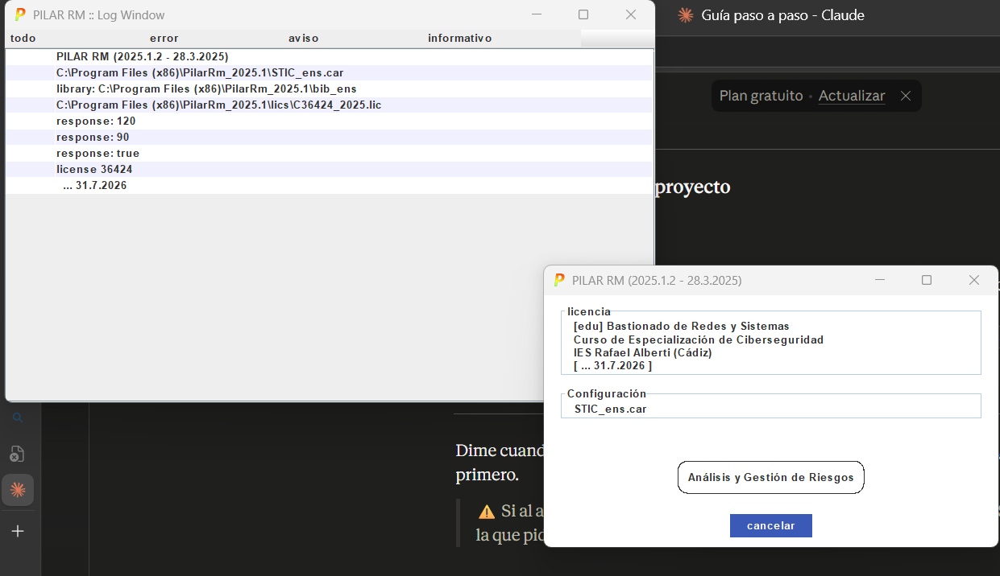
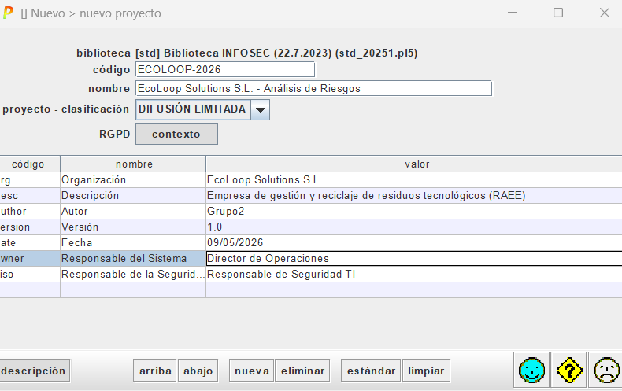
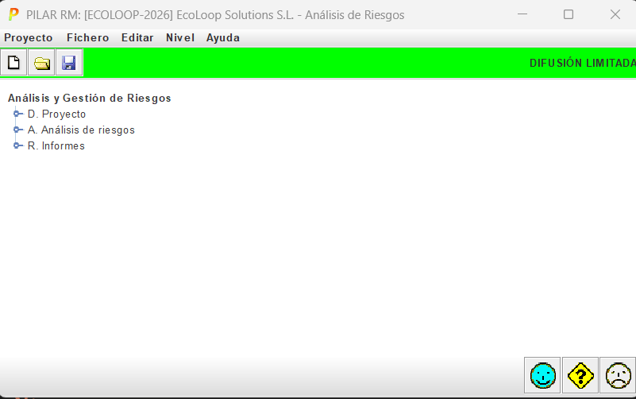
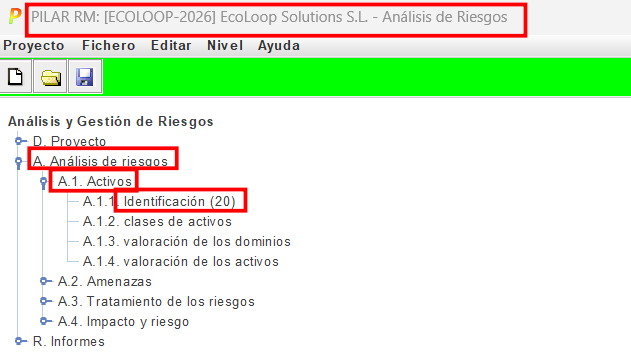
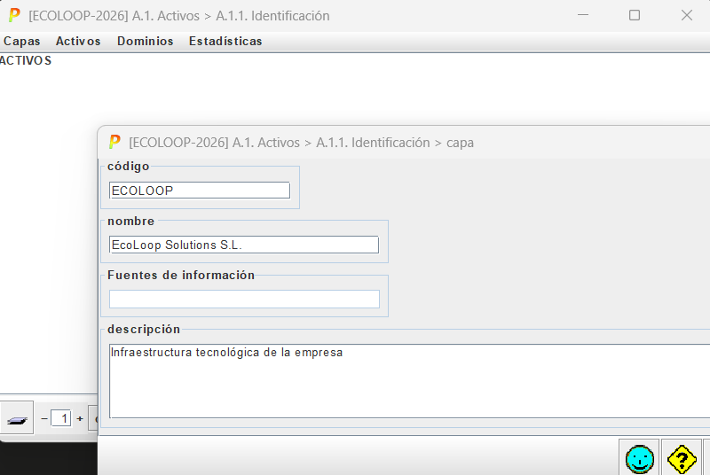
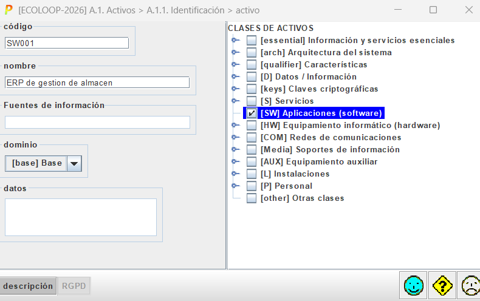
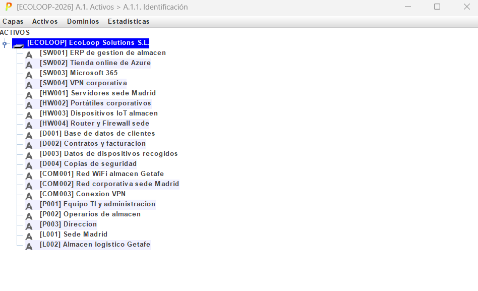

le damos a nalisis y gestion de riesgos

le damos a crear nuevo proyecto y ponemos los datos de nuestra empresa

una evz eso guardamos y vemos el arbol pricipal con tres secciones

le damos a la de identificar activos

una vez dentro le damos a crear capa y lyuego vamos ceando neustos activos

vamos creando todos los activos necesarios (ponemos una captura, ya que es lo mismo pero cambiando el tipo y nombres de los activos)

aqui tenemos ya todos los activos

Ahora le damos a valoracion de activos
