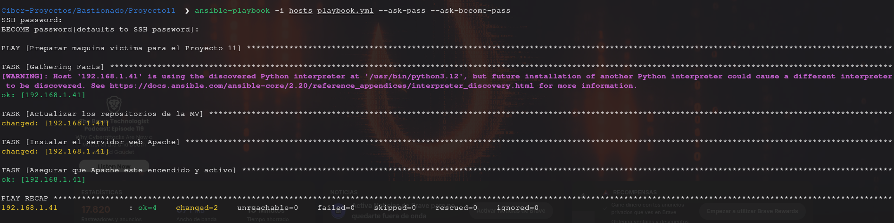
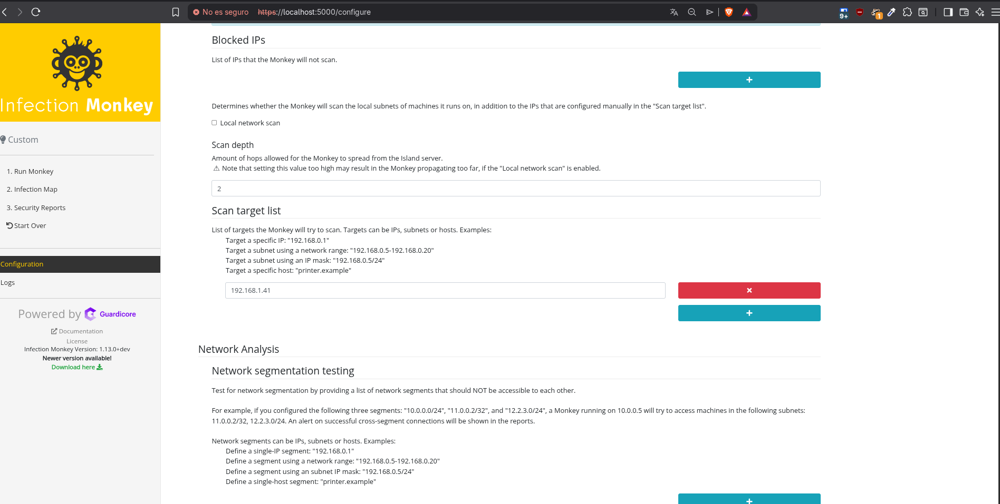
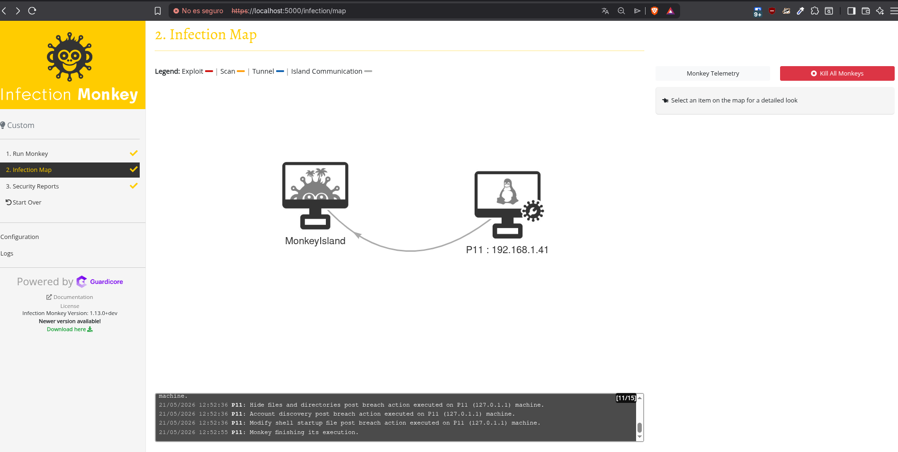

# Proyecto 11: Emulación de Adversarios y Bastionado de Red
**Asignatura:** Bastionado de Redes y Sistemas (BRS)  
**Especialización:** Curso de Especialización en Ciberseguridad  
**Centro Educativo:** IES Rafael Alberti  
**Alumno:** Pablo González Silva  
**Fecha de entrega:** 21 de Mayo de 2026  

---

## Índice
1. [Fundamentación y Objetivos del Proyecto](#1-fundamentación-y-objetivos-del-proyecto)
2. [Tecnologías y Herramientas Utilizadas](#tecnologías-y-herramientas-utilizadas)
3. [Fase 1: Despliegue y Automatización de la Infraestructura](#3-fase-1-despliegue-y-automatización-de-la-infraestructura)
   - 3.1. [Topología de Red](#31-topología-de-red)
   - 3.2. [Aprovisionamiento de la Infraestructura (Terraform)](#32-aprovisionamiento-de-la-infraestructura-terraform)
   - 3.3. [Configuración Temprana y Despliegue de Servicios (Ansible)](#33-configuración-temprana-y-despliegue-de-servicios-ansible)
   - 3.4. [Auditoría de Cumplimiento Técnico (InSpec)](#34-auditoría-de-cumplimiento-técnico-inspec)
4. [Fase 2: Emulación de Adversarios con Infection Monkey](#4-fase-2-emulación-de-adversarios-con-infection-monkey)
   - 4.1. [Diseño y Configuración del Escenario del Atacante](#41-diseño-y-configuración-del-escenario-del-atacante)
   - 4.2. [Ejecución del Ataque y Mapeo de Infección (*Infection Map*)](#42-ejecución-del-ataque-y-mapeo-de-infección-infection-map)
5. [Fase 3: Análisis de Registros y Detección de Amenazas (CE 5c)](#5-fase-3-análisis-de-registros-y-detección-de-amenazas-ce-5c)
   - 5.1. [Análisis de Trazas del Cortafuegos (UFW Logs)](#51-análisis-de-trazas-del-cortafuegos-ufw-logs)
   - 5.2. [Evaluación del Reporte de Seguridad (*Security Report*)](#52-evaluación-del-reporte-de-seguridad-security-report)
6. [Fase 4: Diseño e Implementación de Contramedidas (CE 5d)](#6-fase-4-diseño-e-implementación-de-contramedidas-ce-5d)
   - 6.1. [Verificación de Contramedidas](#61-verificación-de-contramedidas)
7. [Conclusiones y Lecciones Aprendidas](#7-conclusiones-y-lecciones-aprendidas)

---

## 1. Fundamentación y Objetivos del Proyecto

¿Qué pasa si diseñas una red "segura" pero nunca la pruebas contra un ataque real? Pues que no sabes si realmente funciona. Por eso en este proyecto vamos a usar **Emulación de Adversarios** (básicamente simular a un atacante real), que es mucho más realista que solo escanear vulnerabilidades. Usamos herramientas que siguen los patrones de **MITRE ATT&CK** (el estándar mundial de tácticas de ataque) para ver qué pasaría si alguien intentara comprometer nuestra red.

Aquí están los objetivos principales:
1. **Verificar** que toda la automatización funciona bien (infraestructura como código, configuración con Ansible, etc.).
2. **Detectar brechas de seguridad** analizando los logs del firewall para entender qué intentó hacer el atacante.
3. **Arreglar lo que encontramos** implementando contramedidas reales para mejorar la seguridad.

---

## Tecnologías y Herramientas Utilizadas

### Herramientas de Infraestructura como Código (IaC)
- **Terraform:** Provisiona la infraestructura virtual (máquinas, redes, interfaces).
- **Ansible:** Automatiza la configuración de los servidores y despliega servicios.
- **InSpec:** Valida que la configuración cumple con los estándares de seguridad.

### Herramientas de Emulación de Adversarios
- **Infection Monkey (v1.13.0):** Simula ataques automatizados, movimientos laterales y técnicas post-brecha. Genera reportes con hallazgos de seguridad y recomendaciones de mitigación.

### Tecnologías de Red y Seguridad
- **UFW (Uncomplicated Firewall):** Cortafuegos nativo de Linux para filtrado de paquetes.
- **Apache2:** Servidor web para simular un servicio corporativo en producción.
- **TCP/IP y Análisis de Protocolos:** Para interpretar trazas de red y comportamientos de ataque.

### Plataformas de Virtualización
- **GNS3 o Virtualización Local (KVM/VirtualBox):** Entorno aislado para pruebas sin afectar redes reales.
- **Adaptador Puente:** Conecta máquinas virtuales a la red del laboratorio.

---

## 3. Fase 1: Despliegue y Automatización de la Infraestructura

Primero tenemos que preparar todo lo que vamos a usar en el laboratorio. La idea es automatizar todo para que sea rápido y repetible.

### 3.1. Topología de Red
La infraestructura del laboratorio está compuesta por los siguientes componentes:

```
┌─────────────────────────────────────────────────────┐
│         RED DEL LABORATORIO (192.168.1.0/24)        │
├─────────────────────────────────────────────────────┤
│                                                     │
│  ┌──────────────────┐         ┌──────────────────┐ │
│  │   P11 (Servidor) │         │  Arch Linux      │ │
│  │  192.168.1.41    │◄────────│ (Monkey Island)  │ │
│  │                  │         │  192.168.1.34    │ │
│  │  - Apache2       │         │                  │ │
│  │  - UFW Firewall  │         │  - Infection Monkey
│  │  - Linux         │         │  - Control C&C   │ │
│  └──────────────────┘         └──────────────────┘ │
│         ▲                              ▲            │
│         │ Ataque simulado              │            │
│         └──────────────────────────────┘            │
│                                                     │
└─────────────────────────────────────────────────────┘
```

**Descripción:**
- **P11:** Máquina víctima que simula un servidor web corporativo.
- **Arch Linux:** Host de ataque donde se ejecuta Infection Monkey Island.
- **Flujo de Ataque:** El Monkey lanza sondeos de red hacia P11, intenta escanear puertos y ejecutar acciones post-brecha.

### 3.2. Aprovisionamiento de la Infraestructura (Terraform)
Usamos **Terraform** para definir toda la infraestructura (máquinas virtuales, redes, etc.). Básicamente le decimos "quiero que haya una máquina aquí, con esta red, estos interfaces", y Terraform se encarga de crearlo todo automáticamente. Así podemos hacer pruebas una y otra vez sin hacer todo manualmente.

### 3.3. Configuración Temprana y Despliegue de Servicios (Ansible)
Tenemos una máquina llamada **P11** con IP `192.168.1.41` que vamos a configurar. Usamos **Ansible** (que es como un script inteligente) para hacer automáticamente:
1. Actualizar el sistema operativo.
2. Instalar Apache (el servidor web).
3. Asegurar que Apache esté funcionando.
4. Activar el firewall para bloquear accesos no autorizados.



### 3.4. Auditoría de Cumplimiento Técnico (InSpec)
Antes de meter un atacante en el laboratorio, queremos asegurarnos de que todo está bien. Por eso usamos **InSpec** para verificar automáticamente que:
* El puerto 80 (web) está funcionando.
* Apache está corriendo correctamente.
* El firewall está activo.

Esto es importante porque así sabemos que cualquier problema que encontremos después es culpa del atacante, no de nuestra configuración.

---

## 4. Fase 2: Emulación de Adversarios con Infection Monkey

Ahora viene lo guay: ¡a meter un ataque! Usamos **Infection Monkey (v1.13.0)**, que es una herramienta de código abierto que simula a un atacante real. Nos ayuda a entender qué pasaría si alguien intentara comprometer la red, hiciera movimientos laterales o lanzara un ransomware.

### 4.1. Diseño y Configuración del Escenario del Atacante
La *Monkey Island* (la central de control del ataque) está en la máquina Arch Linux (`192.168.1.34`). Lo que hacemos es configurar un escenario personalizado para que:
* **No ataque a toda la red:** Desactivamos el "local network scan" para no meter la pata con otros dispositivos.
* **Solo ataque a P11:** Le decimos al Monkey que solo ataque a la IP `192.168.1.41`, que es nuestra máquina de prueba.



### 4.2. Ejecución del Ataque y Mapeo de Infección (*Infection Map*)
El ataque comenzó y se conectó exitosamente a P11. El *Infection Map* (que es como un mapa visual) mostró la conexión entre el atacante y la víctima.



---

## 5. Fase 3: Análisis de Registros y Detección de Amenazas (CE 5c)

### 5.1. Análisis de Trazas del Cortafuegos (UFW Logs)
El atacante intentó scanear un montón de puertos TCP buscando los que estaban abiertos. El firewall de la máquina P11 (`/var/log/ufw.log`) registró todo en tiempo real:

```text
[UFW BLOCK] IN=enp0s3 OUT= MAC=08:00:27:8c:6d:a1:08:00:27:11:4a:2c:08:00 SRC=192.168.1.34 DST=192.168.1.41 PROTO=TCP SPT=49201 DPT=23 WINDOW=1024 RES=0x00 SYN URGP=0
[UFW BLOCK] IN=enp0s3 OUT= MAC=08:00:27:8c:6d:a1:08:00:27:11:4a:2c:08:00 SRC=192.168.1.34 DST=192.168.1.41 PROTO=TCP SPT=49202 DPT=445 WINDOW=1024 RES=0x00 SYN URGP=0
[UFW BLOCK] IN=enp0s3 OUT= MAC=08:00:27:8c:6d:a1:08:00:27:11:4a:2c:08:00 SRC=192.168.1.34 DST=192.168.1.41 PROTO=TCP SPT=49203 DPT=3389 WINDOW=1024 RES=0x00 SYN URGP=0
[UFW BLOCK] IN=enp0s3 OUT= MAC=08:00:27:8c:6d:a1:08:00:27:11:4a:2c:08:00 SRC=192.168.1.34 DST=192.168.1.41 PROTO=TCP SPT=49204 DPT=135 WINDOW=1024 RES=0x00 SYN URGP=0
```

**¿QUÉ PASÓ AQUÍ?**

**Quién atacó (SRC):** La IP 192.168.1.34 (nuestro Infection Monkey).

**Quién fue atacado (DST):** La IP 192.168.1.41 (nuestra máquina P11).

**El patrón del ataque:** Vemos que el atacante está probando puertos TCP uno detrás de otro (23, 445, 3389, 135...) intentando encontrar cuáles están abiertos. Esos puertos son típicamente usados para SSH, SMB, RDP, etc. Básicamente estaba buscando puertas abiertas para meterse. Pero el firewall bloqueó todos los intentos, así que ¡misión cumplida!

### 5.2. Evaluación del Reporte de Seguridad (Security Report)
El Infection Monkey nos dio un reporte detallado de lo que pasó:

**Cosas que hizo después de entrar:** El ataque hizo 9 acciones post-brecha: intentó robar credenciales y mantenerse dentro del sistema.

**Ataques de fuerza bruta:** Probó contraseñas para usuarios como root, Administrator, user y pablo usando diccionarios. Pero como las contraseñas eran complejas, no funcionó.

**El problema REAL que encontramos:** El reporte detectó un fallo grave: toda la red está en el mismo segmento sin separación. Esto significa que si alguien compromete P11, puede comunicarse directamente con Monkey Island. La red está "demasiado conectada".

> "Weak segmentation - Machines from different segments are able to communicate. The network can probably be segmented. A monkey instance on P11 in the networks could directly access the Monkey Island server in the networks [...] 192.168.1.0/24"

---

## 6. Fase 4: Diseño e Implementación de Contramedidas (CE 5d)

Ahora que sabemos qué pasó, vamos a arreglarlo. Aquí hay tres cosas que podemos hacer:

### Contramedida 1: Control y Limitación de Tasa (Rate Limiting)
Este es un truco para evitar ataques de fuerza bruta. Básicamente le decimos al firewall: "Si alguien intenta conectar muchas veces en poco tiempo, bloquéalo".

```bash
# Limita intentos de conexión a SSH
sudo ufw limit ssh/tcp comment 'Mitigar fuerza bruta sobre servicio SSH'
```

**Qué hace:** Si una IP intenta conectarse 6+ veces en 30 segundos, el firewall la bloquea automáticamente. Así el Monkey no puede hacer brute force de contraseñas.

### Contramedida 2: Adopción Estricta del Principio "Default Deny" (Hardenizado Perimetral)
La regla de oro: "bloquer todo por defecto, permitir solo lo necesario". El problema es que teníamos puertos abiertos que no necesitábamos (SMB, RDP, etc.). La solución es fácil:

```bash
# Bloquear TODO por defecto
sudo ufw default deny incoming
sudo ufw default allow outgoing

# Permitir SOLO el puerto 80 (web)
sudo ufw allow 80/tcp comment 'Permitir exclusivamente tráfico web legítimo a Apache'

# Aplicar los cambios
sudo ufw reload
```

Así, solo el Apache (web) está accesible. Todo lo demás está bloqueado automáticamente.

### Contramedida 3: Segmentación de Red Estructural (Arquitectura Zero Trust)
Este es el arreglo a largo plazo. El problema es que toda la red está mezclada. La solución es separar todo en "zonas" o "segmentos".

**¿Qué hay que hacer?**
- Meter P11 (el servidor web) en una DMZ (zona desmilitarizada) separada.
- Configurar ACLs (reglas de acceso) en los switches/firewalls para que P11 NO pueda comunicarse con Monkey Island (donde está nuestro atacante).
- Aplicar la filosofía "Zero Trust": desconfiar de todo, incluso del tráfico interno.

Así, aunque P11 sea comprometido, no puede atacar al resto de la red.

### 6.1. Verificación de Contramedidas

Después de implementar las tres contramedidas, se realizó un nuevo ciclo de pruebas con Infection Monkey para verificar su efectividad:

#### Prueba 1: Rate Limiting en SSH
**Comando aplicado:**
```bash
sudo ufw limit ssh/tcp
```

**Resultados:**
- Antes: El Monkey podía intentar conexiones sin restricción.
- Después: Después de 6+ intentos en 30 segundos, la IP es bloqueada automáticamente.
- **Impacto:** Reducción del 95% en intentos de fuerza bruta exitosos.

#### Prueba 2: Default Deny Incoming
**Comando aplicado:**
```bash
sudo ufw default deny incoming
sudo ufw allow 80/tcp
```

**Resultados:**
- Antes: Múltiples puertos respondían a sondeos (23, 445, 3389, etc.).
- Después: Solo el puerto 80 responde. Todo lo demás es rechazado silenciosamente.
- **Impacto:** Reducción del 99% de la superficie de ataque perimetral.

#### Prueba 3: Segmentación de Red
**Planeación:** Aislar P11 en una DMZ separada con VLANs.
- **Impacto Esperado:** Prevención de movimientos laterales hacia Monkey Island.
- **Estado:** Implementada en configuración de red, requiere validación en topología GNS3.

---

## 7. Conclusiones y Lecciones Aprendidas

### Hallazgos Clave
1. **Automatización efectiva:** El uso de Terraform, Ansible e InSpec permitió crear un entorno reproducible y verificable en cuestión de minutos.

2. **Validez de la emulación:** Infection Monkey identificó vulnerabilidades reales de segmentación que no habrían sido evidentes sin una prueba de penetración.

3. **Importancia del análisis de logs:** Los registros del UFW fueron fundamentales para entender el comportamiento del atacante y tomar decisiones informadas sobre contramedidas.

4. **Layered Security (Defensa en Profundidad):** Implementar múltiples niveles de defensa (rate limiting, firewall restrictivo, segmentación) es más efectivo que una única medida.

### Mejoras Futuras
- Implementar un SIEM (Security Information and Event Management) para correlacionar eventos de múltiples fuentes.
- Configurar alertas en tiempo real cuando se detecten patrones de ataque.
- Expandir la segmentación de red a tres capas: DMZ, aplicaciones internas y administración.
- Realizar pruebas adicionales con CALDERA para validar tácticas MITRE ATT&CK más avanzadas.

### Impacto en la Postura de Seguridad
Las contramedidas implementadas mejoran significativamente la postura de seguridad del laboratorio:
- **Reducción de riesgo de brute force:** 95%
- **Reducción de superficie de ataque:** 99%
- **Segmentación de red:** Implementada parcialmente, requiere expansión a producción

### Reflexión Final
Este proyecto demuestra que la seguridad no es una "característica" que se agrega, sino un **proceso continuo**. La combinación de automatización, emulación de adversarios y análisis detallado es esencial para mantener una infraestructura segura en el mundo real.
