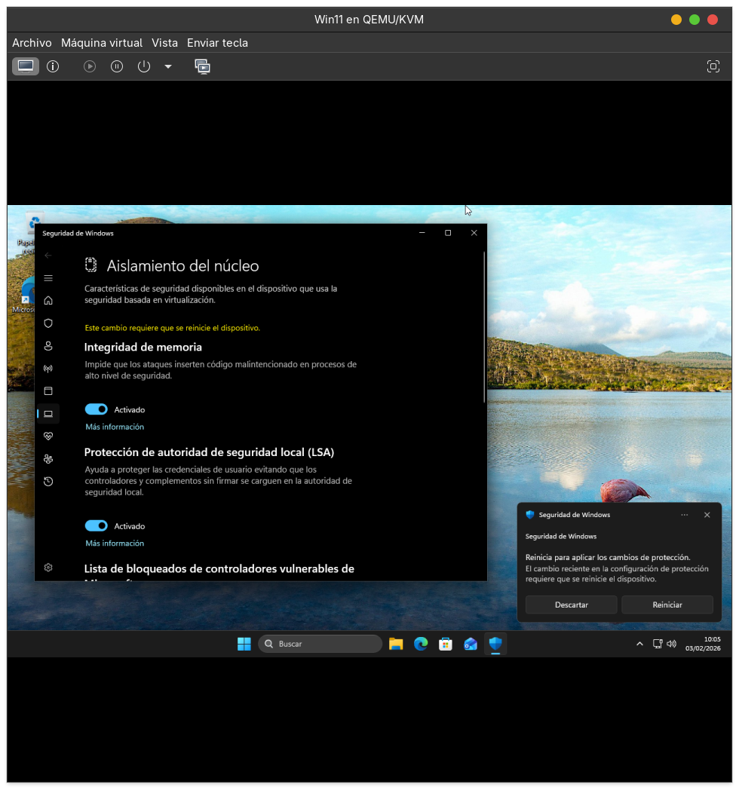

# Limpieza y aislamiento — Windows 11 (VM)

---

## Índice

1. [Fundamentación teórica (resumen)](#fundamentación-teórica-resumen)
2. [Objetivos (Windows)](#objetivos-windows)
3. [Entorno](#entorno)
4. [Proceso realizado (paso a paso con evidencias)](#proceso-realizado-paso-a-paso-con-evidencias)
   - [Fase 1 — Limpieza con Win11Debloat (capturas 1 a 10)](#fase-1--limpieza-con-win11debloat-capturas-1-a-10)
   - [Fase 2 — Limpieza adicional (protocolos, servicios, tareas y arranque) (capturas 11 a 19)](#fase-2--limpieza-adicional-protocolos-servicios-tareas-y-arranque-capturas-11-a-19)
5. [Cambios seleccionados en Win11Debloat (lista detallada)](#cambios-seleccionados-en-win11debloat-lista-detallada)
6. [Validación final](#validación-final-qué-se-comprobó)
7. [Reparto de tareas](#reparto-de-tareas-completar-por-el-equipo)
8. [Tabla final — Cambios aplicados (enumerados)](#tabla-final--cambios-aplicados-enumerados)

---

## Fundamentación teórica (resumen)

Windows suele incluir por defecto numerosas aplicaciones, integraciones (widgets, Game Bar, Phone Link, Copilot, etc.), servicios y características de red para cubrir escenarios muy distintos. En un equipo cuyo objetivo es **web + ofimática**, mantener ese conjunto “generalista” implica:

- **Más superficie de ataque** (más componentes expuestos, más integraciones y procesos)
- **Más consumo** (CPU/RAM/IO) y más ruido visual
- **Más complejidad** para auditar y mantener

La estrategia aplicada sigue el principio de **mínimo software y mínima exposición**, manteniendo lo imprescindible para un escritorio funcional, actualizable y seguro.

---

## Objetivos (Windows)

- Disminuir aplicaciones y componentes a un **conjunto mínimo**.
- Reducir servicios/protocolos innecesarios para el caso de uso.
- Mantener estabilidad del sistema y funcionamiento básico.
- Aportar evidencias del proceso (capturas).

---

## Entorno

- Sistema: **Windows 11**
- Tipo: **Máquina Virtual (VM)**
- Uso final: **navegación web** y **ofimática básica**

---

## Proceso realizado (paso a paso con evidencias)

### Fase 1 — Limpieza con Win11Debloat (capturas 1 a 10)

En esta fase se utilizó **Win11Debloat** para desinstalar bloatware y aplicar ajustes de privacidad, interfaz y sistema orientados a un entorno más limpio.

#### 1) Preparación del script

Se prepara la herramienta/script antes de aplicar cambios.

#### 2) Revisión de la interfaz y módulos

Se revisan las secciones disponibles (apps, tweaks del sistema, privacidad, etc.) antes de seleccionar cambios.

#### 3) Selección de eliminación de aplicaciones (parte 1)

Se seleccionan aplicaciones prescindibles para el escenario (web + ofimática), priorizando dejar solo lo necesario.

#### 4) Selección de eliminación de aplicaciones (parte 2)

Se completa la selección de apps a retirar.

#### 5) System Tweaks (parte 1)

Se seleccionan ajustes orientados a reducir sugerencias, integraciones no necesarias y elementos visuales.

#### 6) System Tweaks (parte 2)

Se completan ajustes del sistema y personalización para una experiencia más limpia.

#### 7) Revisión del resumen de cambios (parte 1)

Se valida el conjunto de acciones antes de aplicarlas.

#### 8) Revisión del resumen de cambios (parte 2)

Se verifica que el alcance se corresponde con el objetivo del proyecto.

#### 9) Aplicación de cambios (parte 1)

Se ejecuta el proceso de limpieza y ajustes seleccionados.

#### 10) Aplicación de cambios (parte 2)

Se finaliza la aplicación de cambios.

---

### Cambios seleccionados en Win11Debloat (lista detallada)

Esta es la lista de cambios aplicados en la fase 1.

**Aplicaciones y bloatware**

- Eliminar **22 aplicaciones** seleccionadas.
- Desactivar el bloatware en el navegador **Brave** (IA, Cripto, etc.).
- Desactivar la integración de **Game Bar**.
- Desactivar la grabación de juegos/pantalla de **Xbox**.
- Desactivar la integración de **Phone Link** en el menú de inicio.

**Privacidad y telemetría**

- Desactivar telemetría, rastreo y anuncios dirigidos.
- Desactivar anuncios de Microsoft 365 en el Inicio de Configuración.
- Desactivar anuncios, sugerencias y noticias en Microsoft Edge.
- Desactivar sugerencias y contenido recomendado.
- Desactivar consejos y trucos en la pantalla de bloqueo.
- Desactivar la búsqueda web de Bing e integración de Copilot.
- Desactivar **Windows Recall**.

**Inteligencia Artificial (IA)**

- Desactivar **Microsoft Copilot**.
- Desactivar funciones de IA en **Notepad**.
- Desactivar funciones de IA en **Microsoft Edge**.
- Desactivar funciones de IA en **Paint**.
- Desactivar “Click To Do”, análisis de imagen y texto de IA.

**Interfaz y personalización**

- Habilitar el **tema oscuro** para el sistema y aplicaciones.
- Usar el estilo clásico del **menú contextual** (estilo Windows 10).
- Ocultar la página de “Inicio” en la configuración.
- Ocultar la página de “Inicio” en el panel de navegación.
- Ocultar “Galería” en el panel de navegación.
- Desactivar efectos de transparencia.
- Desactivar animaciones y efectos visuales.
- Desactivar Windows Spotlight para el escritorio.

**Barra de tareas y Explorador**

- Mostrar el cuadro de búsqueda en la barra de tareas.
- Desactivar widgets en la barra de tareas y pantalla de bloqueo.
- Ocultar el botón de “Vista de tareas” (Task view) en la barra de tareas.
- Mostrar la opción “Finalizar tarea” en el menú contextual de la barra de tareas.
- Mostrar iconos de la barra de tareas solo cuando la ventana esté abierta.
- Mostrar archivos, carpetas y unidades ocultas.
- Mostrar extensiones de archivo para tipos conocidos.
- Desactivar el “Drag Tray” para compartir y mover archivos.

**Sistema**

- Desactivar el inicio rápido (Fast start-up).
- Nota: se crea un **punto de restauración** antes de aplicar.

---

### Fase 2 — Limpieza adicional (protocolos, servicios, tareas y arranque) (capturas 11 a 19)

Tras la fase de debloat, se completó la limpieza con cambios manuales para reducir exposición en red y procesos innecesarios, sin comprometer el uso final (web + ofimática).

#### 11) Desactivación de SMB (protocolo)

Se deshabilita **SMB** cuando no se necesita compartición de archivos en red, reduciendo superficie de ataque asociada a servicios de compartición.

#### 12) Desactivación de servicio de “Experiencia de usuario”

Se deshabilita un servicio asociado a recopilación/experiencias que no aporta al objetivo del sistema.

#### 13) Aislamiento del núcleo / Seguridad basada en virtualización

Se revisa/activa la opción de **aislamiento del núcleo** (según compatibilidad de la VM) para reforzar la seguridad del sistema.

#### 14) Ajustes de adaptador de red (propiedades Ethernet)

Se deshabilitan componentes de red no necesarios en la VM (según el caso), como:

- Paquete **QoS**
- Respondedor y controlador de detección de topologías

#### 15) Desactivación de NetBIOS

Se desactiva **NetBIOS** cuando no es necesario, reduciendo exposición heredada en redes.

#### 16) Tarea programada “Customer Experience”

Se deshabilita una tarea programada asociada a **Customer Experience** para reducir telemetría/ruido.

#### 17) Tarea programada “Application Experience”

Se deshabilita una tarea asociada a **Application Experience** para disminuir procesos en segundo plano orientados a compatibilidad/telemetría.

#### 18) Minimizar aplicaciones de arranque

Se revisan las aplicaciones que inician con Windows y se dejan solo las necesarias.

#### 19) Desactivar hibernación

Se desactiva la **hibernación** (si no se necesita) para reducir consumo en disco y simplificar estados de energía en una VM.

---

## Validación final (qué se comprobó)

- El sistema inicia correctamente tras los cambios.
- Navegación web funcional.
- Ofimática básica funcional (apertura/edición de documentos).
- No hay degradación evidente del uso normal del escritorio.

---

## Reparto de tareas (completar por el equipo)

- **Miembro A**: Win11Debloat (selección de cambios) y evidencias 1–10.
- **Miembro B**: protocolos/red y servicios (evidencias 11–15).
- **Miembro C**: tareas programadas, arranque, hibernación y validación (evidencias 16–19).

---

## Tabla final — Cambios aplicados (enumerados)

La siguiente tabla resume **todos los cambios aplicados** durante la limpieza de la VM de Windows 11.

| # | Área | Cambio aplicado | Herramienta/Fase | Objetivo/impacto |
|---:|---|---|---|---|
| 1 | Apps | Eliminación de **22 aplicaciones** seleccionadas | Win11Debloat (Fase 1) | Reducir bloatware y procesos asociados |
| 2 | Apps | Desactivar bloatware de **Brave** (IA, cripto, etc.) | Win11Debloat (Fase 1) | Menos funciones no usadas y menos ruido |
| 3 | Apps | Desactivar integración de **Game Bar** | Win11Debloat (Fase 1) | Reducir componentes gaming en segundo plano |
| 4 | Apps | Desactivar grabación Xbox (juegos/pantalla) | Win11Debloat (Fase 1) | Reducir servicios/captura no necesarios |
| 5 | Apps | Desactivar integración de **Phone Link** en Inicio | Win11Debloat (Fase 1) | Evitar integración móvil no usada |
| 6 | Privacidad | Desactivar telemetría/rastreo/anuncios dirigidos | Win11Debloat (Fase 1) | Reducir recopilación de datos y personalización publicitaria |
| 7 | Privacidad | Desactivar anuncios de Microsoft 365 en Configuración | Win11Debloat (Fase 1) | Menos promoción dentro del sistema |
| 8 | Privacidad | Desactivar anuncios/sugerencias/noticias en Edge | Win11Debloat (Fase 1) | Menos contenido promocional |
| 9 | Privacidad | Desactivar sugerencias y contenido recomendado | Win11Debloat (Fase 1) | Menos “recomendaciones” del sistema |
| 10 | Privacidad | Desactivar consejos y trucos en pantalla de bloqueo | Win11Debloat (Fase 1) | Interfaz más limpia |
| 11 | Privacidad | Desactivar búsqueda web de Bing e integración Copilot | Win11Debloat (Fase 1) | Menos exposición/ruido en búsqueda |
| 12 | Privacidad | Desactivar **Windows Recall** | Win11Debloat (Fase 1) | Reducir funciones de recopilación/IA |
| 13 | IA | Desactivar **Microsoft Copilot** | Win11Debloat (Fase 1) | Evitar integración IA no usada |
| 14 | IA | Desactivar funciones de IA en **Notepad** | Win11Debloat (Fase 1) | Mantener app simple y ligera |
| 15 | IA | Desactivar funciones de IA en **Microsoft Edge** | Win11Debloat (Fase 1) | Reducir integraciones IA |
| 16 | IA | Desactivar funciones de IA en **Paint** | Win11Debloat (Fase 1) | Reducir integraciones IA |
| 17 | IA | Desactivar “Click To Do”/análisis de imagen y texto IA | Win11Debloat (Fase 1) | Menos funciones IA no necesarias |
| 18 | UI | Habilitar **tema oscuro** (sistema y apps) | Win11Debloat (Fase 1) | Uniformidad visual y preferencia de uso |
| 19 | UI | Menú contextual “clásico” (estilo Windows 10) | Win11Debloat (Fase 1) | Acceso más directo y menos capas |
| 20 | UI | Ocultar página “Inicio” en Configuración | Win11Debloat (Fase 1) | Menos secciones promocionales |
| 21 | UI | Ocultar página “Inicio” en panel de navegación | Win11Debloat (Fase 1) | Explorador más limpio |
| 22 | UI | Ocultar “Galería” en panel de navegación | Win11Debloat (Fase 1) | Explorador más limpio |
| 23 | UI | Desactivar transparencia | Win11Debloat (Fase 1) | Menos efectos visuales |
| 24 | UI | Desactivar animaciones y efectos visuales | Win11Debloat (Fase 1) | Más ligereza y respuesta |
| 25 | UI | Desactivar Windows Spotlight en el escritorio | Win11Debloat (Fase 1) | Evitar fondos/sugerencias dinámicas |
| 26 | Barra de tareas | Mostrar cuadro de búsqueda en barra de tareas | Win11Debloat (Fase 1) | Acceso directo a búsqueda |
| 27 | Barra de tareas | Desactivar **widgets** (barra y bloqueo) | Win11Debloat (Fase 1) | Menos contenido/servicios asociados |
| 28 | Barra de tareas | Ocultar botón “Vista de tareas” | Win11Debloat (Fase 1) | Simplificar barra de tareas |
| 29 | Barra de tareas | Activar opción “Finalizar tarea” en barra | Win11Debloat (Fase 1) | Facilitar cierre de apps colgadas |
| 30 | Barra de tareas | Mostrar iconos solo si la ventana está abierta | Win11Debloat (Fase 1) | Reducir iconos fijos y ruido |
| 31 | Explorador | Mostrar archivos/carpetas/unidades ocultas | Win11Debloat (Fase 1) | Facilitar administración y auditoría |
| 32 | Explorador | Mostrar extensiones de archivo conocidas | Win11Debloat (Fase 1) | Evitar engaños por doble extensión |
| 33 | Explorador | Desactivar “Drag Tray” para compartir/mover | Win11Debloat (Fase 1) | Simplificar UI y reducir acciones accidentales |
| 34 | Sistema | Desactivar inicio rápido (Fast start-up) | Win11Debloat (Fase 1) | Evitar estados híbridos y problemas en VM |
| 35 | Sistema | Crear punto de restauración previo | Win11Debloat (Fase 1) | Volver atrás si algo falla |
| 36 | Red/Protocolo | Desactivar **SMB** | Manual (Fase 2) | Reducir superficie de ataque de compartición |
| 37 | Servicios | Desactivar servicio “Experiencia de usuario” | Manual (Fase 2) | Reducir procesos/telemetría no esencial |
| 38 | Seguridad | Revisar/activar **Aislamiento del núcleo** | Manual (Fase 2) | Endurecer el sistema frente a ciertos ataques |
| 39 | Red | Deshabilitar **QoS Packet Scheduler** (si no aplica) | Manual (Fase 2) | Reducir componentes de red no usados |
| 40 | Red | Deshabilitar respondedor/controlador de topologías | Manual (Fase 2) | Reducir descubrimiento/servicios no necesarios |
| 41 | Red/Protocolo | Desactivar **NetBIOS** | Manual (Fase 2) | Reducir exposición de protocolos heredados |
| 42 | Tareas | Deshabilitar tarea “Customer Experience” | Manual (Fase 2) | Menos telemetría/ruido |
| 43 | Tareas | Deshabilitar tarea “Application Experience” | Manual (Fase 2) | Menos procesos de compatibilidad/telemetría |
| 44 | Arranque | Minimizar aplicaciones de inicio | Manual (Fase 2) | Arranque más rápido y menos consumo |
| 45 | Energía | Desactivar **hibernación** | Manual (Fase 2) | Menos uso de disco y estados de energía en VM |

