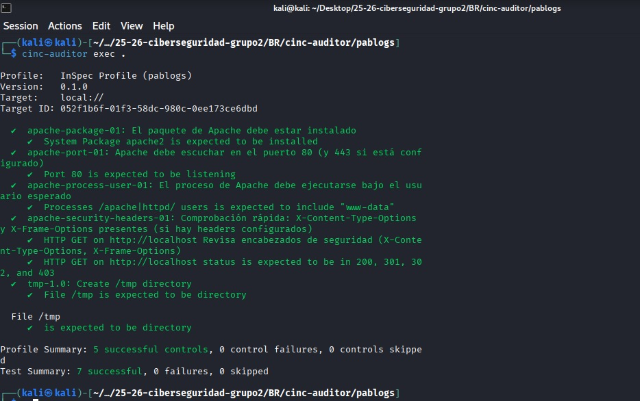

# Guía para cumplir los controles de Apache en Debian 12

Este documento explica cómo configurar y verificar Apache en **Debian 12** para que todas las pruebas de seguridad y configuración del archivo `controls/apache.rb` se cumplan correctamente.


---

## 1. Verificar instalación del paquete Apache

```bash
sudo apt update
sudo apt install apache2 -y
```

Debe aparecer una línea indicando que el paquete `apache2` está instalado.  
El servicio también debe estar activo:

```bash
sudo systemctl status apache2
```

---

## 2. Apache debe escuchar en los puertos 80 y/o 443


Los puertos estén definidos en `/etc/apache2/ports.conf`:

```bash
sudo nano /etc/apache2/ports.conf
```

Debe contener:

```
Listen 80
<IfModule ssl_module>
    Listen 443
</IfModule>
```

HTTPS:

```bash
sudo a2enmod ssl
sudo a2ensite default-ssl.conf
sudo systemctl reload apache2
```

```bash
sudo ss -tuln | grep ':80'
sudo ss -tuln | grep ':443'
```

Debe mostrar que Apache (`apache2`) está escuchando

---

## 3. Apache debe ejecutarse como el usuario correcto

```bash
sudo nano /etc/apache2/apache2.conf
```

Verifica las líneas:

```
User www-data
Group www-data
```

```bash
sudo systemctl restart apache2
```

###  Verificación

```bash
ps aux | grep apache2
```

Debe mostrar procesos ejecutándose como `www-data`

---

## 4. Encabezados de seguridad HTTP básicos


Edita el archivo de configuración del sitio
```bash
sudo nano /etc/apache2/sites-available/000-default.conf
```

Dentro del bloque:

```
<IfModule mod_headers.c>
    Header always set X-Content-Type-Options "nosniff"
    Header always set X-Frame-Options "SAMEORIGIN"
</IfModule>
```

Habilita el módulo `headers`

```bash
sudo a2enmod headers
sudo systemctl reload apache2
```

### Verificación

```bash
curl -I http://localhost
```

Debe mostrar:

```
X-Content-Type-Options: nosniff
X-Frame-Options: SAMEORIGIN
```

---


## 6. Comprobación general
```bash
sudo systemctl restart apache2
sudo inspec exec controls/apache.rb
```


---
