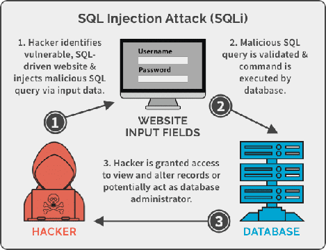
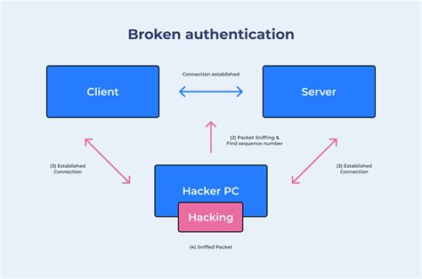
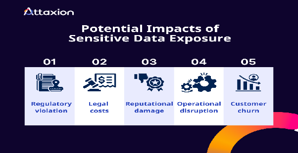
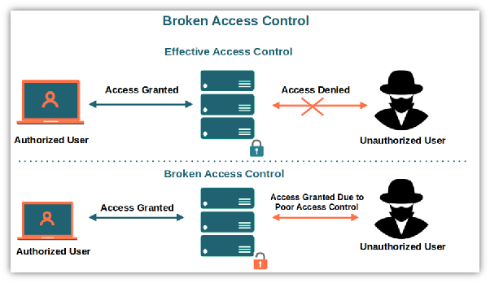
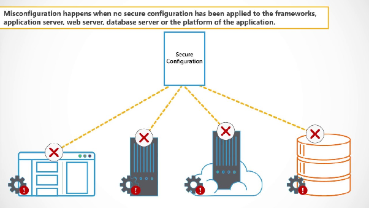
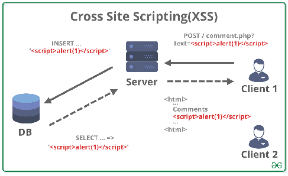
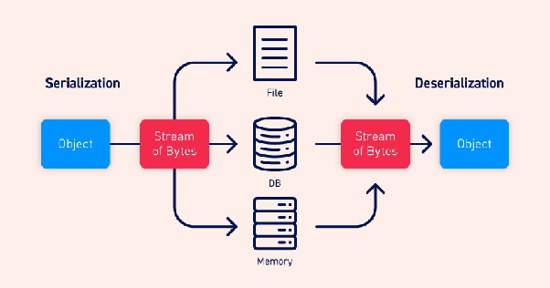
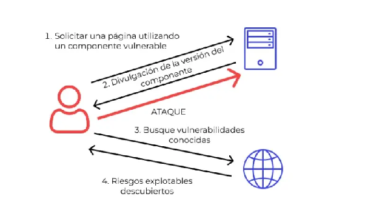
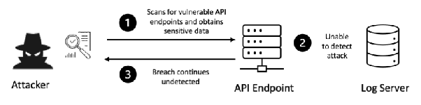
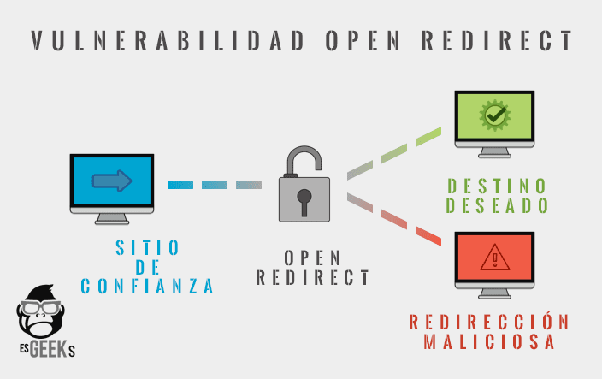

# **Informe Técnico – Proyecto 1: Cybersecurity Consulting**

**Autores**  
Pablo González · Carlos Alcina · David Jiménez · Luis Carlos Romero

**Área seleccionada**  
Aplicaciones Web

**Cliente**  
TrustShield Financial  

# **1\. Introducción**

La seguridad, controlada, equilibrada e inteligente, no es un gasto sino una inversión.

La ciberseguridad es una disciplina en constante evolución, y una parte crucial de esta es la detección temprana de vulnerabilidades. Requiere tanto un conocimiento profundo de los tipos de vulnerabilidades que afectan a distintas áreas tecnológicas como la capacidad de identificar vulnerabilidades concretas que pueden explotarse en escenarios reales.

Los profesionales del hacking ético desempeñan un papel fundamental al identificar brechas de seguridad antes de que sean explotadas.

En este proyecto, por encargo de TrustShield Financial —una institución financiera de renombre internacional—, nuestro grupo ha realizado un análisis detallado del área de Aplicaciones Web, con el objetivo de identificar vulnerabilidades críticas que pudieran comprometer la confidencialidad, integridad y disponibilidad de sus datos y sistemas financieros.

La metodología seguida comprende dos fases: primero, el estudio de las principales categorías de vulnerabilidades que afectan aplicaciones web; segundo, la identificación y análisis de vulnerabilidades reales recogidas de fuentes acreditadas (CVE). A partir de estos análisis se proponen contramedidas concretas, adaptadas al entorno de una entidad financiera.

## 

## 

# **2\. Categorías de vulnerabilidades en aplicaciones web**

A continuación, se analizan las principales categorías de vulnerabilidades que afectan a aplicaciones web, su funcionamiento, impacto y relevancia para el sector financiero.

## **2.1. Inyección (Injection)**

Ejemplo: SQL Injection, Command Injection.  
Ocurre cuando una aplicación permite que datos no validados del usuario se envíen directamente a un intérprete (como una base de datos o shell del sistema).  
Un atacante puede manipular consultas o comandos para acceder o modificar información sensible.

## **2.2. Autenticación rota (Broken Authentication)**

Los mecanismos de inicio de sesión, recuperación de contraseñas o manejo de tokens son inseguros, lo que permite a un atacante suplantar la identidad de otros usuarios o acceder sin autorización.

## **2.3. Exposición de datos sensibles (Sensitive Data Exposure)**

Los datos personales, financieros o confidenciales no se protegen adecuadamente (por ejemplo, sin cifrado HTTPS o con almacenamiento inseguro).  
Esto facilita el robo de información privada.

## **2.4. Control de acceso roto (Broken Access Control)**

Los usuarios pueden acceder a funciones o datos que no deberían.  
Por ejemplo, un usuario estándar puede ver o modificar información de un administrador al manipular URLs o parámetros.

## **2.5. Configuración de seguridad incorrecta (Security Misconfiguration)**

Configuraciones por defecto, mensajes de error detallados o servicios innecesarios activos pueden exponer información o permitir ataques.

Es una de las vulnerabilidades más frecuentes.

## **2.6. Cross-Site Scripting (XSS)**

Ocurre cuando la aplicación inserta código JavaScript malicioso en las páginas vistas por otros usuarios.  
Esto permite el robo de cookies, sesiones o redirección a sitios falsos.

## **2.7. Deserialización insegura (Insecure Deserialization)**

Sucede cuando los datos serializados del usuario (por ejemplo, objetos JSON o binarios) se deserializan sin validación.

Un atacante puede manipular esos datos para ejecutar código malicioso o escalar privilegios.

## **2.8. Uso de componentes vulnerables (Using Components with Known Vulnerabilities)**

La aplicación usa librerías, frameworks o módulos con fallos conocidos (como versiones antiguas de Log4j o jQuery).

Esto expone al sistema a vulnerabilidades ya documentadas.

## **2.9. Registro y monitoreo insuficientes (Insufficient Logging & Monitoring)**

Si la aplicación no registra ni monitorea adecuadamente eventos de seguridad, los ataques pueden pasar desapercibidos y no se podrá responder a tiempo ante incidentes.

## **2.10. Redirecciones y reenvíos inseguros (Unvalidated Redirects and Forwards)**

Ocurre cuando la aplicación redirige o reenvía usuarios a URLs proporcionadas por el atacante, lo que facilita ataques de phishing o redirección a sitios maliciosos.  

# **3\. Identificación de CVEs críticos**

| CVE | Categoría | Score | Descripción |
| ----- | ----- | ----- | ----- |
| CVE-2025-53770 | **Deserialización insegura / Ejecución remota (RCE)** | 9,8 (Crítico) | Vulnerabilidad de deserialización insegura en servidores SharePoint on-premise, explotada activamente como parte de la cadena “ToolShell” para ejecución remota de código. ([The Cloudflare Blog](https://blog.cloudflare.com/cloudflare-protects-against-critical-sharepoint-vulnerability-cve-2025-53770/?utm_source=chatgpt.com)) |
| CVE-2025-29927 | **Control de acceso roto / Bypass de autorización** | 9.1 (Crítico) | Vulnerabilidad en el sistema de middleware de Next.js que permite un salto de autorización, evadiendo controles que normalmente protegerían rutas o recursos. ([picussecurity.com](https://www.picussecurity.com/resource/blog/cve-2025-29927-nextjs-middleware-bypass-vulnerability)) |
| CVE-2025-27448 | **Cross-Site Scripting (XSS)** | 6.8 | Un atacante que puede crear nuevos dashboards puede inyectar código JavaScript en el nombre del dashboard, que se ejecuta cuando se carga la página. ([NVD](https://nvd.nist.gov/vuln/detail/CVE-2025-27448)) |
| CVE-2025-23006 | **Deserialización insegura (previa autenticación)** | 9,8 (Crítico) | Vulnerabilidad de deserialización pre-autenticada en el SMA1000 Appliance Management que podría permitir ejecución de comandos del sistema operativo. ([NVD](https://nvd.nist.gov/vuln/detail/CVE-2025-23006)) |
| CVE-2025-24813 / CVE-2025-27636 (Apache Camel)\*\* | **Inyección / ejecución remota** | 10 (Crítico) | Fallos en Apache Camel permiten ejecución remota de código en versiones vulnerables. ([Unit 42](https://unit42.paloaltonetworks.com/apache-cve-2025-24813-cve-2025-27636-cve-2025-29891/)) |
| CVE-2025-4123 | **XSS / Redirección insegura** | 7,6 | En Grafana, explotación de XSS que puede permitir redireccionamiento a sitios maliciosos. ([Grafana Labs](https://grafana.com/blog/2025/05/21/grafana-security-release-high-severity-security-fix-for-cve-2025-4123/)) |
| CVE-2025-0133 | **Reflected XSS** | 6,9 | Vulnerabilidad de tipo reflected XSS en el portal GlobalProtect de PAN-OS, permite inyección de JavaScript en contexto de navegador. ([security.paloaltonetworks.com](https://security.paloaltonetworks.com/CVE-2025-0133)) |
| CVE-2025-0111 | **Lectura de archivos / falla en interfaz web** | 7,1 | Vulnerabilidad que permite a un atacante autenticado leer archivos desde la interfaz web de gestión de PAN-OS. ([security.paloaltonetworks.com](https://security.paloaltonetworks.com/CVE-2025-0111)) |
| CVE-2025-20204 | **XSS / interfaz de gestión** | 4,8 | Falta de validación de entrada en la interfaz web de Cisco ISE que permite inyección de código JavaScript (XSS) en páginas de usuario. ([NVD](https://nvd.nist.gov/vuln/detail/CVE-2025-20204)) |
| CVE-2025-49704 / CVE-2025-49706 | **Autenticación rota / bypass combinado** | 8.8 | Vulnerabilidades utilizadas en conjunto en SharePoint para evasión de autenticación y ejecución de código. ([Unit 42](https://unit42.paloaltonetworks.com/microsoft-sharepoint-cve-2025-49704-cve-2025-49706-cve-2025-53770/)) |

## 

# **4\. Propuesta de contramedidas**

Para cada categoría de vulnerabilidad analizada, y en particular para cada CVE identificado, se proponen las siguientes contramedidas, ajustadas al contexto de una entidad financiera como TrustShield Financial.

| Categoría (OWASP) | Ejemplo CVE 2025 | Riesgo principal | Contramedidas / Soluciones recomendadas |
| ----- | ----- | ----- | ----- |
| **1\. Inyección (SQL, Command, etc.)** | CVE-2025-24813 (Apache Camel RCE) | Ejecución remota de código (RCE) | Usar *consultas parametrizadas* o *ORMs*. Escapar correctamente entradas de usuario. Validar tipos y longitud de entrada. Implementar *Web Application Firewalls (WAF)* con detección de patrones de inyección. |
| **2\. Autenticación rota (Broken Authentication)** | CVE-2025-49704 (SharePoint Auth Bypass) | Suplantación de identidad o acceso no autorizado | Implementar *autenticación multifactor (MFA)*. Almacenar contraseñas con *bcrypt o Argon2*. Invalidar tokens antiguos al cerrar sesión. Monitorear intentos de login fallidos y bloqueo progresivo. |
| **3\. Exposición de datos sensibles** | (General) | Robo de datos personales o financieros | Cifrar datos en reposo (AES-256) y en tránsito (TLS 1.3). Evitar exponer información sensible en logs o mensajes de error. Cumplir con estándares como *GDPR / ISO 27001*. |
| **4\. Control de acceso roto** | CVE-2025-29927 (Next.js middleware bypass) | Acceso indebido a recursos restringidos | Aplicar *control de acceso a nivel de servidor* (no solo en cliente) Usar *RBAC* o *ABAC* bien definidos. Verificar permisos en cada solicitud del backend. |
| **5\. Configuración de seguridad incorrecta** | (Múltiples CVEs recientes) | Exposición de información o servicios | Deshabilitar servicios innecesarios. Eliminar configuraciones por defecto y credenciales estándar. Actualizar y revisar periódicamente los archivos de configuración. Implementar *hardening* del servidor. |
| **6\. Cross-Site Scripting (XSS)** | CVE-2025-27448 / CVE-2025-4123 | Ejecución de scripts maliciosos en navegador | Escapar salida HTML, JS y CSS. Implementar *Content Security Policy (CSP)*. Usar frameworks que escapan automáticamente (React, Angular). Validar y sanitizar entradas del usuario. |
| **7\. Deserialización insegura** | CVE-2025-53770 / CVE-2025-23006 | Ejecución remota de código a través de objetos manipulados | No deserializar datos no confiables. Usar formatos seguros (JSON) con validación estricta. Implementar *firmas digitales* en objetos serializados. Revisar librerías de serialización. |
| **8\. Uso de componentes vulnerables** | CVE-2025-24813 (Apache Camel) | Dependencias con fallos explotables | Mantener un *SBOM (Software Bill of Materials)*. Actualizar librerías y frameworks frecuentemente. Usar herramientas de *SCA (Software Composition Analysis)*. Evitar dependencias sin mantenimiento. |
| **9\. Registro y monitoreo insuficientes** | (Relacionado con incidentes como ToolShell) | Dificulta detectar ataques en tiempo real | Implementar *SIEM* (Security Information & Event Management).  Registrar intentos de acceso, errores y cambios críticos.  Alertas automáticas ante anomalías.  Mantener logs seguros y auditables. |
| **10\. Redirecciones y reenvíos inseguros** | CVE-2025-4123 (Grafana XSS \+ redirección) | Phishing o desvío a sitios falsos | Validar URLs de destino antes de redirigir. Evitar redirecciones basadas en parámetros de usuario. Usar listas blancas (*allowlists*) de destinos válidos. Mostrar avisos antes de salir del dominio. |

---

# **5\. Conclusiones**

La investigación llevada a cabo por nuestro grupo en el área de Aplicaciones Web para TrustShield Financial ha evidenciado que, aunque muchas vulnerabilidades son de conocimiento general, su correcta gestión y mitigación en el entorno financiero resulta esencial.

Hemos demostrado que categorías como la inyección de código, XSS, CSRF, exposición de datos y gestión de sesiones deficientes, presentan un riesgo real y significativo para la confidencialidad, integridad y disponibilidad de los sistemas de una entidad financiera.

Las contramedidas propuestas están alineadas con las mejores prácticas del sector y son implementables en un entorno corporativo. Recomendamos a TrustShield Financial adoptar estas medidas con urgencia, llevar a cabo auditorías regulares y mantener una cultura de ciberseguridad como parte integral de su negocio.

# **6\. Anexos / Bibliografía**

[https://blog.cloudflare.com/cloudflare-protects-against-critical-sharepoint-vulnerability-cve-2025-53770/](https://blog.cloudflare.com/cloudflare-protects-against-critical-sharepoint-vulnerability-cve-2025-53770/)

[https://www.picussecurity.com/resource/blog/cve-2025-29927-nextjs-middleware-bypass-vulnerability](https://www.picussecurity.com/resource/blog/cve-2025-29927-nextjs-middleware-bypass-vulnerability)

[https://nvd.nist.gov/vuln/detail/CVE-2025-27448](https://nvd.nist.gov/vuln/detail/CVE-2025-27448)

[https://unit42.paloaltonetworks.com/apache-cve-2025-24813-cve-2025-27636-cve-2025-29891/](https://unit42.paloaltonetworks.com/apache-cve-2025-24813-cve-2025-27636-cve-2025-29891/)

[https://grafana.com/blog/2025/05/21/grafana-security-release-high-severity-security-fix-for-cve-2025-4123/](https://grafana.com/blog/2025/05/21/grafana-security-release-high-severity-security-fix-for-cve-2025-4123/)

[https://security.paloaltonetworks.com/CVE-2025-0133](https://security.paloaltonetworks.com/CVE-2025-0133)

[https://nvd.nist.gov/vuln/detail/CVE-2025-20204](https://nvd.nist.gov/vuln/detail/CVE-2025-20204)

[https://unit42.paloaltonetworks.com/microsoft-sharepoint-cve-2025-49704-cve-2025-49706-cve-2025-53770/](https://unit42.paloaltonetworks.com/microsoft-sharepoint-cve-2025-49704-cve-2025-49706-cve-2025-53770/)
