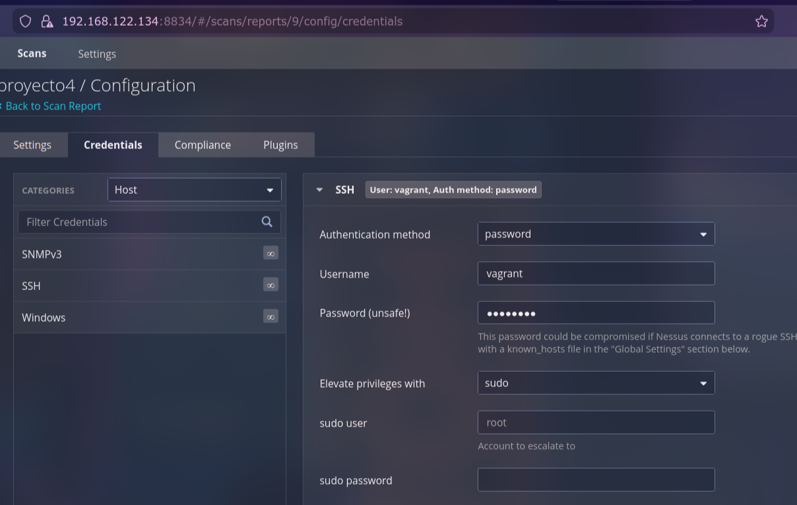

# Informe de Análisis de Vulnerabilidades: Caja Blanca vs. Caja Negra

**Proyecto:** Hunting Vulnerabilities - SecureLogistics

**Fecha:** 11 de Febrero de 2026

El objetvo es contrastar los resultados obtenidos mediante un escaneo externo sin credenciales (Caja Negra) frente a una auditoría interna con credenciales (Caja Blanca) sobre el servidor Linux objetivo (192.168.122.209).

## 1. Introducción y Fundamentación Teórica

El objetivo de esta fase del proyecto es demostrar la importancia de las auditorías autenticadas (Credentialed Scans).

- Análisis de Caja Negra (Black Box): Simula la perspectiva de un atacante externo sin acceso previo. El escáner solo puede evaluar lo que el servidor expone a la red (puertos abiertos, respuestas de servicios).
- Análisis de Caja Blanca (White Box): Simula una auditoría interna o el escenario de un atacante que ha comprometido una cuenta de usuario (en este caso, usuario vagrant). El escáner inicia sesión en el sistema y consulta directamente el gestor de paquetes, el kernel y las configuraciones locales.

## 2. Comparativa Cuantitativa de Resultados

La diferencia en la profundidad del análisis es evidente al comparar las métricas de ambos informes generados por Tenable Nessus.

| Severidad | Escaneo Caja Negra (Sin Credenciales) | Escaneo Caja Blanca (Con Credenciales) | Diferencia |
| --- | --- | --- | --- |
| CRÍTICA | 1 | 17 | +1600% |
| ALTA | 1 | 49 | +4800% |
| MEDIA | 6 | 29 | +383% |
| BAJA | 4 | 5 | +25% |
| Informativa | 34 | 72 | +111% |
| TOTAL | 46 | 172 | +273% |

Observación: La introducción de credenciales reveló 126 vulnerabilidades nuevas que eran invisibles desde el exterior.

## 3. Análisis de las Diferencias (Hallazgos Clave)

### 3.1. Lo que vio la Caja Negra (Visión Superficial)

En el primer escaneo, Nessus solo pudo identificar problemas de red y configuración SSL:

- Obsolescencia del S.O.: Detectó Canonical Ubuntu Linux SEOL (Critical) basándose en las huellas del servicio, pero sin poder ver el estado interno de los parches.
- Cifrado: Detectó cifrados débiles (SWEET32) y certificados no confiables en los puertos web/SSH.

### 3.2. Lo que reveló la Caja Blanca (Visión Profunda)

Al acceder al sistema de archivos local, Nessus destapó vulnerabilidades críticas en el software instalado que no escucha directamente en la red pero que es explotable localmente o por vectores indirectos.

**Categorías de Riesgos Ocultos:**

- Componentes del Sistema Base: Se detectaron múltiples librerías centrales (klibc, glibc, libxml2) sin parchear.
- Servicios Internos: Aplicaciones como Samba y Kerberos presentan fallos críticos que no fueron visibles externamente.
- Lenguajes y Runtimes: Múltiples vulnerabilidades en entornos Python y Ruby instalados en el servidor.

### 3.3. Top Vulnerabilidades Críticas Detectadas (Análisis Detallado)

El análisis de Caja Blanca identificó 17 vulnerabilidades Críticas y 49 Altas. A continuación, se detallan las más significativas encontradas en el reporte:

#### Apache Log4j 1.x Multiple Vulnerabilities (Crítica - CVSS 10.0)

Plugin ID: 156860 / 182252

Detalle: Se detectó la instalación de Log4j 1.x, una librería de registro de Java que está obsoleta (EOL) y contiene múltiples vulnerabilidades de Ejecución Remota de Código (RCE), incluyendo vectores relacionados con JMSAppender (CVE-2021-4104).

Riesgo: Permite a un atacante ejecutar código arbitrario en el servidor si logra inyectar datos maliciosos en los logs. Es invisible para la Caja Negra porque la librería reside en el sistema de archivos, no siempre expuesta en un puerto.

#### Canonical Ubuntu Linux SEOL (Crítica - CVSS 10.0)

Plugin ID: 201408

Detalle: El sistema operativo es Ubuntu 14.04 LTS, cuyo soporte finalizó hace años.

Riesgo: El sistema ya no recibe parches de seguridad oficiales, lo que lo convierte en un blanco fácil para cualquier nuevo exploit.

#### Linux Sudo Privilege Escalation (Alta - CVSS 7.8)

Plugin ID: 146799

Detalle: Vulnerabilidad de escritura fuera de límites en sudo.

Riesgo: Un atacante con acceso de usuario básico (como el usuario vagrant) puede explotar este fallo para obtener permisos de root (administrador total) y tomar el control completo de la máquina.

#### Vulnerabilidades en el Kernel de Linux (Múltiples Altas)

Detalle: Se detectaron decenas de parches de seguridad faltantes en el kernel de Linux (referencias USN-7720-1, USN-7986-1, etc.).

Riesgo: Permiten desde Denegación de Servicio (DoS) hasta escalada de privilegios local. Un escaneo externo nunca puede verificar la versión exacta del kernel en ejecución con esta precisión.

#### Samba Vulnerabilities (Crítica - CVSS 9.8)

Plugin ID: 240197

Detalle: Vulnerabilidades en el servicio de compartición de archivos Samba (USN-7582-1).

Riesgo: Posible ejecución de código o acceso no autorizado a archivos compartidos.

#### Vulnerabilidades en Librerías Core (XML, SQLite, Kerberos)

Componentes: libxml2 (Crítica), SQLite (Crítica), Kerberos (Crítica).

Riesgo: Estas librerías son utilizadas por casi todo el software del servidor. Un fallo en libxml2 podría explotarse simplemente haciendo que el servidor procese un archivo XML malformado subido por un usuario.

## 4. Plan de Acción y Recomendaciones (Roadmap)

Dada la severidad de los hallazgos y el presupuesto limitado de SecureLogistics, se propone una estrategia de remediación priorizada para maximizar la seguridad con el menor coste operativo posible.

### Fase 1: Contención Inmediata (Prioridad 0 - < 24 Horas)

Debido a la presencia de Log4j y vulnerabilidades de Kernel en un sistema obsoleto, el riesgo de compromiso es inminente.

- Aislamiento de Red: Restringir el acceso al servidor 192.168.122.209 únicamente a las IPs de administración imprescindibles mediante reglas de Firewall estrictas.
- Mitigación de Log4j: Si la aplicación Java no es crítica, detener el servicio inmediatamente. Si es crítica, eliminar la clase JMSAppender del archivo .jar de Log4j como medida temporal de "parcheo virtual".
- Segmentación: Mover este servidor a una VLAN aislada (DMZ estricta) para evitar que un atacante salte desde aquí al resto de la red de SecureLogistics (Movimiento Lateral).

### Fase 2: Remediación Raíz (Prioridad 1 - Corto Plazo)

La mayoría de las 172 vulnerabilidades provienen de una única causa raíz: el Sistema Operativo está en "End of Life" (EOL). Parchear individualmente es ineficiente e imposible.

- Actualización de Sistema Operativo: Es imperativo planificar la migración de Ubuntu 14.04 a una versión con soporte activo (mínimo Ubuntu 22.04 LTS).
- Justificación: Esta única acción eliminará de golpe más del 90% de las vulnerabilidades críticas detectadas (Kernel, Sudo, OpenSSL, Glibc, Python, Samba).
- Reemplazo de Protocolos: Deshabilitar soporte para TLS 1.0/1.1 y cifrados débiles (3DES/SWEET32) en SSH y Web.

### Fase 3: Gestión Proactiva (Prioridad 2 - Estratégica)

Para evitar volver a esta situación de obsolescencia no detectada:

- Política de Escaneo Autenticado: Implementar escaneos de Caja Blanca trimestrales. Como se ha demostrado, el escaneo externo solo ve la "punta del iceberg" (46 fallos vs 172 reales).
- Gestión de Inventario: Implementar un control de activos de software para recibir alertas cuando una versión (como Log4j 1.x) llegue a su fin de vida útil antes de que sea explotada.

## 5. Conclusión Ejecutiva

El ejercicio ha demostrado que la visión de seguridad actual de SecureLogistics es incompleta. Un atacante externo podría tardar en entrar, pero un atacante con acceso mínimo (o un malware/ransomware que logre entrar) tendría 17 vías críticas para tomar el control total del servidor inmediatamente debido a la falta de parches internos. La inversión prioritaria no debe ser en más herramientas de escaneo, sino en la renovación de la infraestructura base (S.O.).
