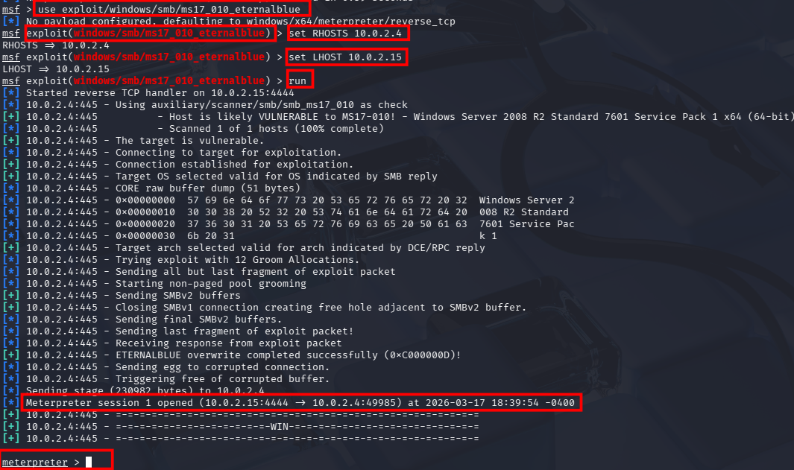

# Informe de Pentesting — Proyecto "Ventanal de Guillermo"

**Cliente:** La Descuidada S.A.
**Equipo de Auditoría:** Pablo González, Carlos Alcina, Luis Carlos Romero
**Fecha:** 17 de Febrero de 2026

---

## Índice

1. [Resumen Ejecutivo](#1-resumen-ejecutivo)
2. [Alcance](#2-alcance)
3. [Metodología](#3-metodología)
4. [Hallazgos Clave (Resumen Unificado)](#4-hallazgos-clave-resumen-unificado)
5. [Detalle por Máquina](#5-detalle-por-máquina)
   - [5.1 Máquina 1 (Windows Server 2008 R2)](#51-máquina-1-windows-server-2008-r2)
   - [5.2 Máquina 2 (Windows Server 2016 - DC)](#52-máquina-2-windows-server-2016---dc)
6. [Recomendaciones Generales](#6-recomendaciones-generales)
7. [Entrega](#7-entrega)

---

## 1. Resumen Ejecutivo

Se realizó una auditoría de seguridad (pentesting) sobre dos máquinas virtuales proporcionadas por el cliente en el entorno de laboratorio. El objetivo fue evaluar la postura de seguridad de ambos sistemas, identificar vulnerabilidades explotables y demostrar el impacto de los hallazgos mediante pruebas controladas.

En ambos objetivos se encontró un patrón de **configuraciones inseguros**, **software desactualizado** y **servicios expuestos** que permiten una cadena de ataque completa desde reconocimiento hasta control total (NT AUTHORITY\SYSTEM) y acceso a datos sensibles.

---

## 2. Alcance

### 2.1 Activos evaluados
* **Máquina 1**: Windows Server 2008 R2 con servicios expuestos (SMBv1, Jenkins, ManageEngine, Elasticsearch, MySQL, WordPress).
* **Máquina 2**: Windows Server 2016 (DC-Company) con servicios de dominio (SMB, LDAP, WinRM, RDP).

### 2.2 Exclusiones
* Equipos de usuario final (PCs, laptops, móviles).
* Infraestructura de red de terceros (routers/ISP, firewalls externos).
* Ingeniería social o uso de credenciales facilitadas por terceros.
* Ataques DoS/DDoS dirigidos a afectar la disponibilidad.

---

## 3. Metodología

Se trabajó bajo un enfoque de **Caja Negra (Black Box)**, siguiendo un proceso basado en PTES:

1. **Reconocimiento y Enumeración:** identificación de hosts, puertos abiertos y servicios.
2. **Análisis de Vulnerabilidades:** identificación de incumplimientos y CVEs relevantes.
3. **Explotación:** ejecución de ataques controlados para obtener acceso inicial.
4. **Post-Explotación:** escalado de privilegios, movimiento lateral y extracción de evidencia.
5. **Reporte:** documentación técnica y recomendaciones.

---

## 4. Hallazgos Clave (Resumen Unificado)

### 4.1 Vulnerabilidades críticas y exploits exitosos

* **MS17-010 (EternalBlue)** en SMB que permite ejecutar código remoto y obtener acceso con privilegios de sistema.
* **Jenkins 1.637** accesible sin autenticación, explotado mediante Script Console para ejecución remota.
* **ManageEngine Desktop Central v9** vulnerable a ejecución remota de comandos (RCE).
* **Elasticsearch** expuesto sin autenticación, permitiendo exfiltración de índices y datos.
* **MySQL** accesible con credenciales débiles/forzadas; permitió manipular la base de datos de WordPress y obtener acceso admin.

### 4.2 Impacto general comprobado

* Compromiso del servidor (NT AUTHORITY\SYSTEM) en ambos objetivos.
* Extracción de credenciales/hashes (incluyendo cuentas Administrator/Vagrant).
* Movimiento lateral y abuso de protocolos de dominio (Pass-the-Hash, WinRM).
* Exposición de datos sensibles y posibilidad de persistencia.

---

## 5. Detalle por Máquina

### 5.1 Máquina 1 (Windows Server 2008 R2)

**Servicios identificados:** SMB/NetBIOS, RDP, HTTP (Apache/Tomcat/GlassFish), Jenkins, Elasticsearch, MySQL, ManageEngine.

**Hallazgos críticos:**
* Explotación de **MS17-010** para conseguir acceso remoto.
* Acceso y manipulación de MySQL (WordPress) tras fuerza bruta.
* Explotación de Jenkins y ManageEngine para ejecución remota y escalado.
* Elasticsearch accesible sin autenticación.

**Evidencias clave:**

Detección de vulnerabilidad MS17-010:

Explotación exitosa:

Acceso a Jenkins sin autenticación:

Explotación de ManageEngine:

Acceso a Elasticsearch:

Manipulación de WordPress vía MySQL:

**Impacto:** Compromiso total del servidor, filtración de datos, posible inclusión en pivoting hacia otros sistemas.

**Referencias:**
* `Ventanal de Guillermo - Maquina 1/informe-maquina1.md`

---

### 5.2 Máquina 2 (Windows Server 2016 - DC)

**Servicios identificados:** SMB, LDAP, WinRM, RDP, WMI, LDAP.

**Hallazgos críticos:**
* Explotación de **MS17-010** para obtener meterpreter y credenciales.
* Uso de **Pass-the-Hash** para acceso lateral y ejecución remota mediante WinRM.
* Enumeración de usuarios, servicios y extracción de hashes del dominio.

**Evidencias clave:**

Escaneo de puertos:

Detección de MS17-010:

Explotación exitosa:

Extracción de hashes:

Pass-the-Hash:

Acceso WinRM:

**Impacto:** Control del dominio, acceso a cuentas de administrador y potencial compromiso de más recursos en el entorno.

**Referencias:**
* `Ventanal de Guillermo - Maquina 2/informe-maquina2.md`

---

## 6. Recomendaciones Generales

1. **Aplicar parches de seguridad inmediatos** (MS17-010, actualizaciones de SO y aplicaciones críticas).  
2. **Deshabilitar SMBv1** y limitar accesos a SMB/WinRM/RDP mediante segmentación de red y ACLs.  
3. **Asegurar servicios web:** forzar autenticación, HTTPS/TLS y restringir acceso por red.  
4. **Gestionar credenciales:** contraseñas robustas, rotación periódica, MFA y eliminación de cuentas por defecto.  
5. **Monitoreo y alertas:** habilitar logs, detecciones de intrusión y revisión periódica de eventos críticos.

## 7. Conclusión y Próximos Pasos

El pentesting reveló vulnerabilidades críticas que permiten compromisos remotos y escalado a privilegios de sistema, con impacto en la confidencialidad e integridad de los datos. El riesgo global es **crítico**, requiriendo acciones inmediatas para mitigar.

**Próximos pasos sugeridos:**
- Implementar las recomendaciones en un plan de remediación priorizado.
- Realizar una re-auditoría para validar las correcciones.
- Considerar auditorías periódicas y capacitación en seguridad para el equipo.

---

## 8. Entrega

* Este informe unificado.
* Informes técnicos individuales por máquina (detallados con evidencias).
* Artefactos de evidencia (capturas, logs, salidas de comandos).

---

*Fin del informe*
