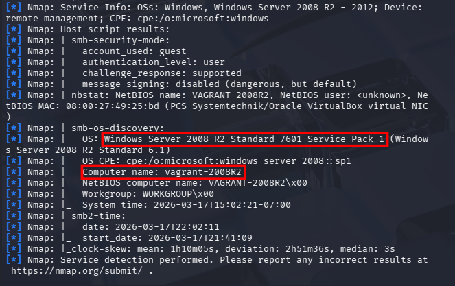
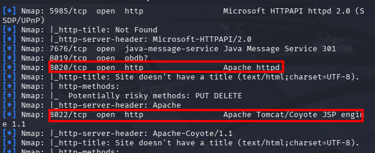
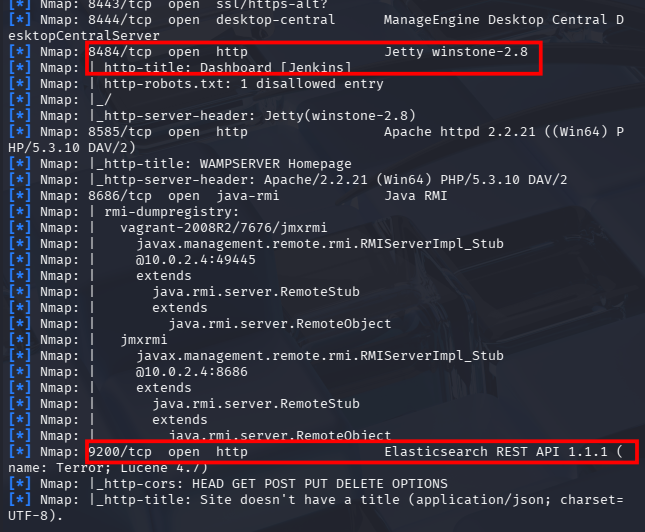
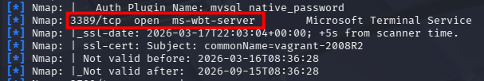
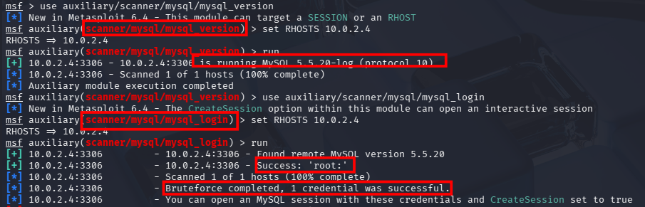
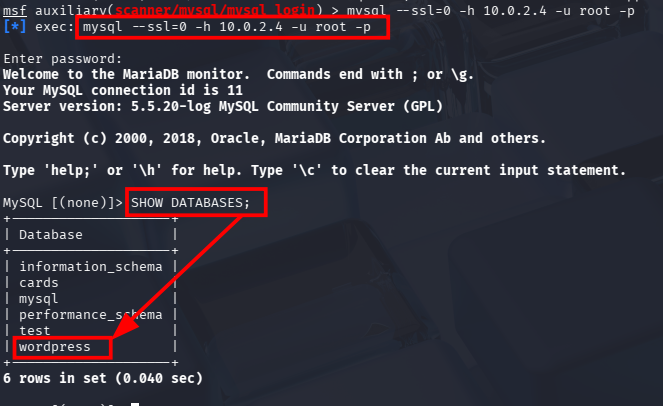
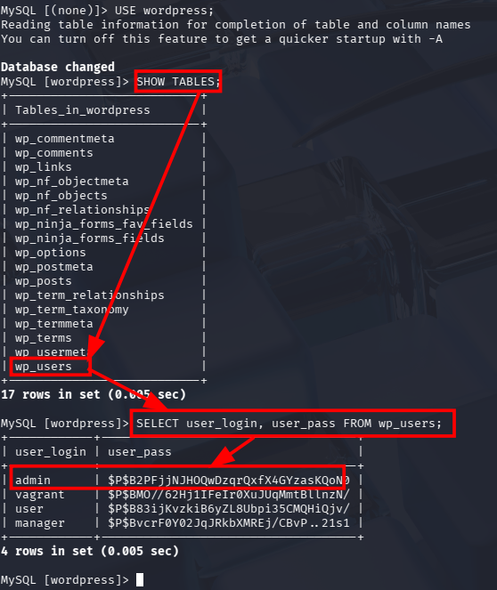

Escaneo completo nmap:

resultado nmap:
netbios-ssn,microsfot-ds windowss erver 2008 r2 standar y mysql:

nombre y http glassfish:

apache y apache tomcat:

jekins y elasticsearch:

RDP:

comprobar vulnerabilidad smb:

explotacion smb:

getuid y hasfdump marcado administrator y vagrant:

eladtisearch acceso,listar indice, leer datos:

mysql version y fuerza bruta:

entrar en msyql y showdatabses (encontrado wordpress):

entarr en wap_users y hacer select en userlogin y pass:
