# Informe de Pentesting — Ventanal de Guillermo (Máquina 1)

- **Cliente/Proyecto:** HE — Proyecto 05
- **Activo evaluado:** Ventanal de Guillermo — Máquina 1
- **Fecha:** 17/03/2026
- **Auditor:** Luis Carlos Romero, Carlos Alcina
- **Versión:** 1.0

> Este documento describe hallazgos y evidencias técnicas obtenidas durante una evaluación de seguridad autorizada. No debe utilizarse para actividades no consentidas.

## 1. Resumen ejecutivo

Durante la evaluación se identificaron múltiples servicios expuestos con configuraciones inseguras y versiones vulnerables. Se confirmó **ejecución remota de código (RCE)** mediante:

- **SMB (MS17-010 / EternalBlue)** en un Windows Server 2008 R2, obteniendo sesión remota y credenciales/hashes.
- **ManageEngine (v9)** mediante un vector de escritura/abuso de identificador de conexión, logrando ejecución de comandos y elevación de privilegios.
- **Jenkins sin autenticación** en versión **1.637**, permitiendo explotación y ejecución remota.

Adicionalmente, se observó **exposición de datos** por **Elasticsearch sin autenticación** y acceso a **MySQL** mediante credenciales débiles, con impacto directo sobre una instancia de **WordPress** (acceso a base de datos y manipulación de credenciales de usuarios).

**Riesgo global:** **Crítico** (posible toma completa del servidor y acceso a datos internos).

## 2. Alcance, supuestos y limitaciones

- **Alcance:** Máquina 1 (servicios accesibles en red durante la ventana de pruebas).
- **IP/Host objetivo:** (completar)
- **Credenciales iniciales proporcionadas:** Ninguna (según evidencias aportadas).
- **Limitaciones:** El presente informe se basa en las capturas aportadas en la carpeta `img/` y en el registro de evidencias en `imagenes-maquina1.md`. Si existieron más hosts o subredes, no están documentados en estas evidencias.

## 3. Metodología

La evaluación siguió un enfoque estándar:

1. **Reconocimiento y enumeración**: descubrimiento de puertos/servicios y fingerprinting de versiones.
2. **Validación de vulnerabilidades**: pruebas específicas para confirmar exposición (p. ej., comprobación MS17-010).
3. **Explotación controlada**: obtención de ejecución remota y verificación de impacto.
4. **Post-explotación**: verificación de privilegios, extracción limitada de evidencias (p. ej., hashes) y acceso a datos (Elasticsearch/MySQL).
5. **Reporte**: documentación de evidencias, impacto y remediación priorizada.

## 4. Enumeración y superficie de ataque observada

De acuerdo con el escaneo y evidencias, el host expone (al menos) los siguientes servicios:

- **SMB/NetBIOS** (Windows Server 2008 R2 Standard)
- **RDP**
- **HTTP** con presencia de **Apache**, **Tomcat** y **GlassFish** (según detecciones)
- **Jenkins** (panel accesible sin autenticación)
- **Elasticsearch** accesible por HTTP (consulta de índices/datos)
- **MySQL** (enumeración de versión y pruebas de acceso)
- **ManageEngine** (versión 9; explotación confirmada)

> Nota: los puertos exactos y banners completos no constan en texto plano dentro de las evidencias; se referencian capturas en el anexo.

**Evidencias de enumeración (Nmap / fingerprinting):**

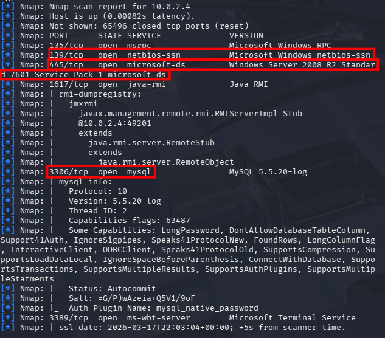

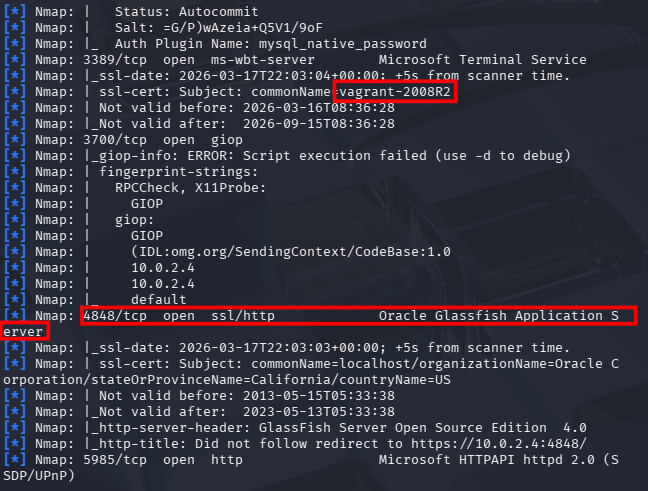

## 5. Hallazgos

### HE-M1-01 — SMB vulnerable a MS17-010 (EternalBlue)

- **Severidad:** Crítica
- **Descripción:** El servicio SMB del host es vulnerable a MS17-010 (EternalBlue), permitiendo ejecución remota de código sin credenciales.
- **Evidencia:** Detección y explotación confirmadas en capturas.
- **Impacto:** Compromiso remoto del sistema, potencial obtención de sesión con privilegios elevados, movimiento lateral y exfiltración de credenciales.
- **Recomendación:**
	- Aplicar los parches de seguridad correspondientes a MS17-010.
	- Deshabilitar **SMBv1** si está habilitado y endurecer configuración SMB.
	- Restringir exposición de SMB mediante firewall/segmentación (solo redes administrativas).
	- Activar registro/alertado para intentos de explotación y actividad anómala.

**Evidencias:**

Detección de vulnerabilidad MS17-010:

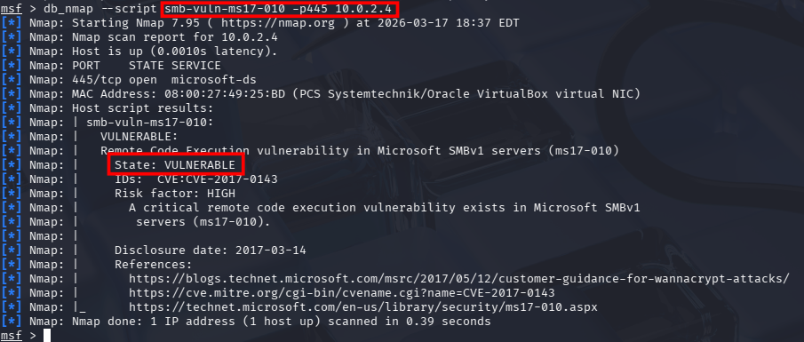

Explotación (EternalBlue):

### HE-M1-02 — Extracción de credenciales/hashes tras compromiso

- **Severidad:** Crítica
- **Descripción:** Tras obtener una sesión, se realizó enumeración de privilegios y extracción de hashes/credenciales (p. ej., cuentas tipo *Administrator* y *vagrant* aparecen en evidencias).
- **Impacto:** Escalada persistente, suplantación de usuarios y acceso a otros sistemas si hay reutilización de contraseñas.
- **Recomendación:**
	- Rotar credenciales de cuentas locales/administrativas y revisar pertenencia a grupos.
	- Activar LAPS (o equivalente) para contraseñas locales.
	- Revisar políticas de contraseñas, auditoría y bloqueo.

**Evidencias:**

Extracción de hashes/credenciales tras la sesión:

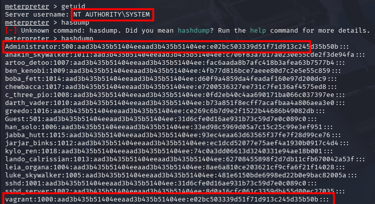

### HE-M1-03 — ManageEngine v9 vulnerable (RCE) y elevación de privilegios

- **Severidad:** Crítica
- **Descripción:** Se identificó una instancia de ManageEngine en versión 9 y se confirmó explotación con ejecución de comandos, con posterior estabilización/migración de sesión y elevación de privilegios (según capturas).
- **Impacto:** Compromiso remoto completo del servidor con capacidad de ejecutar acciones como usuario privilegiado.
- **Recomendación:**
	- Actualizar ManageEngine a una versión soportada y parchada.
	- Restringir acceso al panel/servicio (VPN/allowlist/segmentación) y habilitar autenticación robusta.
	- Revisar configuración de cuentas de servicio y mínimos privilegios.

**Evidencias:**

Configuración/opciones del exploit:

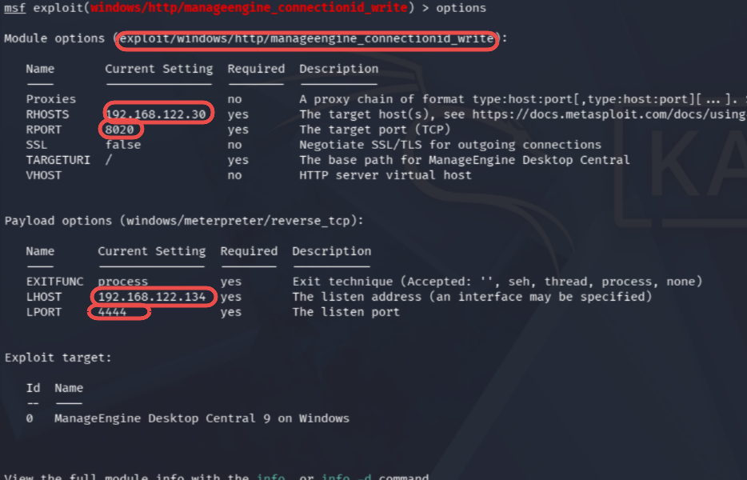

Ejecución del exploit:

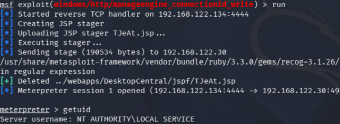

Estabilización/migración de sesión (x86 → x64):

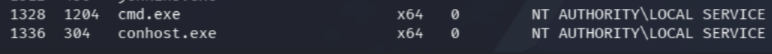

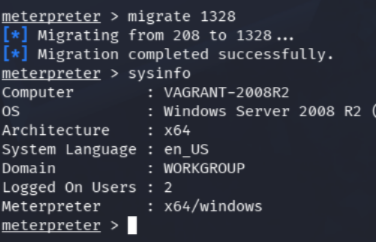

Elevación de privilegios (resultado):

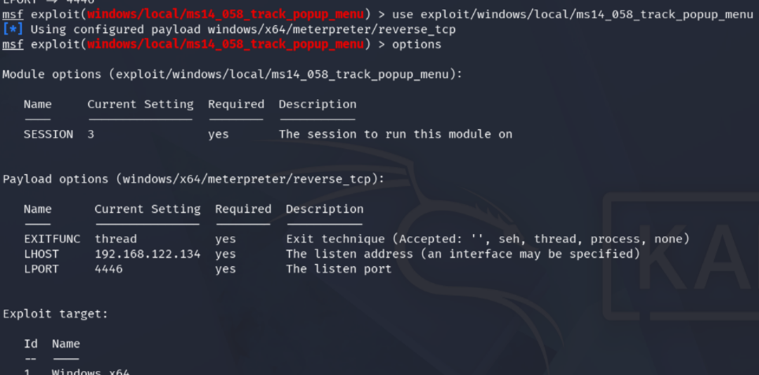

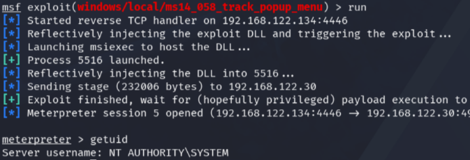

### HE-M1-04 — Jenkins accesible sin autenticación y versión vulnerable (1.637)

- **Severidad:** Alta
- **Descripción:** El panel de Jenkins es accesible sin autenticación y se identifica versión **1.637**. Las evidencias muestran explotación mediante un módulo de framework ofensivo para ejecución remota.
- **Impacto:** Ejecución remota de código con el contexto del servicio Jenkins; potencial acceso a secretos (tokens, credenciales, claves) y a pipelines.
- **Recomendación:**
	- Habilitar autenticación y autorización (Matrix-based security o integración LDAP/SSO) y eliminar acceso anónimo.
	- Actualizar Jenkins y plugins; desinstalar plugins innecesarios.
	- Aislar el servicio en una red de administración y aplicar hardening (least privilege, secretos en vault).

**Evidencias:**

Panel Jenkins accesible y versión:

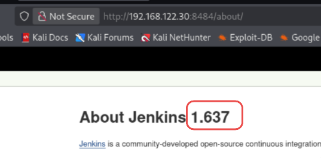

Opciones previas a la explotación:

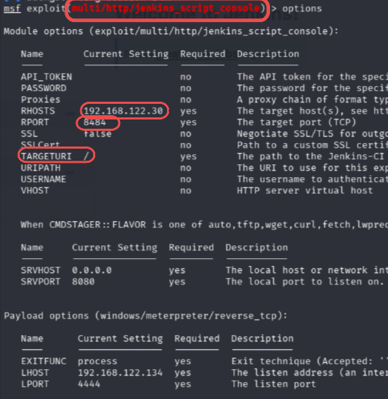

Explotación/ejecución remota:

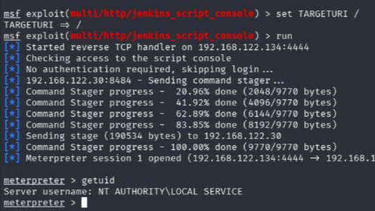

### HE-M1-05 — Elasticsearch expuesto sin autenticación (exposición de datos)

- **Severidad:** Alta
- **Descripción:** Se accede a Elasticsearch sin autenticación para listar índices y leer datos.
- **Impacto:** Exfiltración de información, cumplimiento (datos personales), y apoyo a ataques posteriores (recon, credenciales, rutas internas).
- **Recomendación:**
	- Restringir acceso por red (bind a localhost o red interna) y exigir autenticación.
	- Configurar TLS y control de acceso (X-Pack/Elastic Security o reverse proxy con auth).
	- Revisar qué datos se indexan y aplicar minimización/retención.

**Evidencias:**

Acceso, listado de índices y lectura de datos:

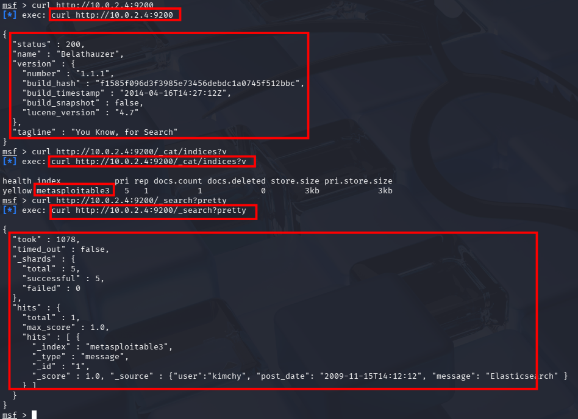

### HE-M1-06 — MySQL accesible con credenciales débiles / fuerza bruta

- **Severidad:** Alta
- **Descripción:** Las evidencias reflejan enumeración de versión y acceso mediante intentos de credenciales (fuerza bruta). Una vez dentro, se enumeran bases de datos, identificando una base asociada a WordPress.
- **Impacto:** Acceso a datos (usuarios, hashes, contenido), manipulación de credenciales y posibilidad de persistencia.
- **Recomendación:**
	- Restringir acceso a MySQL por red (solo hosts necesarios).
	- Aplicar políticas de contraseñas fuertes, deshabilitar usuarios innecesarios y limitar privilegios.
	- Activar logging de autenticación y rate limiting/ban (cuando proceda) en el perímetro.

**Evidencias:**

Enumeración/ataque de credenciales y acceso:

Enumeración de bases de datos (se observa WordPress):

Enumeración de tablas:

### HE-M1-07 — Compromiso de WordPress vía base de datos

- **Severidad:** Alta
- **Descripción:** A partir del acceso a MySQL se consultan tablas de WordPress (p. ej., `wp_users`) y se obtiene/gestiona información de credenciales de usuarios. Las evidencias incluyen acceso posterior al panel administrativo.
- **Impacto:** Control del CMS (cambio de contenido), instalación de plugins maliciosos, robo de información y puerta de entrada a ejecución de código a través de la aplicación.
- **Recomendación:**
	- Aislar la base de datos, rotar credenciales y revisar cuentas de WordPress.
	- Aplicar MFA en cuentas administrativas del CMS.
	- Revisar integridad del sitio (temas/plugins) y logs.

**Evidencias:**

Manipulación/actualización de credenciales en la tabla de usuarios:

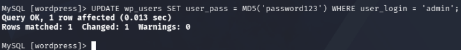

Acceso al login:

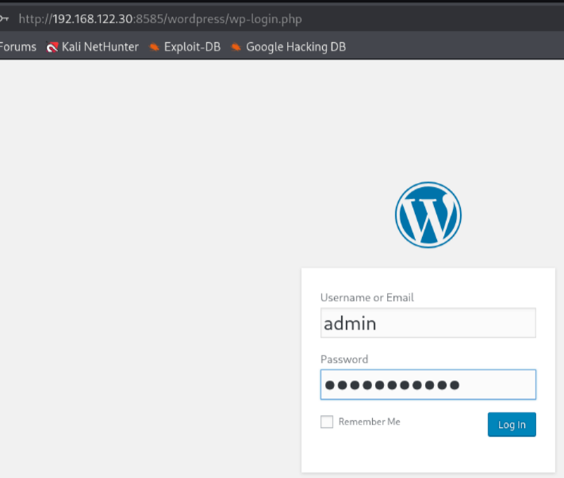

Acceso a panel administrativo:

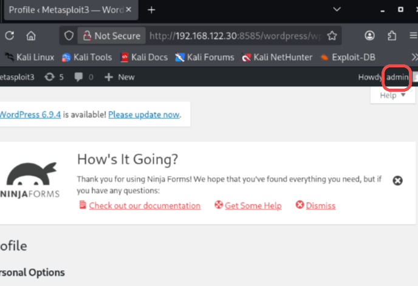

### HE-M1-08 — RDP expuesto

- **Severidad:** Media
- **Descripción:** Se detecta RDP expuesto. Aunque no se documenta explotación directa en evidencias, su exposición incrementa el riesgo (fuerza bruta/credenciales reutilizadas).
- **Impacto:** Acceso remoto interactivo si credenciales son comprometidas.
- **Recomendación:**
	- Restringir RDP a VPN/red administrativa, aplicar NLA, MFA y políticas de bloqueo.
	- Monitorizar intentos fallidos e integrar con SIEM.

## 6. Cadena de ataque (resumen)

Con base en evidencias, una secuencia plausible y confirmada por pruebas es:

1. Enumeración de servicios expuestos (HTTP, SMB, RDP, MySQL, Elasticsearch, etc.).
2. Confirmación de **MS17-010** y explotación SMB, obteniendo sesión y credenciales/hashes.
3. Acceso a **Elasticsearch** sin autenticación para lectura de datos.
4. Acceso a **MySQL** y enumeración de base de WordPress, posibilitando acceso administrativo.
5. Explotación adicional de **ManageEngine** y **Jenkins** (RCE), elevación de privilegios y control del host.

## 7. Priorización de remediación

Orden recomendado (de mayor a menor urgencia):

1. **Parchar MS17-010 / deshabilitar SMBv1 / restringir SMB**.
2. **Actualizar y endurecer ManageEngine** (y limitar su exposición).
3. **Cerrar Jenkins anónimo y actualizar versión/plugins**.
4. **Proteger Elasticsearch** (auth + restricción de red).
5. **Endurecer MySQL** (acceso de red + credenciales fuertes + mínimos privilegios).
6. **Reforzar WordPress** (MFA admins, rotación de credenciales, revisión integridad).
7. **Restringir RDP** (VPN/MFA/NLA) y monitorizar.

