"Fase de Preparación: Verificación de la dirección IP de la máquina atacante (Kali Linux) en la red NAT del laboratorio. Nuestra IP asignada es la 192.168.122.40."

"Fase de Reconocimiento: Tras lanzar un barrido de red con nmap -sn (Ping Scan para agilizar el proceso sin escanear puertos aún), identificamos la máquina objetivo en la IP 192.168.122.205. Nmap ha resuelto el nombre de host como 'DC-Company', lo que sugiere firmemente que el servidor está actuando como un Controlador de Dominio de Active Directory."

"Fase de Reconocimiento (Escaneo de Puertos): Se ejecutó un escaneo de puertos TCP completo (all-ports) de forma sigilosa y rápida utilizando nmap -p- -sS --min-rate 5000. Los resultados revelan una gran cantidad de puertos abiertos característicos de un entorno empresarial de Microsoft (DNS, Kerberos, LDAP, SMB, WinRM). Esto confirma que el objetivo está operando como un Controlador de Dominio de Active Directory."
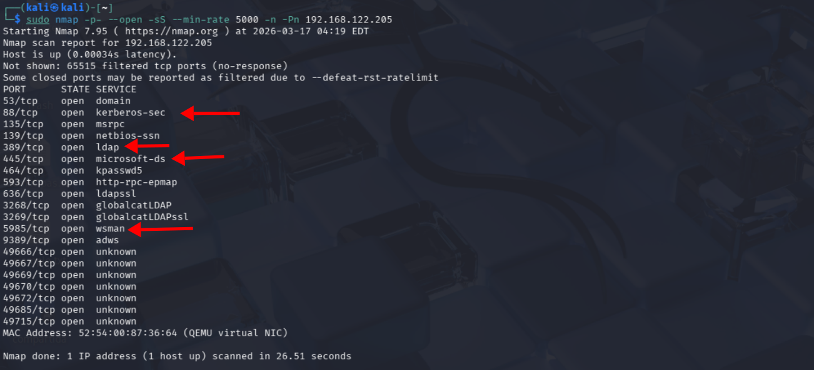

"Fase de Reconocimiento y Enumeración: Tras realizar un escaneo profundo con detección de versiones y scripts por defecto (-sC -sV), logramos extraer información crítica del objetivo. Confirmamos que es un Windows Server 2016 operando como Controlador de Dominio. Además, identificamos el nombre de la máquina (DC-Company) y el nombre del dominio de Active Directory (DescuidadaCorp.local). Esta información es crucial para perfilar nuestros próximos vectores de ataque."
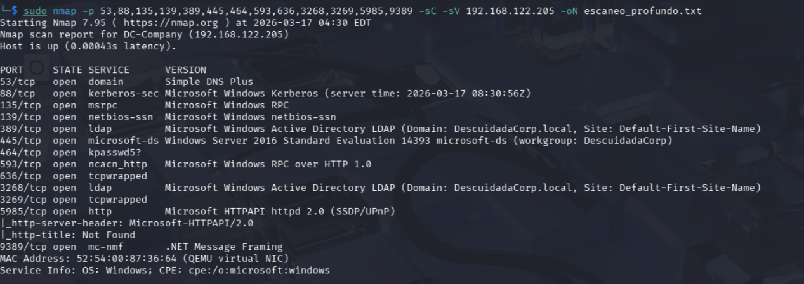 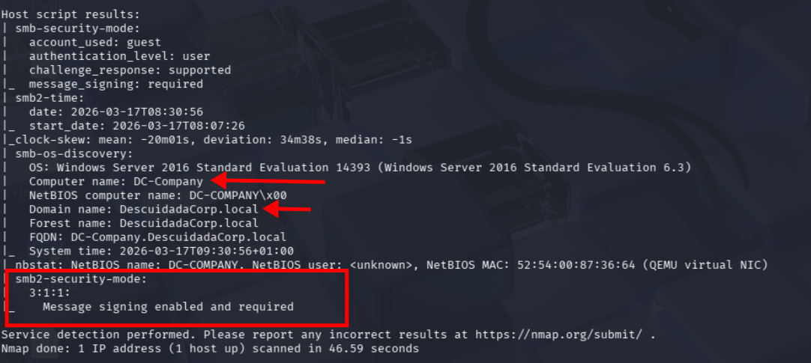

"Fase de Enumeración (SMB): Se intentó un acceso anónimo (Null Session) a los recursos compartidos mediante smbclient. Aunque el servidor aceptó la autenticación anónima, está correctamente securizado para no revelar la lista de recursos (shares) a usuarios sin privilegios. Esto nos obliga a pivotar hacia otros servicios para buscar vectores de entrada."

"Fase de Enumeración (RPC/SMB): Se utilizó la herramienta enum4linux para intentar extraer usuarios y políticas a través de sesiones nulas. Logramos obtener el SID del dominio (S-1-5-21-3493750644-102102059-1812404171), pero las consultas de enumeración de usuarios y grupos (querydispinfo, enumdomusers, rpcclient) devolvieron un error NT_STATUS_ACCESS_DENIED. 

Esto indica que el sistema operativo (Windows Server 2016) está bloqueando por defecto la enumeración anónima vía RPC, por lo que pivotaremos la investigación hacia el servicio LDAP."

 

"Fase de Enumeración (LDAP): Se intentó extraer información del Directorio Activo mediante una conexión anónima ('Anonymous Bind') utilizando ldapsearch. El servidor respondió con un error de operaciones (LdapErr: DSID-0C0909AF), indicando que es obligatorio autenticarse para realizar consultas (a successful bind must be completed). Esto confirma que el Controlador de Dominio deniega la enumeración anónima de LDAP. Procedemos a la búsqueda automatizada de vulnerabilidades (CVEs)."

"Fase de Análisis de Vulnerabilidades: Se ejecutó un escaneo de vulnerabilidades específico para los servicios SMB y RPC utilizando los scripts de Nmap (--script vuln). El resultado fue positivo, identificando de manera concluyente que el servidor es vulnerable a MS17-010 (CVE-2017-0143), comúnmente conocido como EternalBlue. Se trata de una vulnerabilidad crítica de Ejecución Remota de Código (RCE) en el protocolo SMBv1, la cual utilizaremos como vector principal para comprometer el sistema."

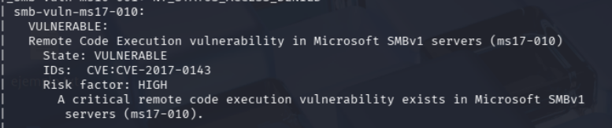

"Fase de Explotación (Preparación): Tras confirmar la vulnerabilidad, se procedió a armar el exploit windows/smb/ms17_010_eternalblue utilizando el framework Metasploit. Se configuraron meticulosamente los parámetros de red: definiendo el objetivo (RHOSTS) en la IP 192.168.122.205 y estableciendo un payload de conexión inversa (Reverse TCP) hacia nuestra máquina auditora (LHOST 192.168.122.40). Esta evidencia demuestra la focalización precisa del ataque dentro del alcance permitido."

"Fase de Explotación: Debido a la inestabilidad del módulo eternalblue original en arquitecturas Windows Server 2016, se pivotó hacia el módulo exploit/windows/smb/ms17_010_psexec. Se configuró un payload de 64-bits (windows/x64/meterpreter/reverse_tcp) para asegurar la compatibilidad con el sistema objetivo. La ejecución fue exitosa, logrando una sobrescritura en memoria que nos otorgó una sesión remota (Reverse Shell). Como se evidencia en la salida, hemos obtenido privilegios máximos (SYSTEM session obtained!), logrando el compromiso total del Controlador de Dominio."

Fase de Post-Explotación: Una vez establecida la sesión de Meterpreter, se procedió a verificar el nivel de acceso obtenido y la identidad del sistema comprometido. El comando getuid confirmó que el exploit nos otorgó privilegios máximos (NT AUTHORITY\SYSTEM). Asimismo, el comando sysinfo corroboró que nos encontramos dentro del objetivo correcto (DC-COMPANY / Windows Server 2016 perteneciente al dominio DescuidadaCorp), validando así el éxito total de la intrusión."
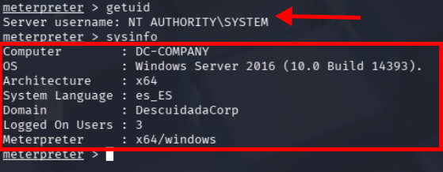

"Fase de Post-Explotación (Exfiltración): Utilizando los privilegios de SYSTEM adquiridos, se procedió a ejecutar el comando hashdump de Meterpreter para volcar la base de datos SAM (Security Account Manager) del sistema. Se obtuvieron con éxito los hashes NTLM de múltiples cuentas locales, incluyendo la del Administrador y la del usuario objetivo ('gventanas'). Cabe destacar que, poco después de esta acción, la sesión de Meterpreter se cerró abruptamente debido a la inestabilidad inherente de la explotación en la memoria del proceso (comportamiento habitual en MS17-010). No obstante, el robo de credenciales demuestra un compromiso crítico y definitivo de la infraestructura."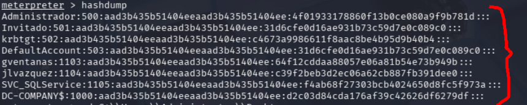

"Fase de Explotación (Vector Alternativo): Para cumplir con el objetivo de explotar el máximo de vulnerabilidades, se procedió a utilizar las credenciales exfiltradas en la fase anterior para realizar un ataque 'Pass-the-Hash' (PtH). Utilizando el módulo psexec de Metasploit, configuramos el acceso autenticado hacia el servicio SMB aprovechando el hash NTLM del usuario 'Administrador'. Esta vulnerabilidad arquitectónica de Windows permite la autenticación sin conocer la contraseña en texto claro."

"Se configura el módulo winrm_script_exec para realizar un movimiento lateral a través del puerto 5985. A diferencia de los módulos de SMB, aquí se utiliza el parámetro USERNAME y PASSWORD para la inyección del hash NTLM. Se establece el dominio DescuidadaCorp para asegurar que la autenticación se procese correctamente contra el Controlador de Dominio."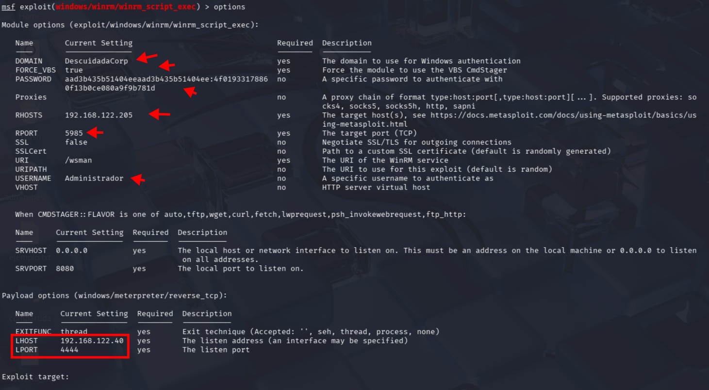

"Fase de Explotación: Se logró el acceso a través de WinRM. Es notable destacar que Metasploit realizó una migración de proceso automática desde el proceso inicial (lispp.exe) hacia un proceso de sistema (svchost.exe), elevando los privilegios de 'Administrador' a 'NT AUTHORITY\SYSTEM'. Esto demuestra que el compromiso de un servicio de gestión remota permite el control total del kernel del sistema."
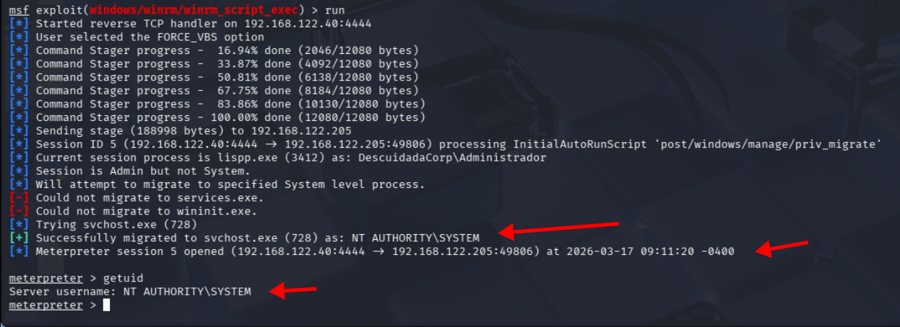

"Fase de Explotación (Vulnerabilidades de Configuración): Se realizó una auditoría del servicio WinRM para evaluar la resistencia contra ataques de fuerza bruta. Se utilizó un diccionario de contraseñas comunes contra el usuario 'Administrador'. Se confirmó la ausencia de una Política de Bloqueo de Cuentas (Account Lockout Policy), ya que el servidor permitió cientos de intentos de inicio de sesión sin interrumpir el servicio ni bloquear la IP atacante. Esto representa un riesgo crítico, ya que facilita la obtención de credenciales mediante ataques de diccionario persistentes."

: "Fase de Enumeración de Superficie: Se auditó el puerto 3389 (RDP) del servidor. La herramienta confirmó que el servicio está activo. Aunque no se detectaron vulnerabilidades de ejecución directa (como BlueKeep), la exposición de este puerto en un Controlador de Dominio aumenta la superficie de ataque, permitiendo potenciales intentos de intrusión mediante fuerza bruta sobre el protocolo RDP."

"Fase de Post-Explotación (Impersonation): Se cargó la extensión incognito para auditar los tokens de seguridad residentes en la memoria del kernel. Se identificaron tokens de delegación para servicios críticos del sistema. Aunque en el momento del análisis no se detectaron tokens de usuarios del dominio activos, la ejecución de esta técnica es vital para identificar posibles vectores de escalada de privilegios y suplantación de identidad (Impersonation) en caso de sesiones concurrentes de administradores."

"Fase de Post-Explotación (Auditoría de Configuración): Se realizó una consulta completa al Service Control Manager (SCM) de Windows mediante el comando sc query. El listado obtenido permite auditar qué servicios están en ejecución (RUNNING) y cuáles están detenidos (STOPPED). Esta información es crítica para identificar vectores de persistencia, servicios con privilegios excesivos o configuraciones de software de terceros que podrían ser explotados para mantener el acceso al servidor a largo plazo."
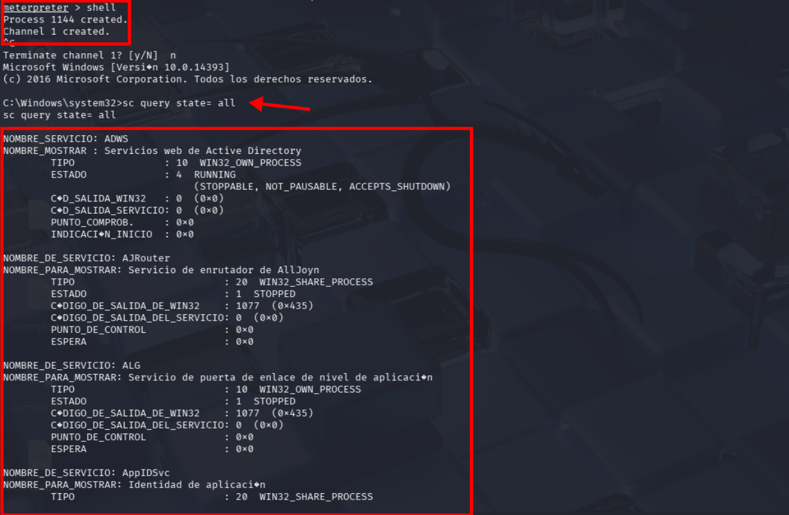

"Fase de Post-Explotación: Se ejecutó el comando netstat -ano para auditar las conexiones activas desde el interior del servidor. Se identificó de forma concluyente la sesión de control establecida entre la víctima (192.168.122.205) y la máquina atacante (192.168.122.40) a través del puerto 4444. Asimismo, se detectaron múltiples conexiones hacia IPs externas por el puerto 443, lo que en una auditoría real requeriría un análisis de tráfico para descartar exfiltración de datos o persistencia de otras amenazas."
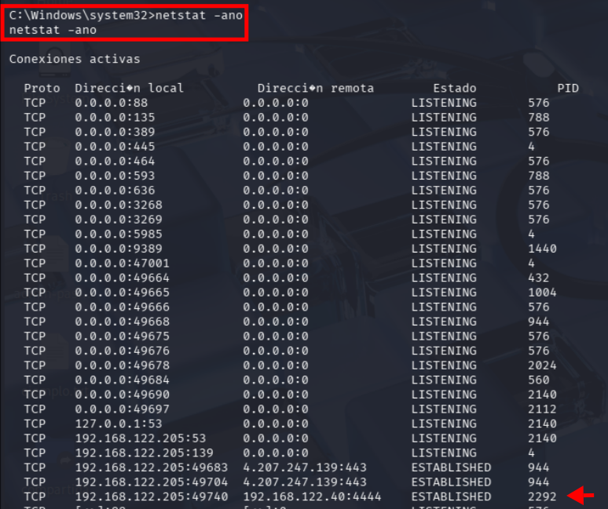

"Fase de Auditoría de Vulnerabilidades Internas: Se utilizó el motor de detección de Metasploit para analizar parches de seguridad ausentes en el kernel de Windows Server 2016. El análisis identificó 15 vectores de escalada de privilegios locales confirmados, incluyendo fallos críticos como 'PrinterDemon' (CVE-2020-1048) y vulnerabilidades de UAC Bypass. Este hallazgo es fundamental para el informe, ya que demuestra que el sistema carece de una política de actualizaciones de seguridad (Patch Management), dejando múltiples puertas abiertas para que un usuario sin privilegios tome el control total del servidor."
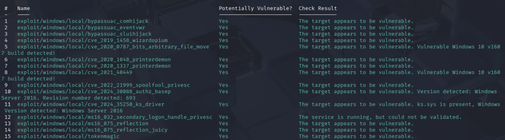