# Informe Técnico de Pruebas de Penetración (Pentesting)

**Objetivo:** Servidor DC-Company (Windows Server 2016)
**Dominio:** DescuidadaCorp.local
**Auditor:** Pablo González

---

## 1. Resumen Ejecutivo

Se ha llevado a cabo una auditoría de seguridad integral sobre el servidor con dirección IP **192.168.122.205**. Durante las pruebas, se ha logrado comprometer por completo el sistema objetivo, obteniendo el máximo nivel de privilegios (**NT AUTHORITY\SYSTEM**).

El compromiso inicial se logró explotando una vulnerabilidad crítica en el protocolo **SMBv1 (MS17-010 / EternalBlue)**. Posteriormente, se demostró el impacto del robo de credenciales mediante técnicas de **Pass-the-Hash** y se evidenciaron graves deficiencias en las políticas de seguridad corporativas y en la gestión de parches del sistema operativo.

---

## 2. Alcance y Preparación

### Fase de Preparación

Verificación de la dirección IP de la máquina atacante (Kali Linux) en la red NAT del laboratorio.

> IP atacante: **192.168.122.40**

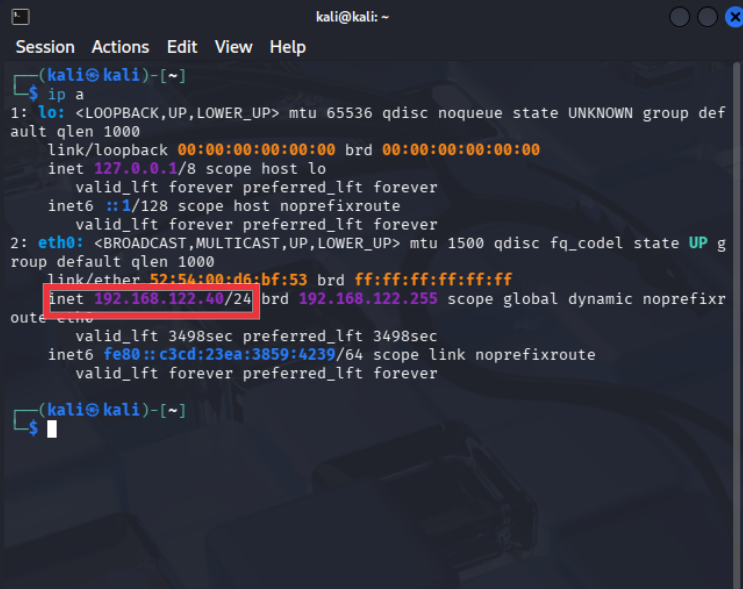

---

## 3. Fases de la Auditoría Técnica

### 3.1 Reconocimiento y Escaneo

Se identificó la máquina objetivo mediante un barrido de red con `nmap -sn`.

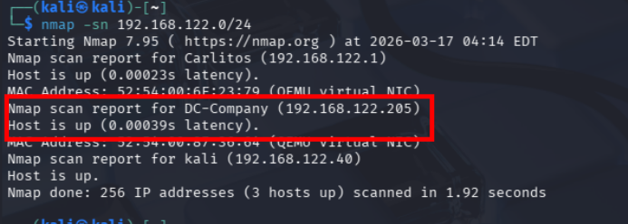

Se realizó un escaneo completo de puertos:

```bash
nmap -p- -sS --min-rate 5000
```


Posteriormente, se ejecutó un escaneo profundo:

```bash
nmap -sC -sV
```


---

### 3.2 Enumeración

#### SMB

Intento de acceso anónimo:

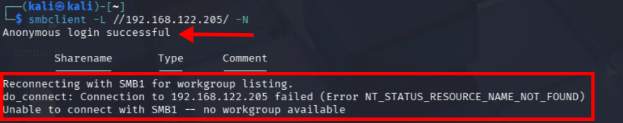

#### RPC / SMB

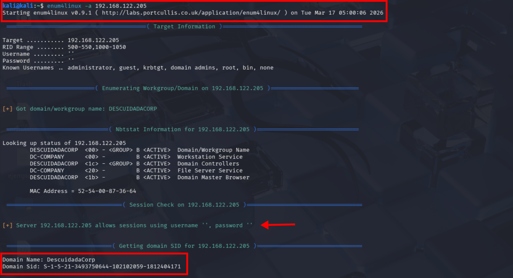
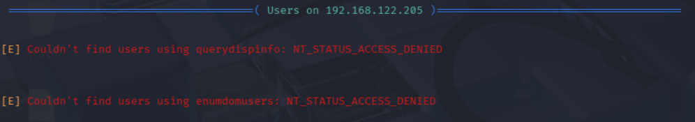

#### LDAP

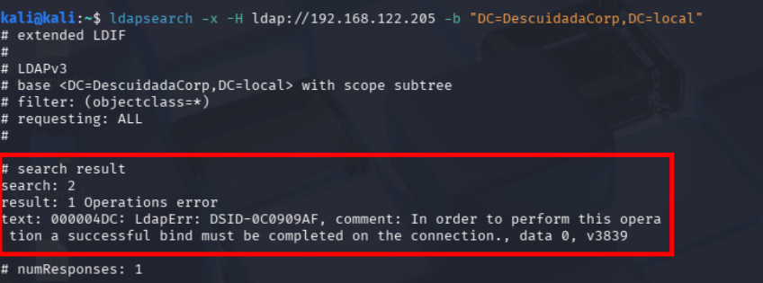

---

### 3.3 Análisis de Vulnerabilidades

Detección de vulnerabilidad crítica **MS17-010 (EternalBlue)**:

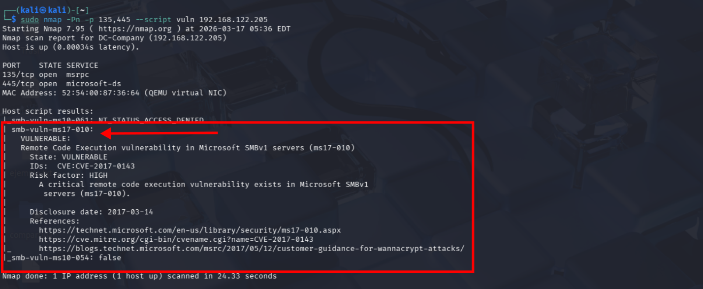


---

### 3.4 Explotación

Configuración del exploit:

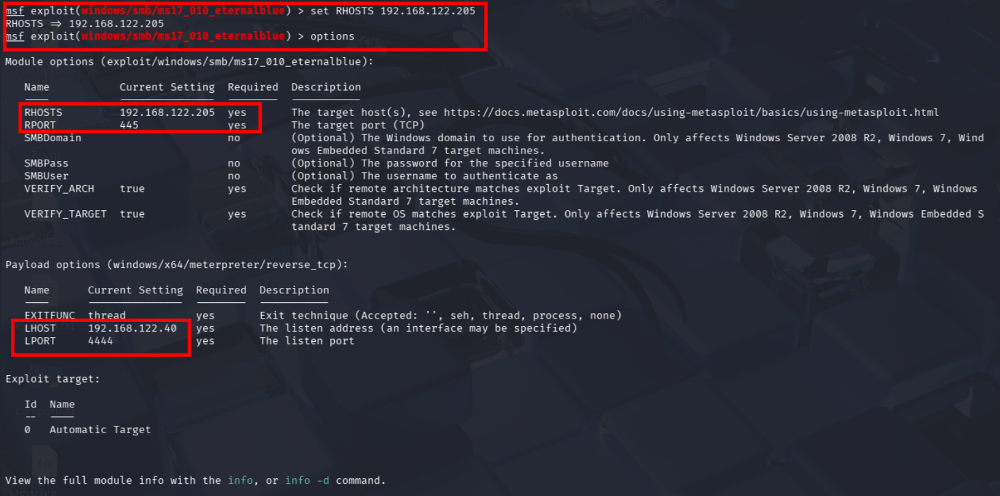

Ejecución exitosa:

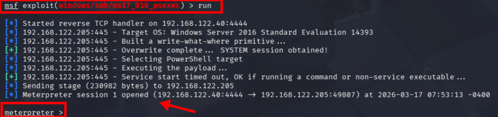

---

### 3.5 Post-Explotación

Verificación de privilegios:


Extracción de credenciales:


---

### 3.6 Movimiento Lateral

Pass-the-Hash:

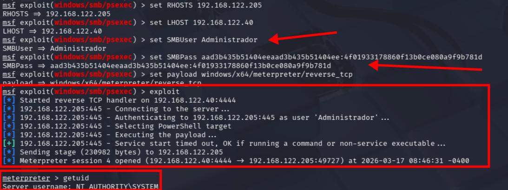

WinRM:


Acceso exitoso:


---

### 3.7 Auditoría de Seguridad

Fuerza bruta en WinRM:

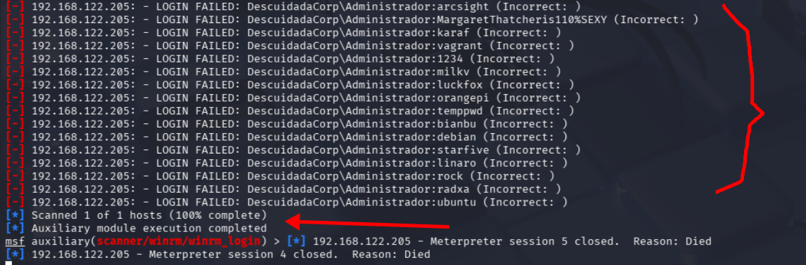

RDP expuesto:

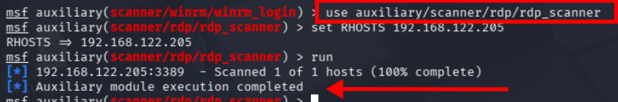

Tokens e impersonation:

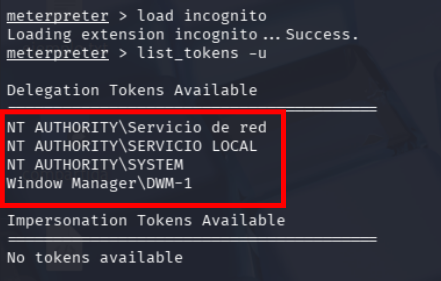

Servicios:


Conexiones:


Vulnerabilidades locales:


---

## 4. Conclusiones y Recomendaciones

### Riesgo: CRÍTICO

Se recomienda aplicar de forma inmediata:

* **Gestión de parches:** aplicar MS17-010 y actualizar el sistema
* **Deshabilitar SMBv1**
* **Políticas de bloqueo de cuentas**
* **Restringir acceso a WinRM y RDP**

---

## 5. Contexto del Proyecto

Este informe forma parte del **Proyecto 5: Guillermo's Window**, cuyo objetivo es:

* Definir un acuerdo de pentesting
* Identificar y explotar vulnerabilidades
* Documentar resultados

La empresa ficticia **"La Descuidada S.A."** solicitó la auditoría sobre dos máquinas, siendo este informe correspondiente a la **Máquina 2**.

---

## 6. Entrega

* Informe en Markdown
* Publicación en GitHub
* Documentación completa del proceso

---

*Fin del informe*
