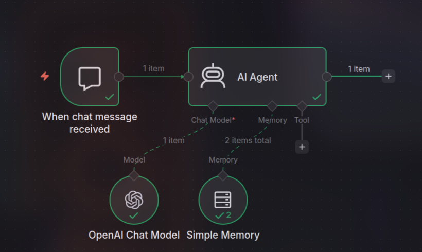
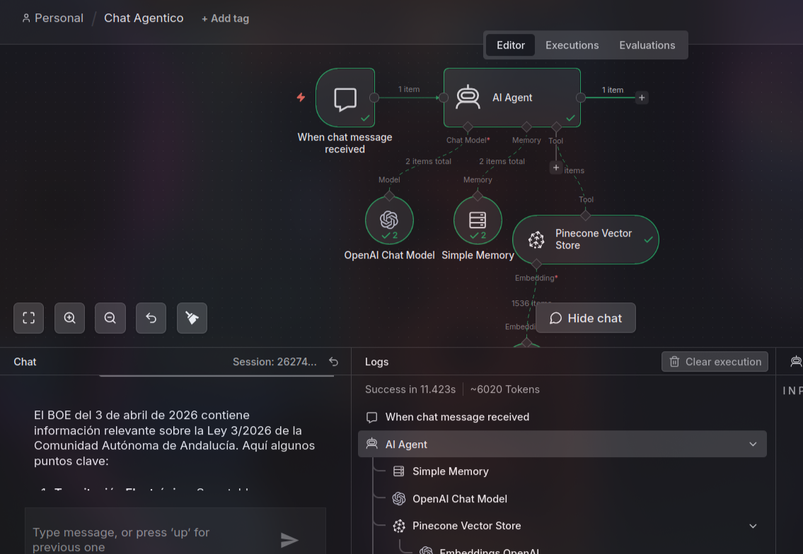
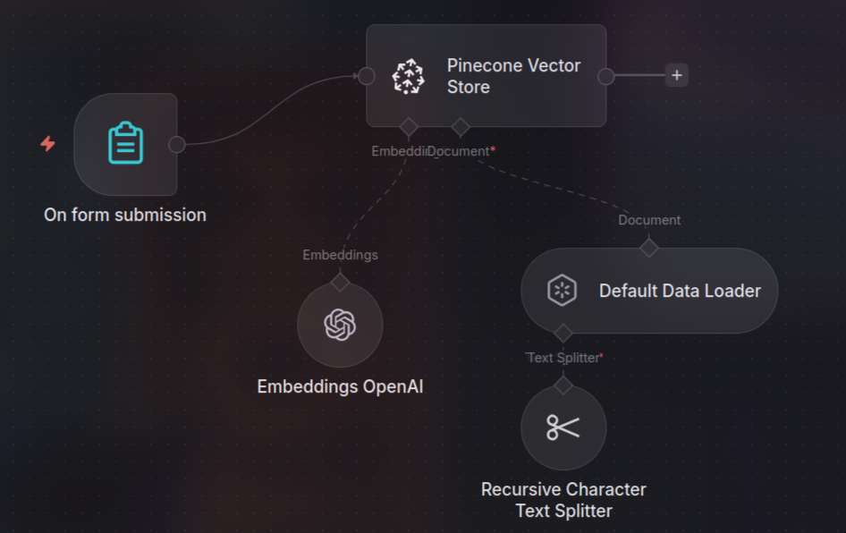
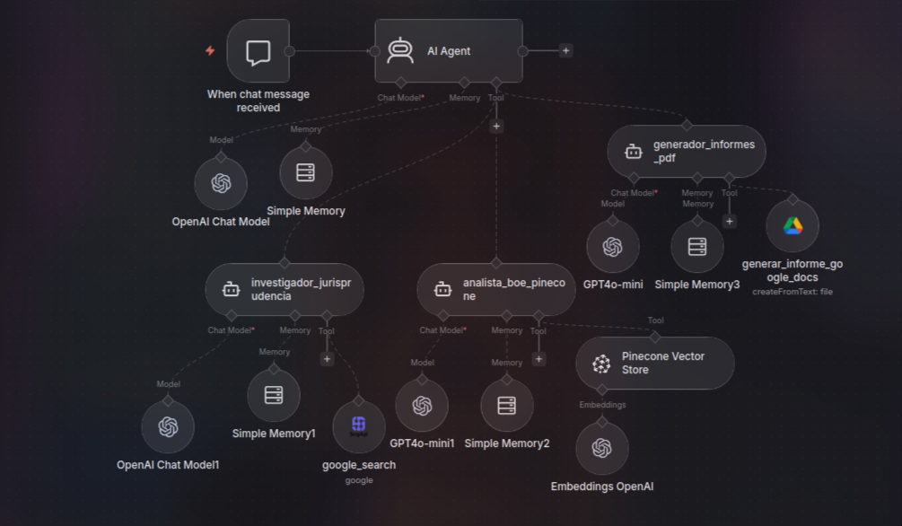

# Asesoría jurídica de ciberseguridad usando IA agéntica

**Proyecto:**  IA-AGÉNTICA (Grupo 2)

**Fecha:** 2026-05-18

## 1. Resumen ejecutivo

Se ha diseñado e implementado un sistema agéntico orientado a **consultas de normativa de ciberseguridad**, simulando el funcionamiento de una **oficina/bufete de asesoría jurídica**. La solución se ha construido en **n8n** mediante un flujo de trabajo (workflow) que combina:

- Un **Agente Supervisor (Abogado Director)** que orquesta tareas.
- Varios **agentes trabajadores especializados (Workers)** para: investigación web, contraste legal con BOE (RAG) y generación de documentos.
- Una **base de conocimiento legal** en una **base de datos vectorial (Pinecone)** alimentada con **leyes consolidadas** del BOE para mejorar precisión y reducir ruido/coste.

Además, durante el desarrollo se identificaron y resolvieron problemas típicos de sistemas RAG (fragmentación de artículos), automatización documental (Google Docs vacío) y límites operativos (429 por tokens/minuto).


## 2. Objetivo y alcance

### 2.1. Objetivo general

Desarrollar un sistema agéntico capaz de:

1. Recibir consultas en lenguaje natural sobre normativa de ciberseguridad.
2. Enriquecer la consulta con contexto (hechos/noticias/sanciones) si es relevante.
3. Contrastar y fundamentar la respuesta con **normativa consolidada** (verdad legal) usando **RAG**.
4. Generar, cuando se solicite, un **informe formal** exportable (documento).

### 2.2. Alcance funcional

- **Entrada:** mensaje de chat (consulta del usuario).
- **Salida:** respuesta en chat con fundamento normativo; opcionalmente, enlace a documento (informe).
- **Ámbito jurídico:** normativa española y europea aplicable a ciberseguridad y áreas relacionadas (ENS, RGPD/LOPDGDD, NIS2, Código Penal, etc.).

## 3. Herramientas y tecnologías

- **n8n (visual workflow):** orquestación de agentes y automatizaciones.
- **OpenAI Chat Models:** LLMs para razonamiento y redacción.
- **Pinecone Vector Store:** base vectorial para recuperación de fragmentos normativos (RAG).
- **OpenAI Embeddings:** vectorización del corpus legal.
- **Text Splitter (Recursive Character Text Splitter):** segmentación controlada de los textos antes de indexarlos.
- **SerpAPI / Google Search (vía nodo):** búsqueda web para contexto (jurisprudencia/noticias/sanciones públicas).
- **Google Drive (Create/Upload con conversión a Google Docs):** generación de documentos de salida.

### 3.1. Alternativas del enunciado (CLI / librerías) y decisión

El enunciado contempla distintas formas de implementar un sistema agéntico:

- **CLI (p. ej., Claude Code / Gemini CLI / Qwen CLI / OpenCode / Cline):** enfoque orientado a terminal, útil para definir agentes/skills como estructura de carpetas y automatizaciones reproducibles por comandos.
- **Librerías (p. ej., LangChain en Python):** enfoque programático, apropiado para integrar RAG y herramientas con mayor control de código.
- **Workflow visual (n8n):** enfoque visual, útil para trazar, depurar y demostrar la orquestación de agentes (y sus herramientas) de forma transparente.

En este trabajo se eligió **n8n** como opción principal por su rapidez para prototipar y por la facilidad de evidenciar el “bufete” multi‑agente mediante el lienzo y los nodos (ver Figuras 1–4).

## 4. Evidencias visuales del desarrollo (capturas)

### Figura 1 — Estado inicial del flujo (atención al cliente)

Flujo inicial minimalista: **Chat Trigger** → **AI Agent** con **modelo** y **memoria simple**.



### Figura 2 — RAG simple con Pinecone en el flujo de chat

Evolución del flujo incorporando **Pinecone Vector Store** como herramienta del agente para recuperar contexto normativo. En la captura se observa también una ejecución correcta del flujo con logs/tokens.



### Figura 3 — Workflow de ingesta a Pinecone (base de conocimiento)

Pipeline de ingesta activado por formulario: carga del documento, particionado (splitter), embeddings y upsert a Pinecone.



### Figura 4 — Arquitectura final multi‑agente (Supervisor + Workers)

Arquitectura final en patrón **“Supervisor + Workers”**, simulando un bufete: un director coordina a especialistas (investigación, análisis legal en BOE/Pinecone, y generación de informes).



## 5. Base de conocimiento legal (BOE) y criterios de selección

### 5.1. Decisión clave: leyes consolidadas vs BOE masivo

Para reducir ruido en embeddings y controlar costes/latencia, se decidió **no indexar el BOE completo** de forma masiva. En su lugar, se alimenta Pinecone con **normativa consolidada en PDF** extraída de la web oficial del BOE, priorizando textos:

- Vigentes y consolidados.
- Relevantes para ciberseguridad, protección de datos y delitos tecnológicos.
- Frecuentemente citados en asesoría y cumplimiento.

### 5.2. Normas incorporadas (mínimo viable)

- **Esquema Nacional de Seguridad (ENS):** Real Decreto 311/2022.
- **Directiva (UE) 2022/2555 (NIS2):** marco europeo (con mención a su transposición/anteproyecto en España).
- **Protección de datos:** RGPD (UE 2016/679) y LOPDGDD (LO 3/2018).
- **Seguridad privada:** Ley 5/2014 (para contextos corporativos/forenses donde aplique).
- **Código Penal:** LO 10/1995 (delitos informáticos).

## 6. Diseño del sistema agéntico: “Imitar la realidad”

### 6.1. Motivación

El enunciado requiere simular una asesoría jurídica real. Para ello, el sistema se reestructuró desde un único agente a una jerarquía de agentes con roles definidos y responsabilidades separadas.

### 6.2. Patrón aplicado: Supervisor + Workers

- **Supervisor (Abogado Director):** única “cara visible”. Decide el plan, llama a workers y sintetiza la respuesta.
- **Worker A (Investigador / Documentalista):** aporta contexto factual desde la web (noticias, resoluciones públicas, sanciones AEPD, etc.).
- **Worker B (Analista legal / Paralegal):** contrasta la consulta con el BOE indexado (Pinecone) y devuelve artículos y fundamento.
- **Worker C (Secretaría técnica):** genera un documento formal si el usuario lo solicita explícitamente.

## 7. Flujo operativo (end‑to‑end)

1. **Entrada:** el usuario envía una consulta por chat.
2. **Paso 1 (opcional según el caso):** el Supervisor llama a **investigador_jurisprudencia** para buscar contexto web.
3. **Paso 2 (obligatorio):** el Supervisor llama a **analista_boe_pinecone** para recuperar y citar normativa aplicable desde Pinecone.
4. **Paso 3 (condicional):** si el usuario pide “informe/PDF/documento”, el Supervisor llama a **generador_informes_pdf**.
5. **Salida:** respuesta por chat (y enlace a documento si aplica).

## 8. Problemas técnicos encontrados y soluciones

### 8.1. Fragmentación de artículos (respuesta incompleta)

**Síntoma:** artículos con múltiples apartados se devolvían “cortados” (p. ej. 7 puntos → solo 2).

**Causa raíz:**

- El splitter generaba chunks demasiado pequeños.
- La recuperación traía 1 chunk “muy relevante”, pero el resto de apartados quedaban en otros chunks no recuperados.

**Solución aplicada:**

- Aumentar **chunk size** a ~2000–2500.
- Aumentar **chunk overlap** a ~200–250.
- Aumentar **Top‑K / Limit** de recuperación en Pinecone a ~8–10 para enviar más contexto al modelo.

**Resultado esperado:** mayor probabilidad de capturar el artículo completo o sus partes adyacentes, reduciendo omisiones.

### 8.2. Documentos vacíos al generar Google Docs

**Síntoma:** se creaba el archivo con título correcto, pero el cuerpo quedaba vacío.

**Causa raíz:** algunos nodos/acciones de Google Docs requieren dos operaciones (crear documento y después “append” del contenido). En una sola llamada no quedaba correctamente orquestado.

**Solución aplicada:**

- Sustituir la generación por **Google Drive (Create/Upload)** con conversión forzada a Google Docs.
- Establecer el **MIME Type**: `application/vnd.google-apps.document`.

**Resultado esperado:** documento final con contenido completo en una operación.

### 8.3. Límite de tokens (429 / TPM)

**Síntoma:** bloqueos por límite de tokens por minuto al enviar fragmentos densos de normativa.

**Solución aplicada:**

- Reservar un modelo “más capaz” para el **Supervisor**.
- Usar un modelo más ligero (p. ej., **mini**) en los **workers** para reducir coste y ampliar margen de TPM.

## 9. Fichas técnicas de agentes (prompts y responsabilidades)


### 9.1. Agente Supervisor — Abogado Director

- **Rol:** coordina, decide el plan y entrega la respuesta final.
- **Modelo:** gpt-4o (según diseño).
- **Entrada user prompt:** dinámico desde chat (p. ej. `{{$json.chatInput}}`).

**System prompt :**

```text
Eres el Abogado Director de un prestigioso bufete especializado en ciberseguridad en España.
Eres la única cara visible y coordinas a tu equipo en un orden estricto:

PASO 1: Llama al agente investigador_jurisprudencia para buscar contexto o noticias en internet.
PASO 2: Envía esa información junto con la duda del usuario al agente analista_boe_pinecone
	para realizar el contraste legal con el BOE. Esta es tu verdad legal absoluta.
PASO 3: Si el usuario pidió explícitamente un informe o PDF, llama al agente generador_informes_pdf.
	Si no, redacta una respuesta clara y profesional directamente en el chat basada en el paso 2.
```

### 9.2. Worker A — Investigador / Documentalista Jurídico

- **Nombre :** `investigador_jurisprudencia`
- **Objetivo:** hechos y contexto público (noticias, sanciones, resoluciones).
- **Herramienta:** búsqueda web (SerpAPI / Google).

**System prompt:**

```text
Eres un Documentalista Jurídico.
Busca en internet usando tus herramientas y devuelve un resumen de los hechos, noticias
o sanciones recientes. No inventes ni des consejos legales directos, limítate a los
hechos y fuentes encontradas.
```

### 9.3. Worker B — Analista Legal / Paralegal (BOE + Pinecone)

- **Nombre :** `analista_boe_pinecone`
- **Objetivo:** contraste normativo y citas.
- **Herramienta:** Pinecone Vector Store + embeddings.

**System prompt :**

```text
Eres un Paralegal experto en legislación española de ciberseguridad.
Contrasta la información recibida con tu base de datos en Pinecone (BOE).
Detalla los artículos aplicables, si se cumple o no la norma y las posibles sanciones.
Cita siempre la ley y el artículo exacto.
```

### 9.4. Worker C — Secretaría Técnica / Generación de informes

- **Nombre :** `generador_informes_pdf`
- **Objetivo:** documento formal cuando se solicite.
- **Herramienta:** Google Drive (Create/Upload) → conversión a Google Docs.

**System prompt:**

```text
Eres el Secretario Técnico.
Formatea el análisis legal recibido en un documento formal con la siguiente estructura:
1. Objeto de la consulta
2. Antecedentes
3. Fundamentos de Derecho
4. Conclusiones

Pasa los parámetros estructurados 'titulo' y 'contenido' al nodo de Google Drive
y devuelve el enlace del archivo creado.
```
