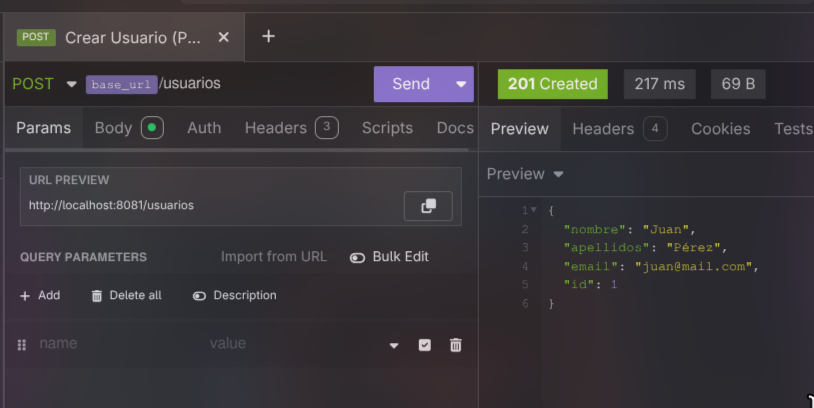
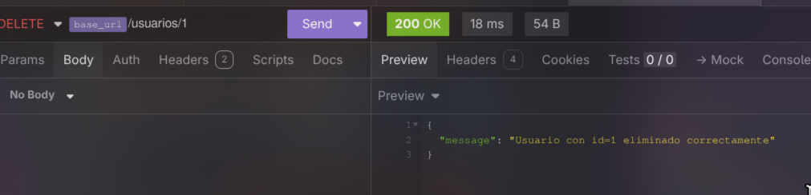
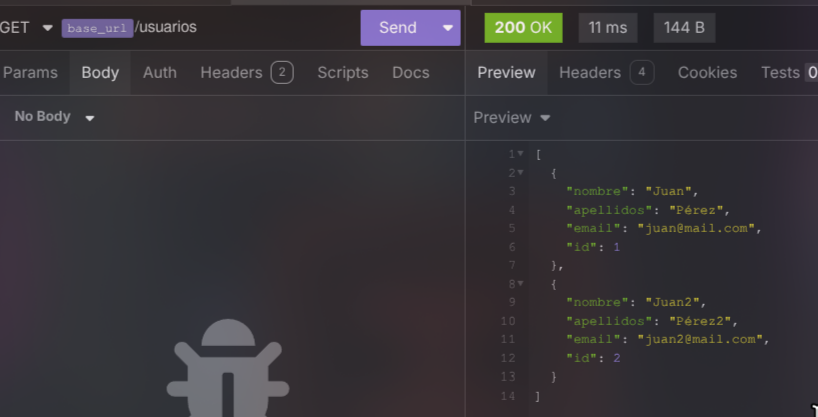
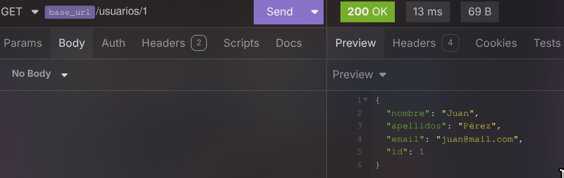
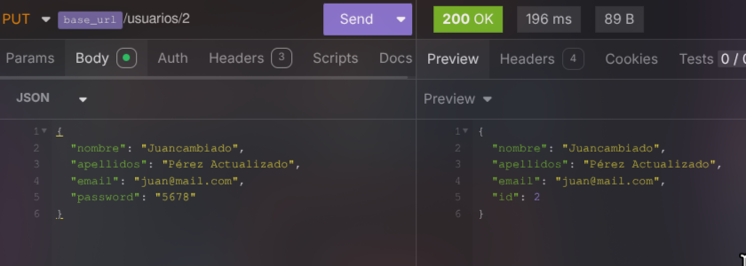

# Python con FastAPI

###  [Enlace coleción Insomnia](./insomnia.json)

## Crear usuario


## Eliminar usuario


## GetAll usuario


## GetById usuario


## Editar usuario


## Login


# Ejecutar proyecto 
Construir la imagen de Docker
```bash
docker build -t usuariosapi .  
```
Ejecutar el contenedor
```bash
docker run -d -p 8080:8080 --name usuariosapi usuariosapi
```
La API quedará accesible en:
```bash
http://localhost:8080
```