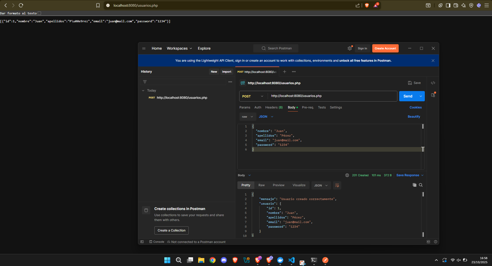
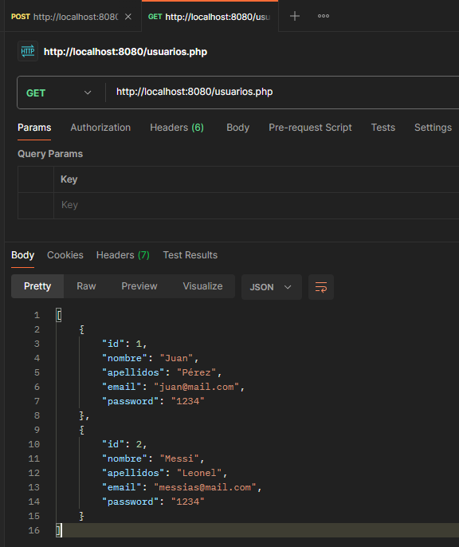
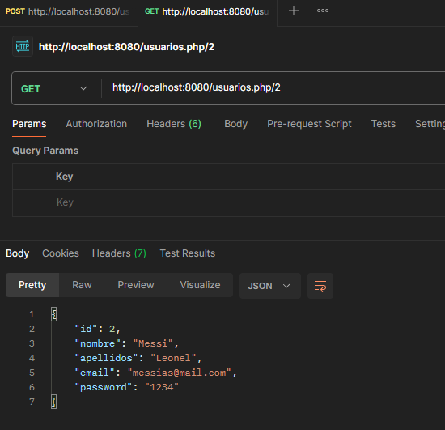
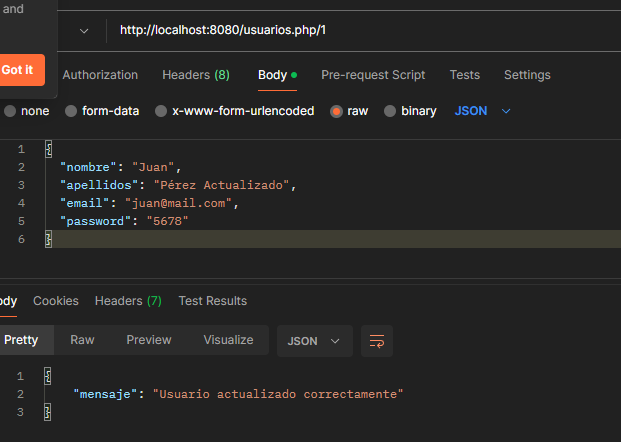
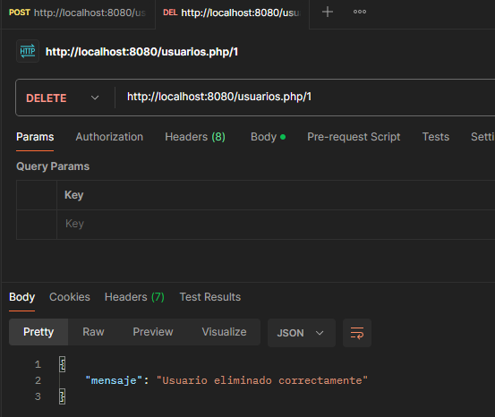
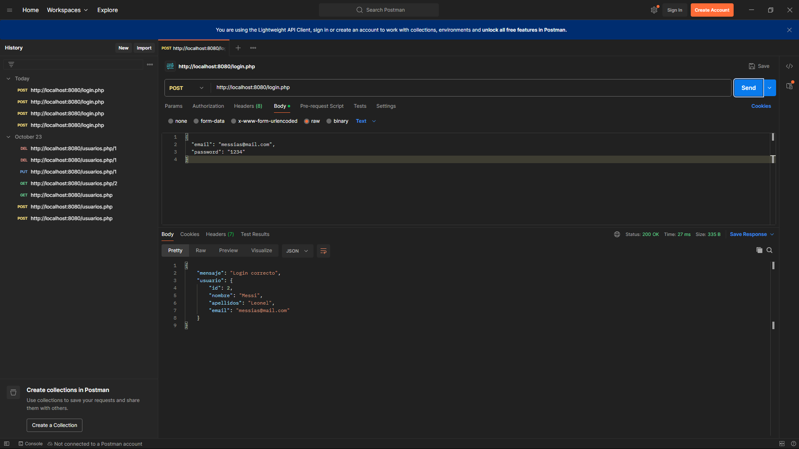

# 🧱 Proyecto API CRUD de Usuarios (PHP + Docker)

Este proyecto implementa una API REST básica en **PHP** para gestionar usuarios (crear, leer, actualizar y eliminar).  
La persistencia se realiza en un archivo JSON o, opcionalmente, en una base de datos MySQL.  

El entorno se ejecuta completamente en **Docker**, sin necesidad de instalar PHP o MySQL localmente.

---

## 🚀 Requisitos previos

Antes de comenzar, asegúrate de tener instalado:

- [Docker Desktop](https://www.docker.com/products/docker-desktop/)
- [Postman](https://www.postman.com/downloads/) (para probar los endpoints)
- Git (opcional, si clonas el repositorio)


---

### 1️⃣ Clona o descarga el proyecto

Si usas Git:

```bash
git clone https://github.com/IES-Rafael-Alberti/25-26-ciberseguridad-grupo2/tree/main/PPS/APIs-CRUD/Php
cd 25-26-ciberseguridad-grupo2/PPS/APIs-CRUD/Php
```
---

#### ⚙️ Configuración y ejecución

docker-compose up -d

Verificamos si esta corriendo: http://localhost:8080/usuarios.php

---

##### ENDPOINTS
 
POST: Crear un nuevo usuario /usuarios.php



GET: Obtener todos los usuarios /usuarios.php



GET: Obtener un usuario por su ID /usuarios.php/{id}



PUT: Actualizar un usuario existente /usuarios.php/{id}



DELETE: Eliminar un usuario /usuarios.php/{id}



###### LOGIN
hemos realizado el login para su comprobación podemos usar postman

