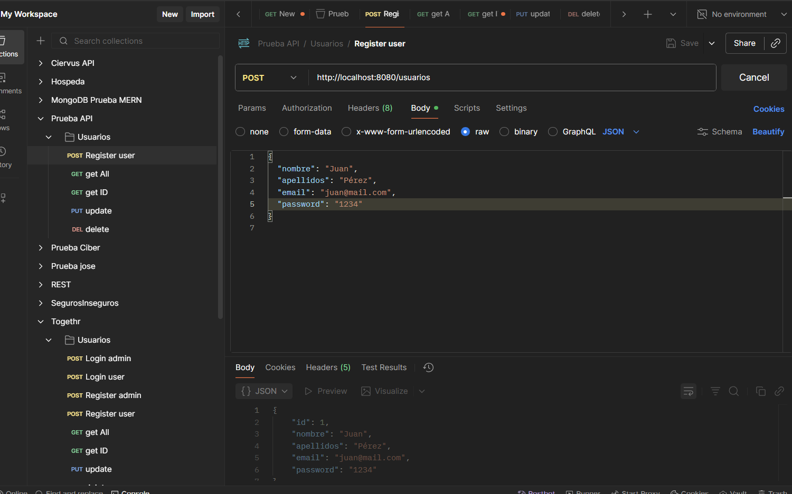
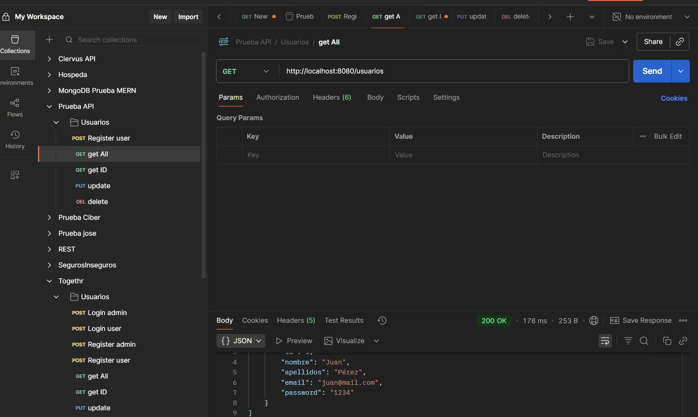
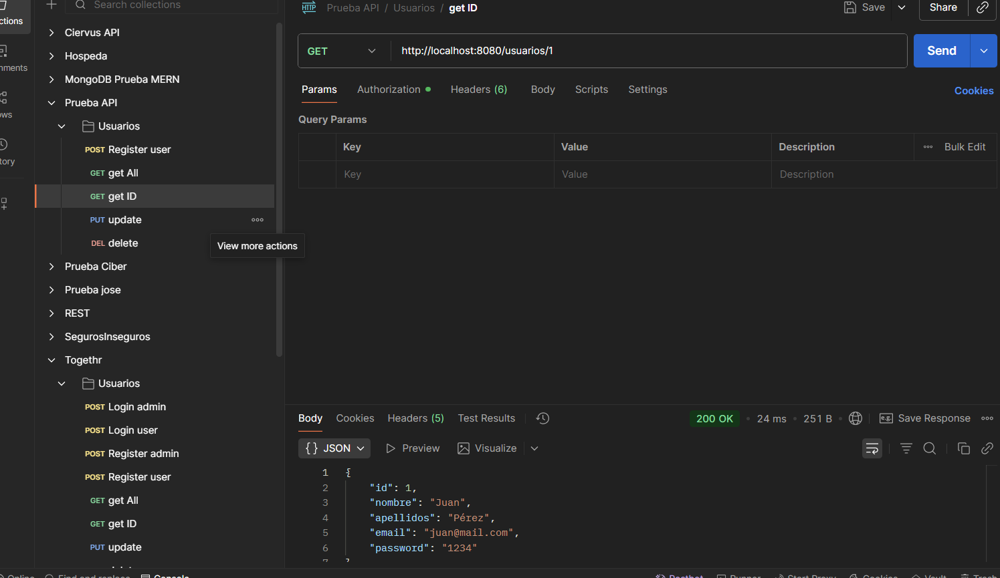
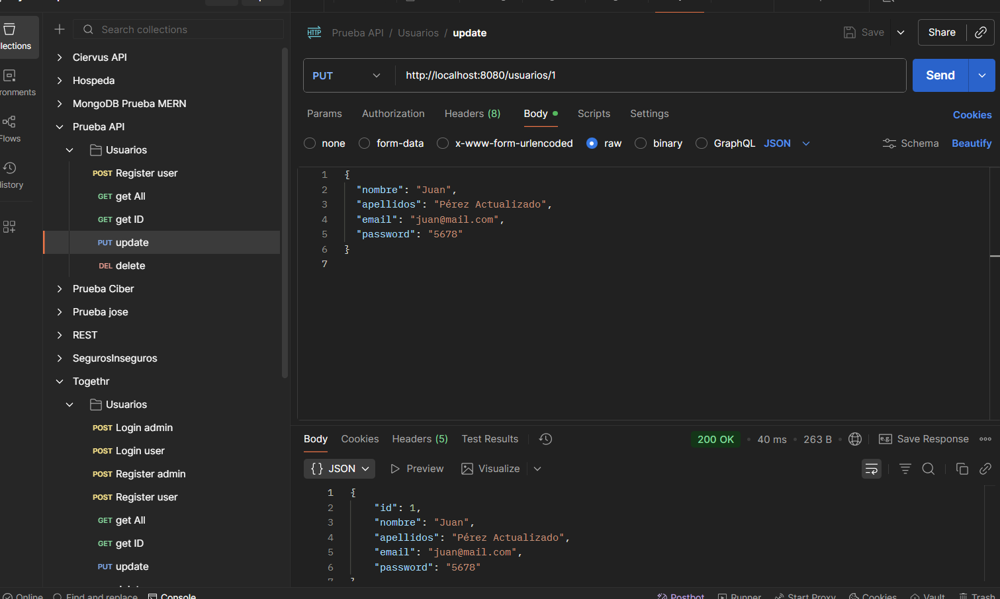
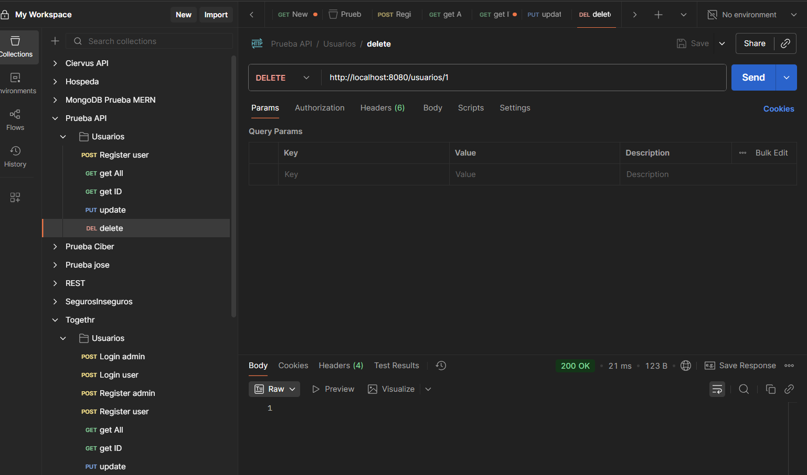

# CRUD de Usuario en Spring Boot

## Descripción

Este proyecto es un **CRUD (Crear, Leer, Actualizar y Eliminar)** de la entidad `Usuario` desarrollado con **Java 21, Spring Boot y JPA**, usando **H2 en memoria** como base de datos para simplificar las pruebas.
Permite gestionar usuarios desde una API REST y probar todos los endpoints fácilmente desde Postman.

---

## Tecnologías

* Java 21
* Spring Boot 3.5.6
* Spring Data JPA
* H2 (base de datos en memoria)
* Gradle
* Docker (opcional para desplegar la app)

---

## Entidad `Usuario`

| Campo       | Tipo   | Descripción            |
| ----------- | ------ | ---------------------- |
| `id`        | Long   | Identificador único    |
| `nombre`    | String | Nombre del usuario     |
| `apellidos` | String | Apellidos del usuario  |
| `email`     | String | Email del usuario      |
| `password`  | String | Contraseña del usuario |

---

## Endpoints de la API

### 1. Crear Usuario

* **Método:** POST
* **URL:** `/usuarios`
* **Body (JSON):

```json
{
  "nombre": "Juan",
  "apellidos": "Pérez",
  "email": "juan@mail.com",
  "password": "1234"
}
```

* **Respuesta:** 201 Created

### 2. Obtener Todos los Usuarios

* **Método:** GET
* **URL:** `/usuarios`
* **Respuesta:** Lista de usuarios, 200 OK

### 3. Obtener Usuario por ID

* **Método:** GET
* **URL:** `/usuarios/{id}`
* **Respuesta:** Usuario con el ID especificado, 200 OK
* **Si no existe:** 404 Not Found

### 4. Actualizar Usuario

* **Método:** PUT
* **URL:** `/usuarios/{id}`
* **Body (JSON):

```json
{
  "nombre": "Juan",
  "apellidos": "Pérez Actualizado",
  "email": "juan@mail.com",
  "password": "5678"
}
```

* **Respuesta:** Usuario actualizado, 200 OK
* **Si no existe:** 404 Not Found

### 5. Eliminar Usuario

* **Método:** DELETE
* **URL:** `/usuarios/{id}`
* **Respuesta:** 200 OK

---

## Ejecución del proyecto

### Local

1. Clonar el repositorio:

```bash
git clone <url-del-repo>
```

2. Abrir el proyecto en IntelliJ IDEA o VS Code.
3. Ejecutar la aplicación:

```bash
./gradlew bootRun
```

4. La API estará disponible en:

```bash
http://localhost:8080/usuarios
```

### Con Docker

1. Construir la imagen:

```bash
docker build -t crud-java .
```

2. Ejecutar el contenedor:

```bash
docker run -p 8080:8080 crud-java
```

---

## Base de datos

Se usa H2 en memoria (`jdbc:h2:mem:testdb`), por lo que los datos se reinician cada vez que se reinicia la aplicación.
Consola H2 disponible en:

```bash
http://localhost:8080/h2-console
```

* **Usuario:** `sa`
* **Contraseña:** (vacía)

---

## Probar con Postman

1. Abrir Postman y usar los endpoints descritos arriba.
2. Asegúrate de usar el header:

```http
Content-Type: application/json
```

### Capturas de Postman

Añade tus propias capturas para mostrar que el CRUD funciona:

1️⃣ Crear Usuario

2️⃣ Obtener Todos los Usuarios

3️⃣ Obtener Usuario por ID

4️⃣ Actualizar Usuario

5️⃣ Eliminar Usuario


---
