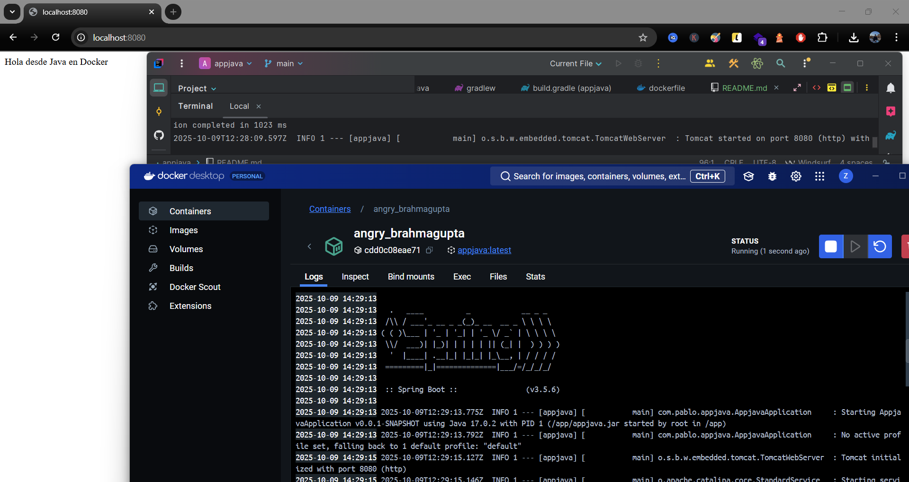

# 🚀 Spring Boot App con Docker

Es importante tener instalado **Java (JDK 17 o superior)** y **Gradle** antes de crear la imagen personalizada de Docker.

---

## 🧱 Crear el proyecto Spring Boot

El proyecto se generó con **Spring Initializr**, usando las siguientes dependencias:
- **Spring Web**
- *(Opcionalmente se añadió JPA, aunque no se usa base de datos en esta demo)*

Estructura básica del proyecto:

```
appjava/
 ├─ src/
 │  ├─ main/java/com/pablo/appjava/AppjavaApplication.java
 │  └─ main/resources/application.properties
 ├─ build.gradle
 └─ Dockerfile
```

Para compilar el proyecto desde consola (por ejemplo en IntelliJ o PowerShell):

```bash
./gradlew build
```

Esto genera el archivo `.jar` dentro de:

```
build/libs/appjava-0.0.1-SNAPSHOT.jar
```

---

## 🐳 Crear el archivo `Dockerfile`

Dentro de la carpeta raíz del proyecto (`appjava/`):

```dockerfile
FROM openjdk:17-jdk-slim

WORKDIR /app

COPY build/libs/appjava-0.0.1-SNAPSHOT.jar appjava.jar

EXPOSE 8080

ENTRYPOINT ["java", "-jar", "appjava.jar"]
```

---

## 🏗️ Construir la imagen Docker

Desde la carpeta donde está el `Dockerfile`:

```bash
docker build -t appjava .
```

---

## ▶️ Ejecutar el contenedor

```bash
docker run -p 8080:8080 appjava
```

Luego abrir en el navegador:

👉 **http://localhost:8080**

Si todo está bien, verás que el contenedor inicia con el logo de **Spring Boot** y el mensaje:

```
Tomcat started on port 8080 (http)
Started AppjavaApplication in X.XXX seconds
```

---

## 🧾 Notas finales

- El proyecto no usa base de datos, es solo una prueba de despliegue.
- Se puede extender fácilmente añadiendo controladores REST o conectando una base de datos MySQL.
- El contenedor arranca un servidor embebido **Tomcat** en el puerto `8080`.

---

## 📸 Ejemplo de ejecución

Así se ve la aplicación funcionando en el navegador:



💡 **Autor:**  
Pablo – Proyecto de despliegue Java con Spring Boot y Docker  
🧰 *IES Rafael Alberti - Grupo 2 Ciberseguridad 25/26*
