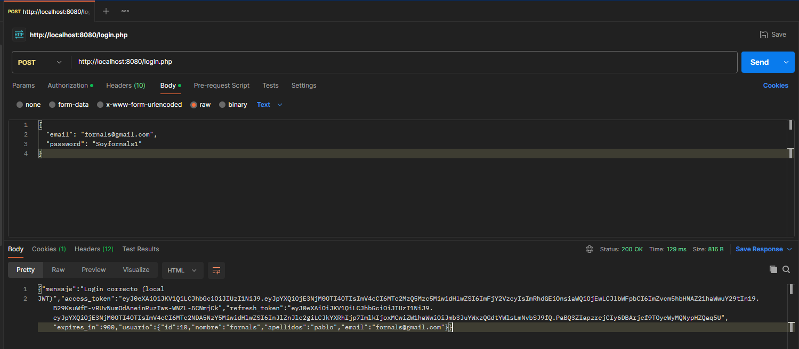
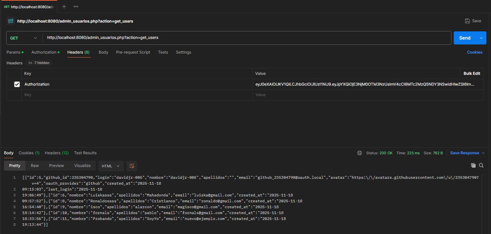
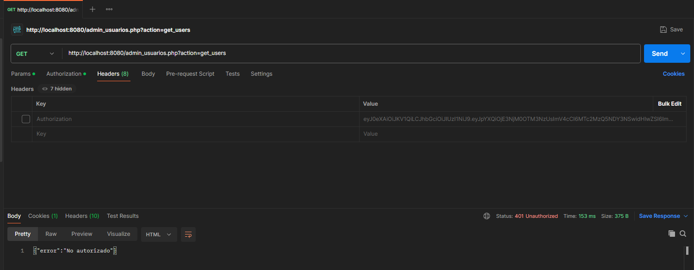
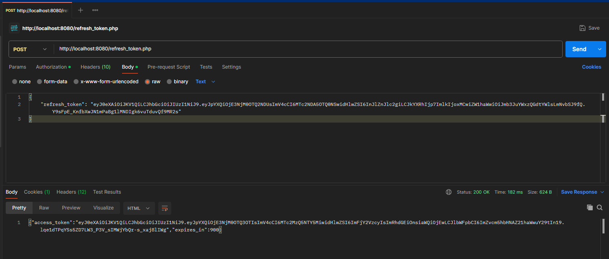
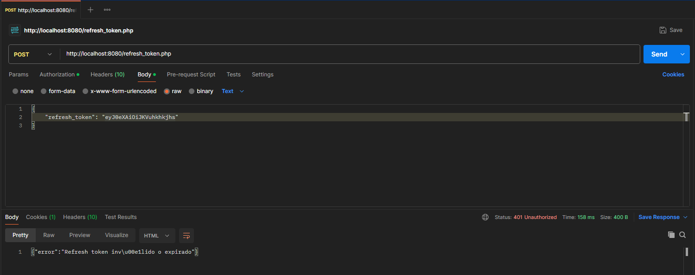
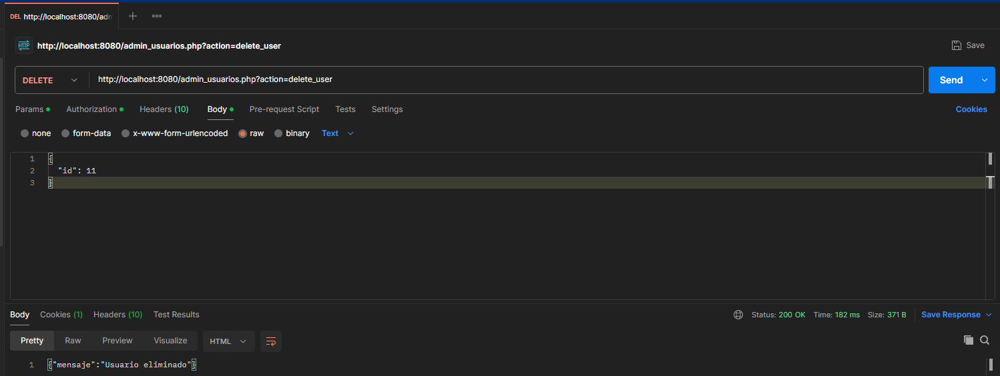
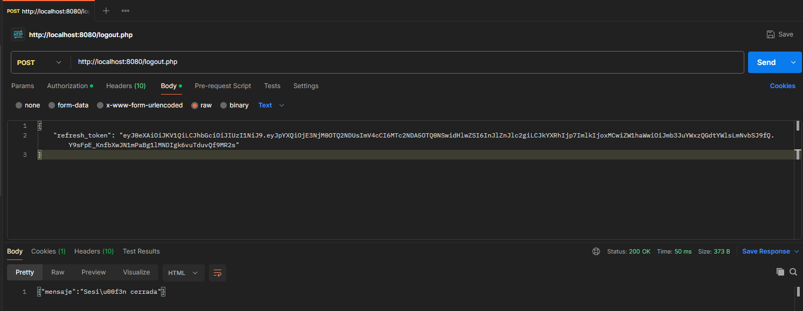
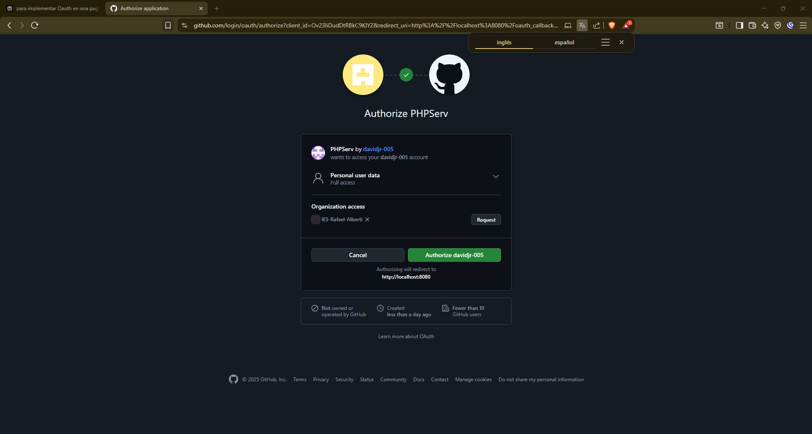
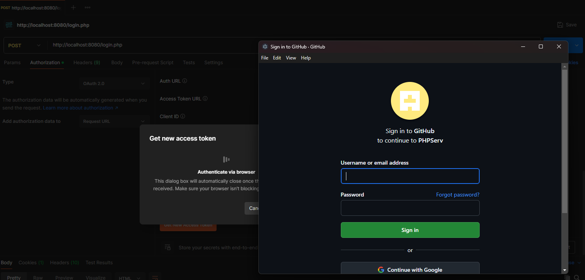

# 📘 Guía de Implementación OAuth 2.0 con GitHub

**Proyecto:** Sistema de Autenticación con OAuth 2.0 + JWT + Refresh Tokens  
**Proveedor:** GitHub OAuth  
**Fecha:** 18 de Noviembre de 2025  
**Autor:** Equipo de Desarrollo

---

## 📋 Tabla de Contenidos

1. [Introducción](#introducción)
2. [Arquitectura del Sistema](#arquitectura-del-sistema)
3. [Paso 1: Registro de la Aplicación en GitHub](#paso-1-registro-de-la-aplicación-en-github)
4. [Paso 2: Configuración del Entorno](#paso-2-configuración-del-entorno)
5. [Paso 3: Implementación del Login](#paso-3-implementación-del-login)
6. [Paso 4: Callback OAuth](#paso-4-callback-oauth)
7. [Paso 5: Gestión de Tokens](#paso-5-gestión-de-tokens)
8. [Paso 6: Sistema de Refresh Tokens](#paso-6-sistema-de-refresh-tokens)
9. [Paso 7: Middleware de Autenticación](#paso-7-middleware-de-autenticación)
10. [Paso 8: Frontend con AuthManager](#paso-8-frontend-con-authmanager)
11. [Testing con Postman](#testing-con-postman)
12. [Troubleshooting](#troubleshooting)

---

## 🎯 Introducción

Este documento describe paso a paso la implementación completa de un sistema de autenticación OAuth 2.0 con GitHub, incluyendo:

- ✅ Login local (email + contraseña)
- ✅ Login con GitHub OAuth
- ✅ JWT con Access Tokens (15 minutos)
- ✅ Refresh Tokens (7 días)
- ✅ Auto-renovación automática
- ✅ Rate limiting (5 intentos)
- ✅ Sanitización completa
- ✅ Token blacklist

---

## 🏗️ Arquitectura del Sistema

```
┌─────────────────────────────────────────────────────────────┐
│                    FLUJO OAUTH COMPLETO                     │
└─────────────────────────────────────────────────────────────┘

1. Usuario hace clic en "Login con GitHub"
   └─→ login.php?action=oauth
       │
       ↓
2. Genera state CSRF y redirige a GitHub
   └─→ https://github.com/login/oauth/authorize
       │
       ↓
3. Usuario autoriza en GitHub
   └─→ GitHub redirige a oauth_callback.php con code
       │
       ↓
4. oauth_callback.php intercambia code por access_token
   └─→ POST a https://github.com/login/oauth/access_token
       │
       ↓
5. Obtiene datos del usuario de GitHub
   └─→ GET https://api.github.com/user
       │
       ↓
6. Busca/Crea usuario en usuarios.json
   └─→ Merge de datos GitHub + datos locales
       │
       ↓
7. Genera Access Token (15 min) + Refresh Token (7 días)
   └─→ JWT con type: 'access' y type: 'refresh'
       │
       ↓
8. Guarda en localStorage y redirige
   └─→ admin_usuarios.php (Panel de administración)
       │
       ↓
9. AuthManager auto-refresca cada 12 minutos
   └─→ Transparente para el usuario
```

---

## 📝 Paso 1: Registro de la Aplicación en GitHub

### 1.1. Crear OAuth App en GitHub

1. Ve a **GitHub** → **Settings** → **Developer settings** → **OAuth Apps**
2. Click en **"New OAuth App"**
3. Rellena los datos:

```
Application name: Sistema de Autenticación OAuth
Homepage URL: http://localhost
Authorization callback URL: http://localhost/oauth_callback.php
```

4. Click en **"Register application"**
5. **Guarda estos datos:**
   - `Client ID`: `Ov23li...` (ejemplo)
   - `Client Secret`: `xxx...` (generar y copiar)

⚠️ **IMPORTANTE:** Nunca subas el Client Secret a GitHub. Usa variables de entorno.

---

## 🔧 Paso 2: Configuración del Entorno

### 2.1. Crear archivo `.env`

Crea un archivo `.env` en la raíz del proyecto:

```env
# GitHub OAuth Credentials
GITHUB_CLIENT_ID=Ov23li...
GITHUB_CLIENT_SECRET=xxx...
REDIRECT_URI=http://localhost/oauth_callback.php

# JWT Secret Key (generado aleatoriamente)
SECRET_KEY=tu_clave_secreta_super_larga_y_aleatoria_aqui_min_32_caracteres

# Database File
DATA_FILE=data/usuarios.json
```

### 2.2. Añadir `.env` a `.gitignore`

```gitignore
.env
data/usuarios.json
data/token_blacklist.json
vendor/
```

### 2.3. Instalar dependencias con Composer

```bash
composer require firebase/php-jwt
```

### 2.4. Crear archivo `config.php`

```php
<?php
// Cargar variables de entorno
$envFile = __DIR__ . '/.env';
if (file_exists($envFile)) {
    $lines = file($envFile, FILE_IGNORE_NEW_LINES | FILE_SKIP_EMPTY_LINES);
    foreach ($lines as $line) {
        if (strpos($line, '#') === 0) continue; // Ignorar comentarios
        list($name, $value) = explode('=', $line, 2);
        $_ENV[trim($name)] = trim($value);
    }
}

// Constantes de configuración
define('GITHUB_CLIENT_ID', $_ENV['GITHUB_CLIENT_ID'] ?? '');
define('GITHUB_CLIENT_SECRET', $_ENV['GITHUB_CLIENT_SECRET'] ?? '');
define('REDIRECT_URI', $_ENV['REDIRECT_URI'] ?? '');
define('SECRET_KEY', $_ENV['SECRET_KEY'] ?? '');
define('DATA_FILE', $_ENV['DATA_FILE'] ?? 'data/usuarios.json');

// Verificar que las constantes estén definidas
if (empty(GITHUB_CLIENT_ID) || empty(GITHUB_CLIENT_SECRET) || empty(SECRET_KEY)) {
    die('Error: Faltan configuraciones en .env');
}
```

---

## 🚀 Paso 3: Implementación del Login

### 3.1. Crear archivo `login.php`

**Funciones principales:**
- `login_local($email, $password)` - Login con email/contraseña
- `login_oauth()` - Inicia flujo OAuth
- `register_user($data)` - Registro de nuevos usuarios
- `checkRateLimit($email, $password)` - Protección contra fuerza bruta

**Código clave para OAuth:**

```php
// Función para iniciar login OAuth
function login_oauth() {
    $_SESSION['oauth_state'] = bin2hex(random_bytes(16));
    $state = $_SESSION['oauth_state'];
    
    $client_id = GITHUB_CLIENT_ID;
    $redirect_uri = REDIRECT_URI;
    
    $authUrl = "https://github.com/login/oauth/authorize" .
               "?client_id=" . urlencode($client_id) .
               "&redirect_uri=" . urlencode($redirect_uri) .
               "&scope=user" .
               "&state=" . urlencode($state);
    
    header('Location: ' . $authUrl);
    exit();
}

// Procesar petición OAuth
if ($_SERVER['REQUEST_METHOD'] === 'GET' && isset($_GET['action']) && $_GET['action'] === 'oauth') {
    login_oauth();
}
```

**HTML - Botón de GitHub:**

```html
<a href="login.php?action=oauth" class="oauth-btn">
    <svg width="20" height="20" viewBox="0 0 16 16" fill="currentColor">
        <path d="M8 0C3.58 0 0 3.58 0 8c0 3.54 2.29 6.53 5.47 7.59..."/>
    </svg>
    GITHUB
</a>
```

---

## 🔄 Paso 4: Callback OAuth

### 4.1. Crear archivo `oauth_callback.php`

**Flujo del callback:**

```php
<?php
session_start();
require_once 'config.php';
require_once 'vendor/autoload.php';

use Firebase\JWT\JWT;

// 1. Validar state CSRF
if (!isset($_GET['state']) || $_GET['state'] !== ($_SESSION['oauth_state'] ?? '')) {
    exit('Error: State inválido (posible CSRF)');
}
unset($_SESSION['oauth_state']);

// 2. Verificar code
if (empty($_GET['code'])) {
    exit('Error: No se recibió el código de autorización');
}

// 3. Intercambiar code por access_token
$token_url = 'https://github.com/login/oauth/access_token';
$params = [
    'client_id' => GITHUB_CLIENT_ID,
    'client_secret' => GITHUB_CLIENT_SECRET,
    'code' => $_GET['code'],
    'redirect_uri' => REDIRECT_URI
];

$ch = curl_init($token_url);
curl_setopt($ch, CURLOPT_POST, true);
curl_setopt($ch, CURLOPT_POSTFIELDS, http_build_query($params));
curl_setopt($ch, CURLOPT_RETURNTRANSFER, true);
curl_setopt($ch, CURLOPT_HTTPHEADER, ['Accept: application/json']);
$response = curl_exec($ch);
curl_close($ch);

$tokenData = json_decode($response, true);

if (empty($tokenData['access_token'])) {
    error_log('OAuth Error: ' . print_r($tokenData, true));
    exit('Error en la autenticación');
}

$accessToken = $tokenData['access_token'];

// 4. Obtener datos del usuario
$user_url = 'https://api.github.com/user';
$ch = curl_init($user_url);
curl_setopt($ch, CURLOPT_RETURNTRANSFER, true);
curl_setopt($ch, CURLOPT_HTTPHEADER, [
    'Authorization: Bearer ' . $accessToken,
    'User-Agent: PHP-OAuth-App'
]);
$userResponse = curl_exec($ch);
curl_close($ch);

$userData = json_decode($userResponse, true);

// 5. Sanitizar datos
$userData['login'] = htmlspecialchars($userData['login'], ENT_QUOTES, 'UTF-8');
$userData['name'] = htmlspecialchars($userData['name'] ?? $userData['login'], ENT_QUOTES, 'UTF-8');
$userData['email'] = filter_var($userData['email'], FILTER_VALIDATE_EMAIL);
$userData['avatar_url'] = filter_var($userData['avatar_url'] ?? '', FILTER_SANITIZE_URL);

// 6. Buscar o crear usuario en usuarios.json
$usuarios = [];
if (file_exists(DATA_FILE)) {
    $usuarios = json_decode(file_get_contents(DATA_FILE), true);
}

$userId = null;
$indexExistente = null;

// Buscar por github_id
foreach ($usuarios as $index => $u) {
    if (isset($u['github_id']) && $u['github_id'] === (int)$userData['id']) {
        $indexExistente = $index;
        $userId = $u['id'];
        break;
    }
}

if ($indexExistente !== null) {
    // Usuario existente - actualizar datos
    $usuarios[$indexExistente]['github_id'] = (int)$userData['id'];
    $usuarios[$indexExistente]['login'] = $userData['login'];
    $usuarios[$indexExistente]['nombre'] = $userData['name'];
    $usuarios[$indexExistente]['email'] = $userData['email'];
    $usuarios[$indexExistente]['avatar'] = $userData['avatar_url'];
    $usuarios[$indexExistente]['oauth_provider'] = 'github';
    $usuarios[$indexExistente]['last_login'] = date('Y-m-d H:i:s');
} else {
    // Usuario nuevo - crear
    $userId = count($usuarios) > 0 ? max(array_column($usuarios, 'id')) + 1 : 1;
    
    $nuevoUsuario = [
        'id' => $userId,
        'github_id' => (int)$userData['id'],
        'login' => $userData['login'],
        'nombre' => $userData['name'],
        'apellidos' => '',
        'email' => $userData['email'],
        'avatar' => $userData['avatar_url'],
        'oauth_provider' => 'github',
        'created_at' => date('Y-m-d H:i:s'),
        'last_login' => date('Y-m-d H:i:s')
    ];
    
    $usuarios[] = $nuevoUsuario;
}

// Guardar usuarios
file_put_contents(DATA_FILE, json_encode($usuarios, JSON_PRETTY_PRINT | JSON_UNESCAPED_UNICODE));

// 7. Generar tokens JWT
$accessPayload = [
    'iat' => time(),
    'exp' => time() + 900, // 15 minutos
    'type' => 'access',
    'data' => [
        'id' => $userId,
        'email' => $userData['email']
    ]
];

$refreshPayload = [
    'iat' => time(),
    'exp' => time() + 604800, // 7 días
    'type' => 'refresh',
    'data' => [
        'id' => $userId,
        'email' => $userData['email']
    ]
];

$accessToken = JWT::encode($accessPayload, SECRET_KEY, 'HS256');
$refreshToken = JWT::encode($refreshPayload, SECRET_KEY, 'HS256');

// 8. Guardar en sesión
$_SESSION['user'] = [
    'id' => $userId,
    'email' => $userData['email'],
    'name' => $userData['name'],
    'login' => $userData['login']
];
$_SESSION['access_token'] = $accessToken;
$_SESSION['refresh_token'] = $refreshToken;
?>

<!-- 9. Página intermedia con redirección automática -->
<!DOCTYPE html>
<html lang="es">
<head>
    <meta charset="UTF-8">
    <title>Autenticación exitosa</title>
</head>
<body>
    <h2>✓ Autenticación exitosa</h2>
    <p>Redirigiendo...</p>
    
    <script>
        // Guardar tokens en localStorage
        localStorage.setItem('access_token', '<?php echo $accessToken; ?>');
        localStorage.setItem('refresh_token', '<?php echo $refreshToken; ?>');
        
        // Redirigir después de 1.5 segundos
        setTimeout(function() {
            window.location.href = 'admin_usuarios.php';
        }, 1500);
    </script>
</body>
</html>
```

---

## 🔐 Paso 5: Gestión de Tokens

### 5.1. Access Token vs Refresh Token

| Característica | Access Token | Refresh Token |
|----------------|--------------|---------------|
| **Duración** | 15 minutos | 7 días |
| **Uso** | Operaciones normales | Renovar access token |
| **Tipo** | `type: 'access'` | `type: 'refresh'` |
| **Revocable** | No (expira solo) | Sí (blacklist) |
| **Se envía en** | Authorization header | Solo a refresh endpoint |

### 5.2. Estructura del JWT

**Access Token:**
```json
{
  "iat": 1700000000,
  "exp": 1700000900,
  "type": "access",
  "data": {
    "id": 1,
    "email": "usuario@ejemplo.com"
  }
}
```

**Refresh Token:**
```json
{
  "iat": 1700000000,
  "exp": 1700604800,
  "type": "refresh",
  "data": {
    "id": 1,
    "email": "usuario@ejemplo.com"
  }
}
```

---

## 🔄 Paso 6: Sistema de Refresh Tokens

### 6.1. Crear archivo `refresh_token.php`

```php
<?php
session_start();
require_once 'config.php';
require_once 'vendor/autoload.php';

use Firebase\JWT\JWT;
use Firebase\JWT\Key;

if ($_SERVER['REQUEST_METHOD'] === 'POST') {
    $input = json_decode(file_get_contents('php://input'), true);
    
    if (empty($input['refresh_token'])) {
        http_response_code(400);
        echo json_encode(['error' => 'Refresh token requerido']);
        exit;
    }
    
    try {
        // Validar refresh token
        $decoded = JWT::decode($input['refresh_token'], new Key(SECRET_KEY, 'HS256'));
        
        // Verificar que es un refresh token
        if (!isset($decoded->type) || $decoded->type !== 'refresh') {
            http_response_code(401);
            echo json_encode(['error' => 'Token inválido']);
            exit;
        }
        
        // Verificar blacklist
        $blacklist = [];
        if (file_exists('data/token_blacklist.json')) {
            $blacklist = json_decode(file_get_contents('data/token_blacklist.json'), true);
        }
        
        if (in_array($input['refresh_token'], $blacklist)) {
            http_response_code(401);
            echo json_encode(['error' => 'Token revocado']);
            exit;
        }
        
        // Generar nuevo access token
        $newAccessToken = [
            'iat' => time(),
            'exp' => time() + 900,
            'type' => 'access',
            'data' => [
                'id' => $decoded->data->id,
                'email' => $decoded->data->email
            ]
        ];
        
        $jwt = JWT::encode($newAccessToken, SECRET_KEY, 'HS256');
        
        http_response_code(200);
        echo json_encode([
            'access_token' => $jwt,
            'expires_in' => 900
        ]);
        
    } catch (Exception $e) {
        http_response_code(401);
        echo json_encode(['error' => 'Refresh token inválido o expirado']);
    }
    exit;
}
```

### 6.2. Crear archivo `logout.php`

```php
<?php
session_start();
require_once 'config.php';

if ($_SERVER['REQUEST_METHOD'] === 'POST') {
    $input = json_decode(file_get_contents('php://input'), true);
    
    if (!empty($input['refresh_token'])) {
        // Añadir a blacklist
        $blacklist = [];
        $blacklistFile = 'data/token_blacklist.json';
        
        if (file_exists($blacklistFile)) {
            $blacklist = json_decode(file_get_contents($blacklistFile), true);
        }
        
        $blacklist[] = $input['refresh_token'];
        
        file_put_contents($blacklistFile, json_encode($blacklist, JSON_PRETTY_PRINT));
    }
    
    session_destroy();
    
    http_response_code(200);
    echo json_encode(['mensaje' => 'Sesión cerrada']);
    exit;
}
```

---

## 🛡️ Paso 7: Middleware de Autenticación

### 7.1. Crear archivo `admin_usuarios.php` con verificación

```php
<?php
session_start();
require_once 'config.php';
require_once 'vendor/autoload.php';

use Firebase\JWT\JWT;
use Firebase\JWT\Key;

// Función para verificar autenticación
function verificarAuth() {
    $headers = getallheaders();
    $authHeader = $headers['Authorization'] ?? '';
    
    if (empty($authHeader)) {
        http_response_code(401);
        echo json_encode(['error' => 'No autorizado']);
        exit;
    }
    
    $token = str_replace('Bearer ', '', $authHeader);
    
    try {
        $decoded = JWT::decode($token, new Key(SECRET_KEY, 'HS256'));
        
        // Verificar que es un access token
        if (!isset($decoded->type) || $decoded->type !== 'access') {
            http_response_code(401);
            echo json_encode(['error' => 'Token inválido']);
            exit;
        }
        
        return $decoded;
    } catch (Exception $e) {
        http_response_code(401);
        echo json_encode(['error' => 'Token inválido o expirado']);
        exit;
    }
}

// API Endpoints
if ($_SERVER['REQUEST_METHOD'] === 'GET' && isset($_GET['action']) && $_GET['action'] === 'get_users') {
    verificarAuth();
    // ... código para obtener usuarios
}
```

---

## 💻 Paso 8: Frontend con AuthManager

### 8.1. Crear archivo `auth.js`

```javascript
// auth.js - Sistema de auto-refresh de tokens

class AuthManager {
    constructor() {
        this.accessToken = localStorage.getItem('access_token');
        this.refreshToken = localStorage.getItem('refresh_token');
        this.refreshInterval = null;
        
        if (this.accessToken && this.refreshToken) {
            this.startAutoRefresh();
        }
    }
    
    setTokens(accessToken, refreshToken) {
        this.accessToken = accessToken;
        this.refreshToken = refreshToken;
        localStorage.setItem('access_token', accessToken);
        localStorage.setItem('refresh_token', refreshToken);
        this.startAutoRefresh();
    }
    
    getAccessToken() {
        return this.accessToken;
    }
    
    async refreshAccessToken() {
        try {
            const response = await fetch('refresh_token.php', {
                method: 'POST',
                headers: {'Content-Type': 'application/json'},
                body: JSON.stringify({refresh_token: this.refreshToken})
            });
            
            const data = await response.json();
            
            if (response.ok) {
                this.accessToken = data.access_token;
                localStorage.setItem('access_token', data.access_token);
                console.log('✅ Token renovado automáticamente');
                return true;
            } else {
                this.logout();
                return false;
            }
        } catch (error) {
            console.error('❌ Error en refresh:', error);
            return false;
        }
    }
    
    startAutoRefresh() {
        if (this.refreshInterval) clearInterval(this.refreshInterval);
        
        // Renovar cada 12 minutos
        this.refreshInterval = setInterval(() => {
            console.log('🔄 Renovando token automáticamente...');
            this.refreshAccessToken();
        }, 720000); // 12 minutos
    }
    
    async fetch(url, options = {}) {
        options.headers = options.headers || {};
        options.headers['Authorization'] = 'Bearer ' + this.accessToken;
        
        let response = await fetch(url, options);
        
        // Si token expiró, renovar y reintentar
        if (response.status === 401) {
            const refreshed = await this.refreshAccessToken();
            if (refreshed) {
                options.headers['Authorization'] = 'Bearer ' + this.accessToken;
                response = await fetch(url, options);
            }
        }
        
        return response;
    }
    
    logout() {
        fetch('logout.php', {
            method: 'POST',
            headers: {'Content-Type': 'application/json'},
            body: JSON.stringify({refresh_token: this.refreshToken})
        });
        
        localStorage.removeItem('access_token');
        localStorage.removeItem('refresh_token');
        clearInterval(this.refreshInterval);
        window.location.href = 'login.php';
    }
}

// Instancia global
const auth = new AuthManager();
```

### 8.2. Uso en HTML

```html
<script src="auth.js"></script>
<script>
    // Cargar usuarios usando AuthManager
    async function loadUsers() {
        const response = await auth.fetch('admin_usuarios.php?action=get_users');
        const data = await response.json();
        console.log(data);
    }
    
    // Cerrar sesión
    function logout() {
        auth.logout();
    }
</script>
```

---

## 🧪 Testing con Postman

### Test 1: Login Local

**Descripción:** Verificar login con email y contraseña

**Request:**
```
POST http://localhost/login.php
Content-Type: application/json

{
  "email": "usuario@ejemplo.com",
  "password": "Contraseña123"
}
```


**Comprobaciones:**
- [x] Status code es 200
- [x] Devuelve `access_token`
- [x] Devuelve `refresh_token`
- [x] `expires_in` es 900 segundos
- [x] Datos del usuario correctos

---

### Test 2: Login con Credenciales Incorrectas

**Request:**
```
POST http://localhost/login.php
Content-Type: application/json

{
  "email": "usuario@ejemplo.com",
  "password": "ContraseñaIncorrecta"
}
```


**Comprobaciones:**
- [x] Status code es 401
- [x] Muestra intentos restantes
- [x] Rate limiting funciona (máximo 5 intentos)

---

### Test 3: Rate Limiting

**Descripción:** Verificar bloqueo después de 5 intentos fallidos

**Request (repetir 5 veces):**
```
POST http://localhost/login.php
Content-Type: application/json

{
  "email": "usuario@ejemplo.com",
  "password": "Incorrecta"
}
```


**Comprobaciones:**
- [x] Status code es 429
- [x] Muestra mensaje de bloqueo
- [x] Indica tiempo restante

---

### Test 4: Registro de Usuario

**Request:**
```
POST http://localhost/login.php
Content-Type: application/json

{
  "action": "register",
  "nombre": "Nuevo",
  "apellidos": "Usuario",
  "email": "nuevo@ejemplo.com",
  "password": "Contraseña123"
}
```


**Comprobaciones:**
- [x] Status code es 201
- [x] Usuario creado correctamente
- [x] Password hasheado con BCRYPT

---

### Test 5: Obtener Usuarios (con Access Token)

**Request:**
```
GET http://localhost/admin_usuarios.php?action=get_users
Authorization: Bearer {access_token}
```



**Comprobaciones:**
- [x] Status code es 200
- [x] Devuelve array de usuarios
- [x] NO incluye passwords
- [x] Incluye datos de GitHub si OAuth

---

### Test 6: Obtener Usuarios sin Token

**Request:**
```
GET http://localhost/admin_usuarios.php?action=get_users
```



**Comprobaciones:**
- [x] Status code es 401
- [x] Rechaza acceso sin token

---

### Test 7: Refresh Token

**Request:**
```
POST http://localhost/refresh_token.php
Content-Type: application/json

{
  "refresh_token": "{refresh_token}"
}
```


**Comprobaciones:**
- [x] Status code es 200
- [x] Devuelve nuevo `access_token`
- [x] Expira en 900 segundos

---

### Test 8: Refresh Token Inválido

**Request:**
```
POST http://localhost/refresh_token.php
Content-Type: application/json

{
  "refresh_token": "token_invalido_123"
}
```


**Comprobaciones:**
- [x] Status code es 401
- [x] Rechaza token inválido

---

### Test 9: Actualizar Usuario

**Request:**
```
POST http://localhost/admin_usuarios.php?action=update_user
Authorization: Bearer {access_token}
Content-Type: application/json

{
  "id": 1,
  "nombre": "Usuario Actualizado",
  "apellidos": "Apellido Nuevo",
  "email": "usuario@ejemplo.com"
}
```


**Comprobaciones:**
- [x] Status code es 200
- [x] Usuario actualizado correctamente
- [x] Sanitización aplicada (htmlspecialchars)

---

### Test 10: Eliminar Usuario

**Request:**
```
DELETE http://localhost/admin_usuarios.php?action=delete_user
Authorization: Bearer {access_token}
Content-Type: application/json

{
  "id": 2
}
```


**Comprobaciones:**
- [x] Status code es 200
- [x] Usuario eliminado del JSON
- [x] No se puede eliminar sin token

---

### Test 11: Logout (Revocar Refresh Token)

**Request:**
```
POST http://localhost/logout.php
Content-Type: application/json

{
  "refresh_token": "{refresh_token}"
}
```


**Comprobaciones:**
- [x] Status code es 200
- [x] Refresh token añadido a blacklist
- [x] No se puede usar el mismo refresh token después

---

### Test 12: Usar Refresh Token Revocado

**Request:**
```
POST http://localhost/refresh_token.php
Content-Type: application/json

{
  "refresh_token": "{refresh_token_revocado}"
}
```


**Comprobaciones:**
- [x] Status code es 401
- [x] Detecta token en blacklist

---

## 📚 Recursos Adicionales

### Documentación Oficial

- [GitHub OAuth Documentation](https://docs.github.com/en/developers/apps/building-oauth-apps)
- [JWT.io - JSON Web Tokens](https://jwt.io/)
- [PHP JWT Library](https://github.com/firebase/php-jwt)

### Herramientas Útiles

- [Postman](https://www.postman.com/) - Testing de APIs
- [JWT Debugger](https://jwt.io/#debugger) - Decodificar JWTs
- [Ngrok](https://ngrok.com/) - Túneles HTTPS para testing local

---

## ✅ Checklist Final

- [x] OAuth App registrada en GitHub
- [x] Archivo `.env` configurado
- [x] `.env` en `.gitignore`
- [x] Composer instalado y dependencias descargadas
- [x] `config.php` carga variables correctamente
- [x] `login.php` funciona con email/contraseña
- [x] Botón GitHub redirige correctamente
- [x] `oauth_callback.php` intercambia code por token
- [x] Usuarios se guardan/actualizan en `usuarios.json`
- [x] Access tokens expiran a los 15 minutos
- [x] Refresh tokens expiran a los 7 días
- [x] AuthManager auto-refresca cada 12 minutos
- [x] Rate limiting bloquea después de 5 intentos
- [x] Logout añade refresh token a blacklist
- [x] Todos los tests de Postman pasan
- [x] Datos sanitizados con `htmlspecialchars()`
- [x] Emails validados con `filter_var()`
- [x] Passwords hasheados con BCRYPT
- [x] CSRF protegido con state token

---



