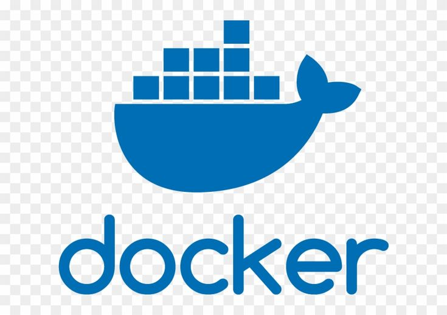

# Proyecto PPS 25-26 Ciberseguridad Grupo 2

Este repositorio contiene varios ejemplos de aplicaciones en diferentes tecnologías, cada una preparada para ejecutarse en Docker.

## Subproyectos

- [Java (Spring Boot)](./appjava/README.md)
- [Django (Python)](./django/README.md)
- [Node.js (Express)](./nodejs/README.md)
- [.NET](./dotnet/README.md)
- [PHP + Wordpress](./phpwordpress/README.md)

Cada subcarpeta contiene su propio README con instrucciones específicas de instalación y ejecución.

---

Para más información sobre cada tecnología, consulta el README correspondiente.