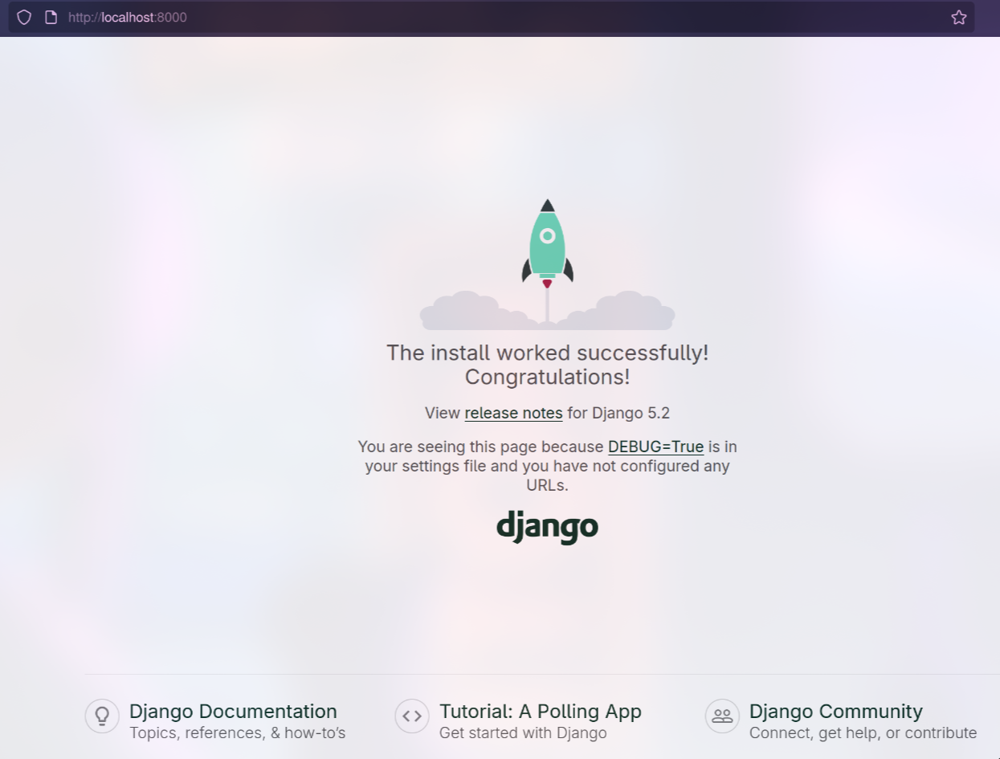

# Django App con Docker
Es importante tener instalado Django de antes en el sistema antes de crear la imagen personalizada de Docker
## Crear el proyecto Django

```bash
mkdir djangoapp
django-admin startproject grupo2 djangoapp
cd djangoapp
python manage.py runserver
```

Abrir el navegador y comprobar si **http://localhost:8000** funciona correctamente

---

## Crear el archivo `Dockerfile`


```dockerfile
FROM python:3.12-slim

ENV PYTHONDONTWRITEBYTECODE=1
ENV PYTHONUNBUFFERED=1

WORKDIR /app

RUN pip install --no-cache-dir Django

COPY . .

EXPOSE 8000

# Default command: run Django’s development server
CMD ["python", "manage.py", "runserver", "0.0.0.0:8000"]
```

---

## Construir la imagen Docker

```bash
docker build -t django-hello .
```

---

## Ejecutar el contenedor

```bash
docker run -d -p 8000:8000 django-hello
```

Abrir **http://localhost:8000**


