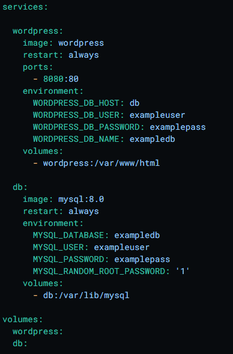
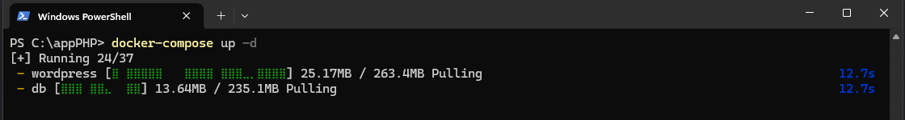
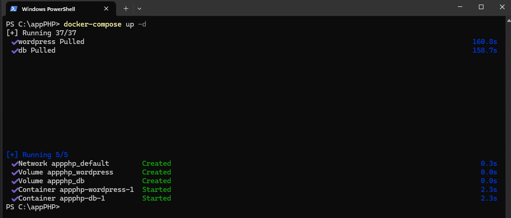
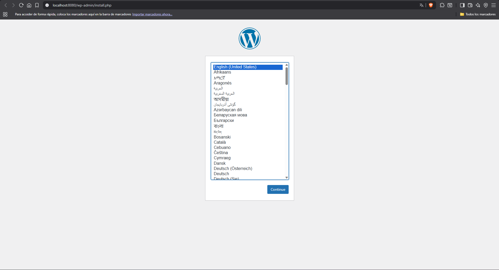

Realizamos un docker-compose con la referencia de la imagen de wordpress en DockerHub

Una vez realizado, entramos en la powershell en dicha carpeta donde se encuentre el docker-compose
y iniciamos el contenedor

Esperamos a que se complete

Acceder a la instalación de wordpress
por el puerto que hemos configurado en el docker-compose, en este caso el localhost:8080

