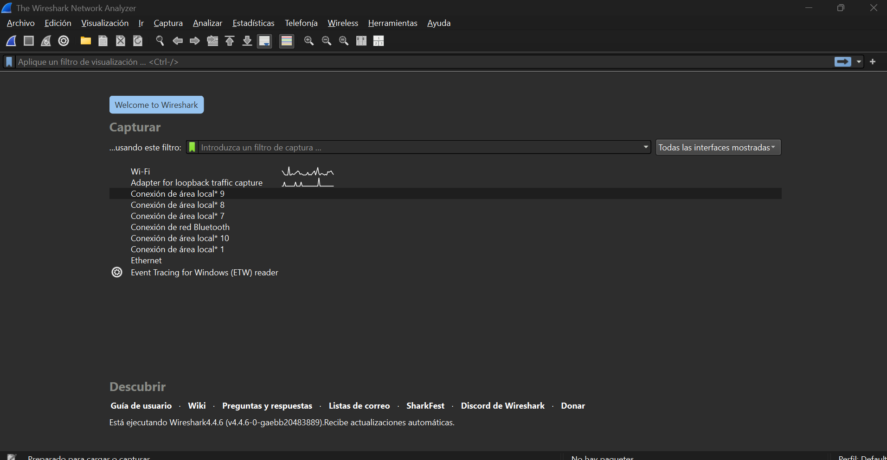
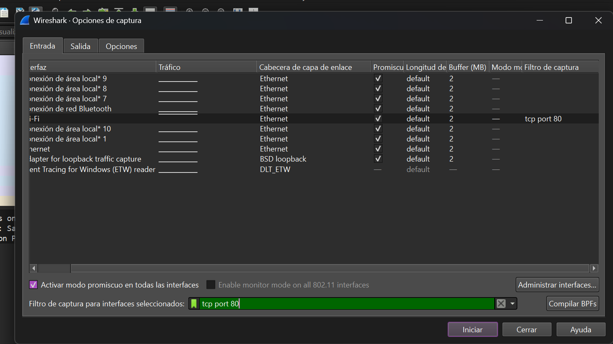
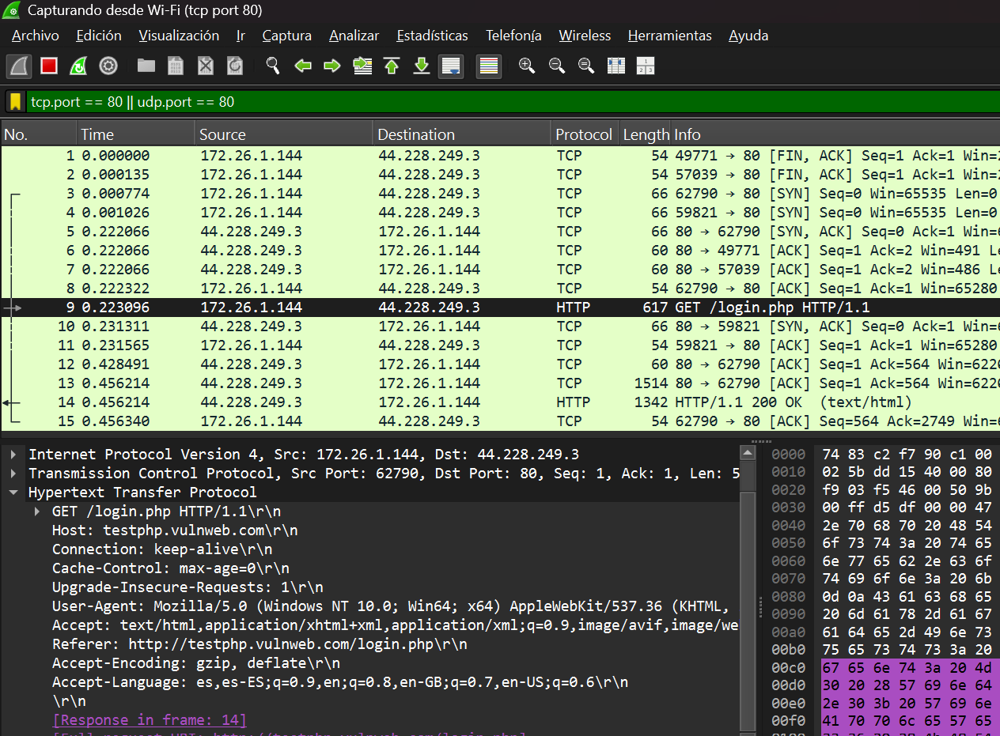
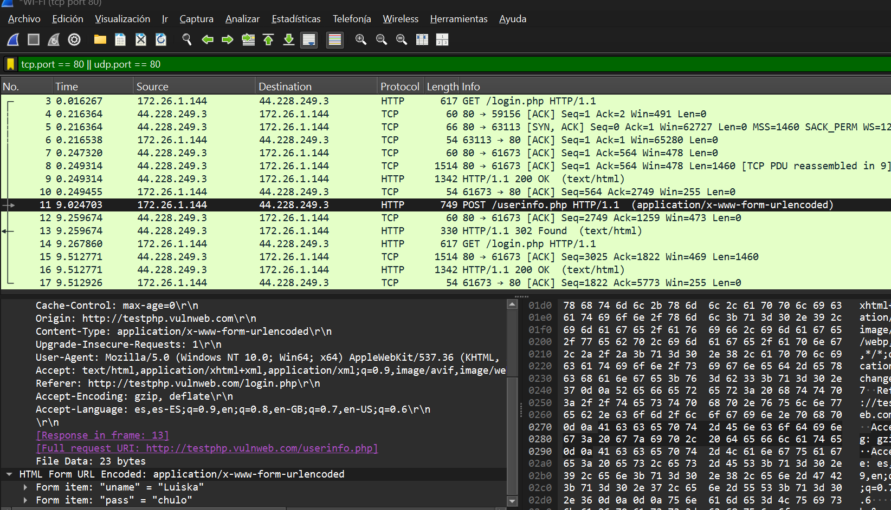

# Captura y Análisis de Tráfico de Red en Conexiones HTTP

---

## Wireshark

1. Instalar **Wireshark**
2. Ejecutar con privilegios de administrador.
3. Explorar la interfaz principal:
   - **Lista de interfaces de red.**
   - **Ventana de paquetes capturados.**
   - **Detalles del paquete seleccionado.**
   - **Vista en bytes del paquete.**

---

## Captura de Tráfico

1. Se seleccionó la interfaz de red `Wi-Fi` (en mi caso).
2. Para filtrar el tráfico HTTP y reducir ruido, se aplicó el siguiente **tcp.port == 80 || udp.port == 80**:  

2. Identificar solicitudes **HTTP GET** y **HTTP POST**.

3. Examinamos el contenido de un paquete `HTTP POST`, miramos la informacion en la sección **Form URL Encoded**:

---

## Observaciones

- HTTP transmite los datos **sin cifrar**, haciendo que cualquier persona con acceso a la red pueda interceptar infromacion sensible.
- En Wireshark, los parámetros del formulario aparecen en la pestaña **“Form URL Encoded”** dentro de los detalles del paquete.

---

## Reflexión

- El uso de **HTTPS (HTTP Secure)** es fundamental para proteger la información transmitida.  
- HTTPS utiliza **TLS (Transport Layer Security)**, que cifra los datos antes de enviarlos.
- Los navegadores modernos alertan a los usuarios cuando un formulario intenta enviar datos por HTTP sin cifrado.
- Las medidas de seguridad recomendadas incluyen:
- Usar certificados digitales válidos.
- Implementar redirecciones automáticas de HTTP a HTTPS.
- No almacenar contraseñas en texto plano en el servidor.
- Aplicar políticas de seguridad en el encabezado HTTP (HSTS, CSP, etc.).

---
